## **AI adoption by small and medium‑sized enterprises**

OECD discussion paper for the G7

## **Disclaimers**

This document was prepared by the Organisation for Economic Co-operation and Development (OECD) at the request of the 2025 G7 Presidency of Canada. It was drafted by the OECD's Centre for Entrepreneurship, SMEs, Regions and Cities (CFE); Directorate for Employment, Labour and Social Affairs (ELS) and Directorate for Science, Technology and Innovation (STI). The paper aims to inform the development of the proposed G7 SME AI Adoption Blueprint in the context of the G7 Industry, Digital, and Technology Working Group and the G7 Industry, Digital and Technology Ministerial Meeting (IDTMM) on 7-9 December 2025 in Montreal, Quebec, Canada.

This work is published under the responsibility of the Secretary-General of the OECD. The opinions expressed and arguments employed herein do not necessarily reflect the official views of OECD Member countries.

This document, as well as any data and map included herein, are without prejudice to the status of or sovereignty over any territory, to the delimitation of international frontiers and boundaries and to the name of any territory, city or area.

The statistical data for Israel are supplied by and under the responsibility of the relevant Israeli authorities. The use of such data by the OECD is without prejudice to the status of the Golan Heights, East Jerusalem and Israeli settlements in the West Bank under the terms of international law.

Cover image: © Gorodenkoff/GettyImages.

#### © OECD 2025

#### **Attribution 4.0 International (CC BY 4.0)**

This work is made available under the Creative Commons Attribution 4.0 International licence. By using this work, you accept to be bound by the terms of this licence ( https://creativecommons.org/licenses/by/4.0/ ).

**Attribution** – you must cite the work.

**Translations** – you must cite the original work, identify changes to the original and add the following text: In the event of any discrepancy between the original work and the translation, only the text of original work should be considered valid.

**Adaptations** – you must cite the original work and add the following text: This is an adaptation of an original work by the OECD. The opinions expressed and arguments employed in this adaptation should not be reported as representing the official views of the OECD or of its Member countries.

**Third-party material** – the licence does not apply to third-party material in the work. If using such material, you are responsible for obtaining permission from the third-party and for any claims of infringement.

You must not use the OECD logo, visual identity or cover image without express permission or suggest the OECD endorses your use of the work. Any dispute arising under this licence shall be settled by arbitration in accordance with the Permanent Court of Arbitration (PCA) Arbitration Rules 2012. The seat of arbitration shall be Paris (France). The number of arbitrators shall be one

## **Abstract**

Artificial intelligence (AI) holds significant promise for enhancing business productivity and innovation, including among small and medium-sized enterprises (SMEs). Despite recent technological advancements in AI tools, adoption of AI by SMEs remains relatively low compared to other digital technologies and to larger firms. Canada's 2025 G7 Presidency has made accelerating AI adoption by SMEs a key priority. This discussion paper, prepared by the OECD Secretariat at the request of the G7 Presidency, seeks to inform G7 discussions on a proposed Blueprint for SME AI Adoption. It examines recent evidence on AI diffusion across G7 economies, highlighting large and persistent gaps between SMEs and large firms. It introduces a taxonomy of SME AI adopters based on digital maturity, complexity of use, and scope of application, with a view to supporting policy design. Drawing on case studies from G7 countries, the paper illustrates diverse adoption pathways and identifies key enablers – connectivity; AI-enabling inputs; skills; and finance – that are prerequisites for SMEs to successfully adopt AI. The findings underscore the need for governments to support strategies that can accelerate AI uptake among SMEs and promote digital transformation that benefits all. The paper contributes to ongoing G7 and OECD efforts to foster innovative, trustworthy, and productivity-enhancing AI diffusion in line with the OECD AI Principles.

## **Acknowledgments**

The authors thank Jerry Sheehan, Nadim Ahmad, Audrey Plonk, Lucia Cusmano, Guy Lalanne, Karine Perset, Glenda Quintini, Andrew Paterson, Raffaella Centurelli, Gallia Daor, Alexia Gonzalez Fanfalone and Lucia Russo for their support throughout this project and for their insightful feedback. Valuable methodological guidance was provided by Molly Lesher and Nils Adriansson. The authors are grateful to comments and suggestions received by G7 delegates within the Industry, Digital and Technology Working Group under the 2025 Canadian G7 Presidency. Special thanks go to the team at Innovation, Science and Economic Development Canada (ISED), whose initiative, valuable insights, and steadfast support, including their voluntary financial contribution, have been critical for the delivery of this paper.

The paper was written by Flavio Calvino, Marco Bianchini, Marguerita Lane, Jose Montegu, Vincent Verger and Slavina Ancheva, with contributions by Celine Caira, Alice Holt and Maximilian Reisch. The authors also thank Andreia Furtado and Jack Waters for their support in finalising the report for publication, and Hélder Costa for useful suggestions.

## **Table of contents**

| Executive summary                                                                   | 6  |
|-------------------------------------------------------------------------------------|----|
| Introduction                                                                        | 8  |
| 1 Adoption trends                                                                   | 9  |
| Recent evidence about AI diffusion                                                  | 9  |
| Adoption gaps between SMEs and large firms                                          | 10 |
| Sectoral patterns of AI diffusion                                                   | 12 |
| Beyond adoption: The links between AI use and productivity                          | 14 |
| 2 A proposed taxonomy of AI adopters                                                | 17 |
| Taxonomy                                                                            | 18 |
| 3 Case studies                                                                      | 22 |
| AI Novices                                                                          | 22 |
| AI Optimisers                                                                       | 24 |
| AI Explorers                                                                        | 25 |
| AI Champions                                                                        | 26 |
| 4 Key enablers to facilitate AI adoption by SMEs                                    | 29 |
| Connectivity                                                                        | 29 |
| AI-enabling inputs                                                                  | 31 |
| Skills                                                                              | 32 |
| Finance                                                                             | 36 |
| 5 Policy approaches to AI adoption by SMEs                                          | 38 |
| Country profiles                                                                    | 39 |
| Selected policy examples beyond the G7                                              | 44 |
| From AI Novices to AI Champions: Policy pathways for SME adoption                   | 45 |
| 6 Proposed policy recommendations for governments to enhance AI adoption by SMEs | 48 |
| References                                                                          | 50 |
| Annex A. Additional tables and figures                                              | 60 |

## **Executive summary**

**AI use is consistently lower among SMEs than among large firms across all G7 countries.** The adoption gap between large firms and SMEs is evident across AI technologies and applications. In fact, across the OECD, the share of large firms using AI (40%) is more than three times that of small firms (11.9%). Sectoral differences are pronounced, with information and communication technologies (ICT) and professional services leading in adoption. Similar patterns of sectoral heterogeneity are evident across G7 countries. Overall, the adoption rate of AI by firms is increasing but remains relatively low compared to other digital technologies. Between 2020 and 2024, the share of firms using AI rose from 5.6% to 14% across OECD Member countries.

**AI adoption has the potential to enhance productivity of SMEs.** An increasing body of evidence suggests a strong positive association between AI use and firms' productivity. At the macroeconomic level, a recent OECD study estimates potential gains from AI ranging from 0.2 to 1.3 percentage points in annual labour productivity growth across G7 economies over the next decade. Generative AI in particular shows promise as a general-purpose technology, but its potential has yet to be fully realised. Maximising aggregate productivity will require not just broader adoption, particularly among SMEs, but also complementary investments in workers' skills and other assets that enable firms to realise the full benefits of AI.

**This discussion paper identifies four critical enablers for AI adoption in SMEs: i) connectivity, ii) AI-enabling inputs, iii) skills, and iv) finance.** While there has been progress in the expansion of highquality connectivity across OECD Member countries, including G7 members, disparities remain across firms of different sizes and between urban and rural areas. Access to AI-enabling inputs, such as quality datasets and compute resources is essential for adopting certain types of AI applications and for improving SMEs' ability to develop custom AI tools to harness AI's innovative potential. Skill shortages are a major barrier to AI adoption, consistently identified by SMEs as one of the main hurdles they face. Financial constraints hinder long-term investment, prompting governments implement policies and actions that improve and expand access to a broad range of financing instruments and fintech, enabling SMEs to secure the resources needed for digital transformation.

**Recognising different SME adoption profiles can help design more targeted and effective policy support.** The discussion paper proposes a taxonomy for AI adoption in SMEs, distinguishing four categories of SME adopters according to their digital maturity, complexity of AI use, and the scope of AI application: *AI Novices*, *AI Explorers*, *AI Optimisers*, and *AI Champions*. This taxonomy can support governments in designing targeted policy design aligned with the specific needs and capabilities of SMEs at different stages of their AI adoption journey.

**Case studies of SMEs from G7 countries illustrate diverse adoption pathways.** *AI Novices* typically rely on embedded tools for peripheral tasks, while *AI Optimisers* integrate multiple tools across functions. *AI Explorers* develop bespoke solutions, and *AI Champions* embed AI across operations and strategy. Despite the benefits of using AI, SMEs across all categories experience challenges and risks related to AI adoption, and reported issues concern accuracy, harmful content, and legal uncertainty.

**G7 governments are implementing multi-pronged strategies and diverse sets of policy measures to enhance AI adoption by SMEs, addressing the four key enablers identified in this paper.** Common instruments include infrastructure investments, skills development programmes, financial support, data access initiatives, and regulatory guidance. Country-specific programmes reflect national priorities but share a common goal of enabling inclusive and productive AI diffusion across SMEs.

**Further policy efforts can help accelerate adoption of AI among SMEs and contribute to closing the gaps between small and large firms.** Policymakers should enhance connectivity, facilitate access to digital resources and AI inputs, raise awareness of potential use cases, benefits and risks of AI, and strengthen workforce capabilities through targeted training. Improving investment readiness, expanding financing options and tailoring interventions to diverse SME profiles are essential, alongside promoting AI use in core business functions. Enhanced international co-operation on AI, aligned with the OECD AI Principles, will promote knowledge-sharing, certainty, and harmonisation of regulatory approaches and technical standards, helping accelerate adoption by firms of all sizes.

## **Introduction**

**The** *G7 Leaders' Statement on AI for Prosperity* **(adopted in Kananaskis, Alberta, on June 17, 2025) proposes a shared vision of human-centric, trustworthy AI that supports inclusive economic transformation** (Government of Canada, 2025[1]). Business adoption of AI has accelerated markedly across advanced economies in recent years, yet productivity gains are neither automatic nor evenly distributed.

**Enabling AI diffusion across the economy is a strategic priority.** Building on the *Hiroshima AI Process* and the development of International Guiding Principles and the International Code of Conduct, the 2025 G7 agenda – under Canada's presidency – places particular emphasis on moving from principles to implementation. Ensuring that small and medium-sized enterprises (SMEs) can adopt and benefit from AI is central to this goal, as they represent the backbone of G7 economies but often face structural barriers that limit their capacity to leverage emerging technologies.

**This discussion paper focuses on AI adoption by SMEs across the economy.** It follows the 2024 report prepared under the Italian G7 Presidency (Spallone and Bandiera, 2024[2]), which focused on manufacturing, expanding the scope to SMEs across all sectors. Broad adoption is critical to achieving the productivity, competitiveness and resilience enhancing benefits associated with AI diffusion.

**The data, evidence and analysis on AI adoption by SMEs presented in this paper highlight recent adoption trends and policy efforts across G7 economies and identify key enablers and diverse adoption pathways for SMEs**. The first section of the paper synthesises the latest evidence on adoption trends, gaps and sectoral patterns, and reviews current knowledge on the relationship between AI use and productivity. Section 2 proposes a taxonomy of SME adopters, based on digital maturity and the scope and complexity of AI use. Section 3 presents SME case studies that illustrate diverse adoption pathways. Section 4 identifies and discusses the evidence on four key enablers of AI adoption. The final section reviews national policy approaches and discusses targeted pathways tailored to the needs of different types of adopters.

**It is important to note that the term "AI" covers many different types of systems, from logic-based or symbolic systems to machine learning systems, such as large language models (LLMs) and generative AI, to emerging agentic uses.** The OECD Recommendation on AI, updated in 2024, provides a widely adopted definition of an AI system that underpins analysis of economic and societal impacts and provides a common reference point. Generative AI has garnered significant attention and has been the focus of much study and analysis since late 2022. Where relevant, this paper specifies the AI type in question (e.g. generative AI) as policy implications vary significantly according to AI types. It also discusses the scope of AI application and complexity of AI use.

**While G7 members share the goal of promoting inclusive and productive AI diffusion among SMEs, the design and delivery of these strategies vary according to national priorities, institutional capacities and industrial structures.** Common ground is clear: strengthen foundational enablers, pair them with targeted measures, and ensure governance approaches that build trust and reduce compliance burdens. International co-operation, in line with the *OECD Recommendation on AI* and the *OECD Recommendation on SME and Entrepreneurship Policy*, can further help to reduce uncertainty, support interoperability, lower cross-border frictions and encourage responsible adoption and use of AI, helping SMEs translate experimentation into sustained performance gains.

# **1 Adoption trends**

#### **Recent evidence about AI diffusion**

**AI use by firms remains relatively low but is increasing rapidly**. The latest available data from the OECD show that, between 2020 and 2024, the share of businesses with 10 employees or more using AI increased from 5.6% to 14% across OECD Member countries [\(Figure](#page-8-2) 1). These figures are well below the adoption rates of more mature digital technologies, such as cloud computing, which reached over 50% in 2024, on average across OECD Member countries. The growth reflects increasing accessibility of AI technologies in recent years, notably generative AI tools. AI adoption rates have been rapidly increasing across all G7 countries, also from low levels (see [Figure](#page-60-0) A.1 and [Table](#page-60-1) A.2 in the Annex).

**Figure 1. Share of firms using AI across OECD Member countries, 2020-2024**

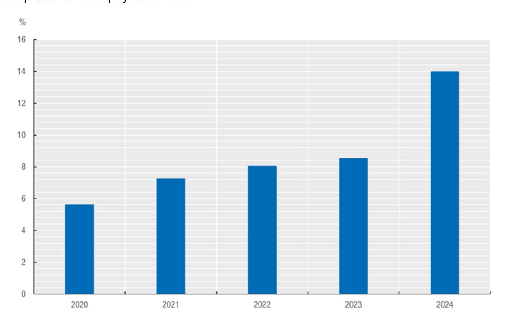

Note: The figure shows the unweighted average AI adoption rates across OECD Member countries by enterprises with ten employees or more, as reported in the OECD ICT Access and Usage by Businesses database. Further details about the underlying data for each country, the relevant definitions and methodology are available on the OECD Data Explorer, in OECD (2024[2]), and in Table A.1 in the Annex for G7 countries. Comparisons over time should be made with caution, as the averages are calculated based on different groups of OECD Member countries, and definitions may vary across countries and time periods.

Sourc[e: OECD ICT Access and Usage Database,](https://oe.cd/dx/ict-access-usage) accessed in July 2025.

**Zooming-in on firms' core business functions and operations, AI adoption was below 10 percent in G7 countries in 2024**. Focusing on G7 countries, and addressing comparability challenges in aggregate statistics, OECD analysis shows that AI adoption in core business functions – related to the production of goods and services – ranges from 1.9% in Japan to 6.1% in the United States in 2024, confirming that there is room for further integrating AI in firms' core business activities in the future (Filippucci et al., 2025[3]).

**AI has the potential to be highly pervasive.** While adoption by firms remains relatively limited, AI usage by individuals and workers – particularly with regard to generative AI – tends to be higher. For instance, in the United States, survey estimates show that about 40% of the population aged 18-64 used generative AI either at work or at home as of late 2024, and more than 22% of workers used it at least once in the last week for work, with overall adoption faster than other general-purpose technologies such as personal computers or the internet (Bick, Blandin and Deming (2024[4]); see also OECD work by Calvino, Haerle and Liu (2025[5]) for further discussion).

**Looking ahead, the generative capabilities of recent AI models, combined with their intuitive use, may offer firms opportunities to integrate AI more seamlessly into their processes and generalise its use across functions.** OpenAI's analysis of ChatGPT usage indicates that, as of July 2025, the number of weekly active users had reached 700 million, with 27% of the 2.6 billion daily messages being work-related. Anthropic's report on the use of its Claude chatbot shows that G7 countries lead global usage, with the global share of Claude users as compared to the share of the global working-age population ranging from 1.4 in Italy to 3.6 in the United States (Chatterji et al., 2025[6]) (Appel et al., 2025[7]).

#### **Adoption gaps between SMEs and large firms**

**AI adoption is consistently lower among SMEs than large firms**. Data from the OECD (see [Figure](#page-8-2) 1 and [Table](#page-59-1) A.1 in the Annex) highlight that, across the OECD, while 40% of firms with 250 or more employees were using AI in 2024 (or in the most recent available year), only 20.4% of firms of between 50 to 249 employees and only 11.9% of firms with between 10 and 49 employees used AI. Although these gaps are also evident for the adoption of other data-driven technologies, such as cloud computing or the internet of things, they are even larger in the case of AI (OECD, 2024[8]). In fact, while firms with 10-49 employees were about half as likely to purchase cloud computing services or use the internet of things than large firms, they were less than one-third as likely to use AI. AI adoption gaps between SMEs and large firms are observed across all G7 countries (see [Figure](#page-61-0) A.2 and [Table](#page-60-1) A.2 in the Annex).

**Gaps between SMEs and large firms are evident across different AI applications.** For instance, the 2024 Eurostat data show that European SMEs are lagging behind large firms in all AI applications considered [\(Figure](#page-10-0) 2), which include text mining, speech recognition, natural language generation, image recognition and processing, machine learning for data analysis, AI applied to robotic process automation or to autonomous robots, drones and self-driving cars. In 2024, the domain of application for which the adoption gap between firms of more than 250 employees and firms of 10 to 49 employees was largest was autonomous robots, self-driving vehicles, autonomous drones (7.2% vs. 0.7%). Smaller adoption gaps were observed for natural language generation (16.7% vs. 4.6%), possibly reflecting the relative ease of access to the relevant tools.

**SMEs and large firms also use AI for different purposes.** Eurostat data show that, in the European Union in 2024, gaps between small and large enterprises are evident in AI use for logistics, research and development or Information and Communication Technologies (ICT) security. A notable exception is AI use for marketing or sales purposes where, among firms using AI, small enterprises exhibit a slightly higher share than large ones. This is an area where SMEs have been leveraging the most the potential of generative AI, as highlighted in a recent representative OECD survey (OECD, 2025[9]). The survey however also shows that while a sizable share of micro and SMEs use generative AI, it is mostly used for peripheral rather than core tasks, aiding operations without radically reshaping production processes. Among SMEs using generative AI, only 29% report using it in their core activities.

**Younger firms – including start-ups – have a higher tendency to use AI.** See for instance OECD analysis by Calvino and Fontanelli (2023[10]) for evidence on France and Germany; McElheran et al. (2024[11]) for evidence of high AI adoption among start-ups in leading cities or hubs in the United States; or further OECD work (Calvino et al., 2022[12]) for evidence of polarisation between young-small and oldlarge AI adopters in the United Kingdom.

**Gaps between SMEs and large firms persist even after accounting for sectoral composition.** Analysing official surveys across 11 OECD Member countries with a harmonised methodology, OECD analysis has shown that when comparing firms operating in the same sectors, and even after accounting for the role of other confounding factors such as firm age or assets composition, larger firms are still more likely to use AI than SMEs (Calvino and Fontanelli, 2023[10]). See also McElheran et al. (2024[11]) for evidence on the United States, or further OECD work (Calvino et al., 2022[12]) for evidence on the United Kingdom.

**Figure 2. Share of enterprises using AI across OECD Member countries by size, 2024 or latest available year**

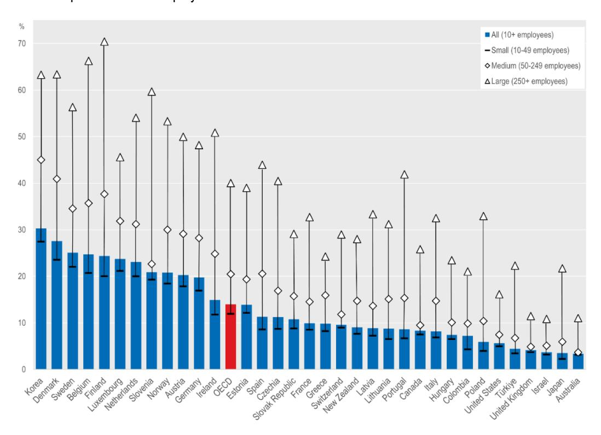

Note: The figure shows AI adoption rates across countries for enterprises with ten employees of more, as reported in the OECD ICT Access and Usage by Businesses database, distinguishing small (10-49 employees), medium (50-249 employees), and large (250 or more employees) enterprises. Further details about the underlying data for each country, the relevant definitions and methodology are available on the OECD Data Explorer, in OCDE (2024[8]), and in Table A.1 in the Annex for G7 countries. Latest available years are 2020 for Colombia, Israel, United Kingdom; 2021 for Japan, Switzerland, United States; 2022 for Australia, New Zealand; 2023 for Canada, Korea; 2024 for the remaining countries. Comparisons across countries should be made with caution given that years and definitions may differ across countries. Source[: OECD ICT Access and Usage Database,](https://oe.cd/dx/ict-access-usage) accessed in July 2025.

**Figure 3. Enterprises using AI technologies by type of AI technology and size class, EU, 2024**

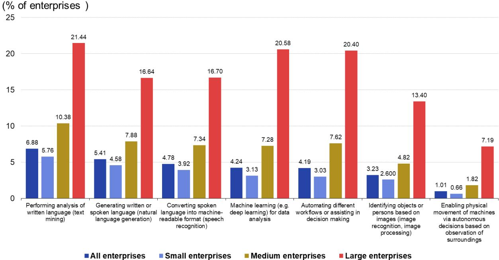

Note: The figure shows the share of enterprises using AI technology in the European Union in 2024, by type of AI technology used and by size class, distinguishing small (10-49), medium (50-249), and large (250+) enterprises. Further details about the metadata are available at [this li](https://ec.europa.eu/eurostat/cache/metadata/en/isoc_e_esms.htm)nk. Source: Eurostat (2025), Enterprises using AI technologies by type of AI technology and size class, EU, 2024 (dataset), [https://doi.org/10.2908/ISOC\\_EB\\_AI,](https://doi.org/10.2908/ISOC_EB_AI) accessed in July 2025.

#### **Sectoral patterns of AI diffusion**

**The use of AI varies across sectors, with adoption concentrated in ICT and professional services.**  OECD data highlight that in 2024, AI use reached almost 45% among firms operating in the ICT sector and more than 25% for those in the Professional, scientific and technical activities sector (see [Figure](#page-12-0) 4). These figures are well above the rates in sectors such as Construction (7.2%), Accommodation and food services activities (7.8%) and Transportation and storage (9.2%). Adoption gaps between the ICT and other sectors are also pervasive across G7 countries, with the ICT sector often having adoption rates more than three times higher than the manufacturing sector.

**The ICT sector exhibits the highest use of different AI applications.** Eurostat data suggest that, in the European Union in 2024, the ICT sector exhibits the highest rates of adoption of all AI applications considered, ranging from text mining – which exhibits the highest share of enterprises using AI, about 30% – to machine learning, or natural language generation, a key aspect related to generative AI. The main use of AI in the ICT sector appears related to R&D or innovative activity, highlighting the critical role of the ICT sector for the development of novel AI-based applications. Furthermore, OECD work focusing on different types of AI adopters in the United Kingdom, also highlights that the ICT sector appears particularly represented among firms with AI at the core of their business, while AI innovators and firms hiring AI talent tend to be more widespread across sectors (Calvino et al., 2022[12]).

**Figure 4. Share of firms using AI across OECD Member countries by sector and year (2021-2024)**

% enterprises with 10 employees or more

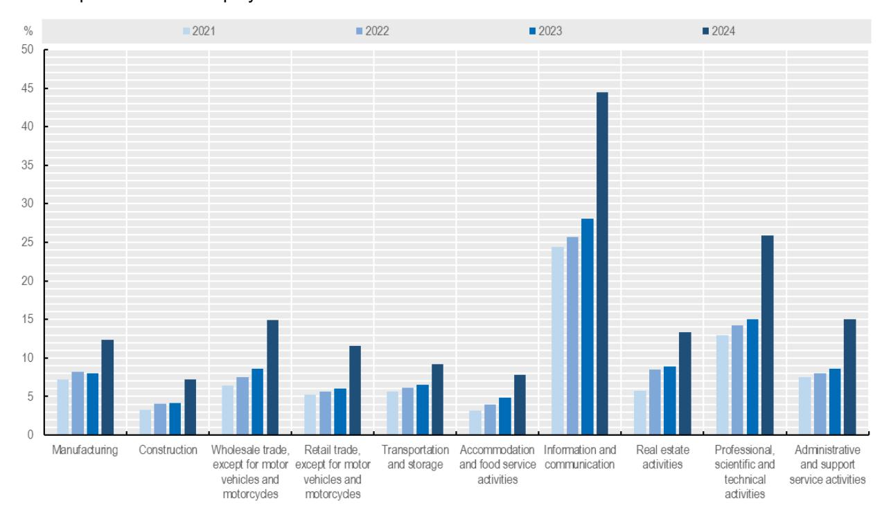

Note: The figure shows the unweighted average AI adoption rates across OECD Member countries for enterprises with ten employees of more by broad sector of economic activity, as reported in the OECD ICT Access and Usage by Businesses database. Further details about the underlying data for each country, the relevant definitions and methodology are available on the OECD Data Explorer, in OCDE (2024[8]), and in Table A.1 in the Annex for G7 countries. Comparisons over time should be made with caution, as the averages are calculated based on different groups of OECD Member countries, and definitions may vary across countries and time periods. Source: [OECD ICT Access and Usage Database,](https://oe.cd/dx/ict-access-usage) accessed in July 2025.

**The increasing adoption of AI is an all-sector phenomenon.** Firms from the ICT and professional service sectors remain overrepresented among AI adopters, but since 2021, firms from all sectors have been increasingly relying on AI. On average across OECD Member countries most sectors doubled their adoption rates between 2021 and 2024 [\(Figure](#page-12-0) 4). The largest absolute increases were observed in sectors that already had high adoption rates at the start. Notably, the ICT sector experienced an increase of 20 percentage points, Professional and scientific services of 13 percentage points, and the Wholesale trade sector of about 8 percentage points. Although adoption rates have also increased in the Transportation and storage and the Manufacturing sectors, these are sectors with lower relative increase in adoption rates over the 2021–2024 period, with increases of about 60% and 70%, respectively.

**AI-intensive sectors are leading in both adopting and shaping the technology**. Going beyond AI use, recent OECD work proposes a multidimensional approach to analyse the AI intensity of sectors, taking into account AI human capital, AI innovation, task exposure to AI, as well as AI use (Calvino et al., 2024[13]). Relying on this indicator suggests that ICT sectors – in particular the Media, IT services and Telecommunications sectors – score systematically high in the different dimensions of AI intensity [\(Figure](#page-13-1) 5). This highlights the fact that these sectors are not only relevantly adopting AI, but they are also actively driving its evolution by investing in talent and innovation. The Computer and electronics and the Legal and accounting sectors also demonstrate strong AI intensity, while sectors such as the Manufacturing of transport equipment or of Other machinery and equipment generally show medium levels of AI intensity.

**Figure 5. Sectoral taxonomy of AI intensity, by indicator**

Distribution of AI intensity across industries considered, by indicator

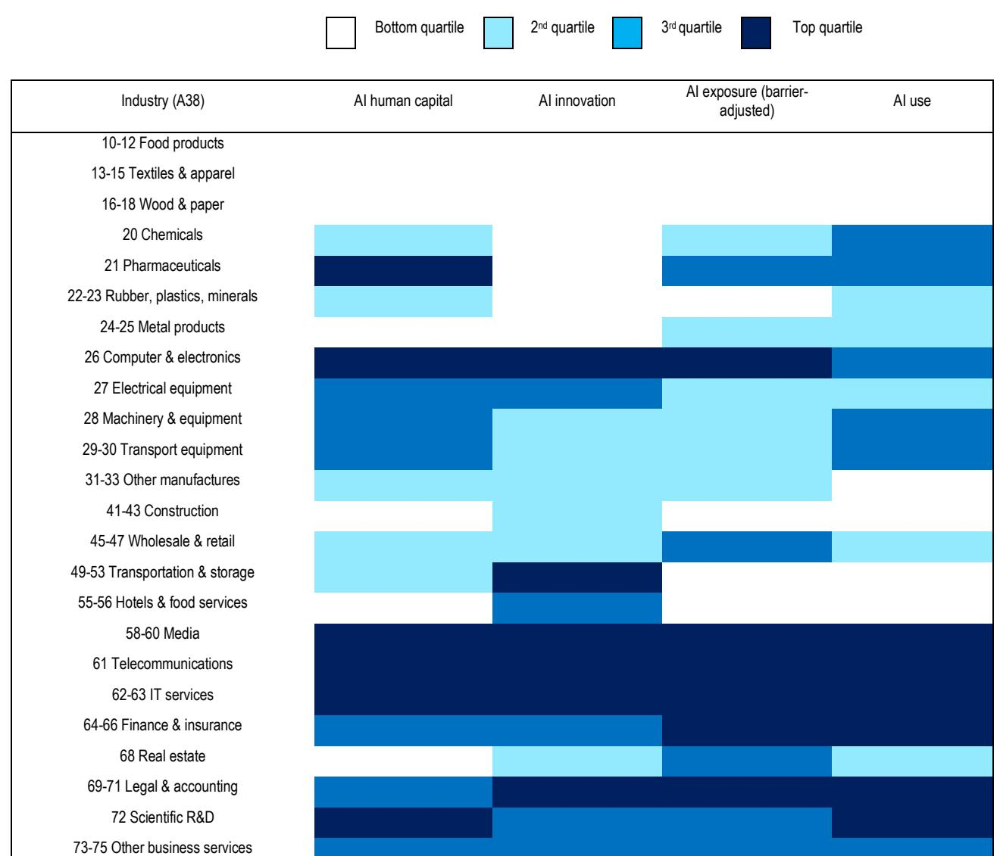

Note: all underlying indicators are expressed as sectoral intensities, where sectoral values represent averages across countries and years. The colour of the cells in the table corresponds to the quartile of the sectoral distribution to which the sector belongs. Sectors considered are A38 industries within manufacturing (excluding coke and petroleum), construction and business services. Source: Calvino et al. (2024[13]).

#### **Beyond adoption: The links between AI use and productivity**

#### *AI has the potential to increase productivity*

77-82 Admin. & support services

**The potential of AI as a general-purpose technology has yet to fully materialise and broader adoption by SMEs can help maximise its associated benefits.** The fact that ICT and professional services are the sectors with the highest share of AI adoption is not surprising since those are the sectors from which AI tends to originate. Nevertheless, AI exhibits strong potential for more widespread diffusion across sectors and firms (Calvino, Haerle and Liu, 2025[5]). In particular, given their currently low level of adoption, important gains can be achieved from adoption by SMEs across sectors.

**AI has the potential to boost long-run productivity growth.** While macroeconomic projections differ on the extent to which AI can drive output, its potential as a general-purpose technology offers an optimistic outlook, particularly regarding its capacity to fuel productivity. A recent OECD working paper (Filippucci et al., 2025[3]) estimates potential productivity gains from AI across G7 economies and finds that annual labour productivity growth stemming from AI could range from 0.2 to 1.3 percentage points over the next decade, depending on the adoption scenario. For comparison, labour productivity gains during the US ICT boom of the mid-1990s were estimated between 0.5 and 1.5 percentage points. Further productivity gains could also arise from AI enabling broader innovation in organisational structures and business models, considering the innovation spawning potential of the technology (see further discussion below).

**Gains from AI are likely to differ across G7 economies.** Japan and Italy could see annual labour productivity gains between 0.2 and approximately 0.8 percentage points over the next decade, while the United Kingdom and the United States may experience higher gains, ranging from 0.4 to 1.3 percentage points annually for the next 10 years (Filippucci et al., 2025[3]). In this study, the heterogeneity of gains from AI within and across countries is driven by several factors, including speed of AI adoption, capabilities of AI technologies and sectoral composition.

**Generative AI can be a key driver of productivity gains, in SMEs and beyond.** A recent OECD study suggests that generative AI exhibits key characteristics of general-purpose technologies that are critical for long-run growth, notably pervasiveness, significant improvement over time, and spawning of innovation across the economy (Calvino, Haerle and Liu, 2025[5]). Recent experimental evidence further highlights that generative AI can significantly boost productivity by contributing to automating tasks, enhancing skill development and transforming business operations. Generative AI can also boost innovation, by enhancing idea generation and creativity, accelerating R&D in academia and in the private sector, as well as fostering entrepreneurship, lowering entry barriers or supporting early-stage growth (see Calvino, Reijerink and Samek (2025[14]) for a comprehensive OECD review of such experimental evidence). In two non-representative OECD surveys of SMEs across all G7 countries in 2023 and 2024, respondents indicated that generative AI was the most used type of AI, hinting at how the low barriers to access in terms of costs and skills (partly thanks to "natural language queries"), at least for basic uses, are facilitating their uptake (Bianchini and Lasheras Sancho, 2025[15]; OECD, 2024[16])).

**SMEs already leverage generative AI to improve employee performance.** Recent OECD evidence shows that surveyed SMEs see improved employee performance as the main benefit of generative AI – also the main reported benefit among SMEs in Canada, Germany, Japan and the United Kingdom – followed by cost savings and performing new tasks (OECD, 2025[9]). Offering new products and services, competing with larger companies or increasing revenues were less reported. SMEs using generative AI for tasks considered core to the company were generally more likely to report benefits. The same survey also highlights the potential for generative AI to compensate for skill gaps experienced by SMEs, alleviating an important constraint on employee performance. 39% of SMEs that use generative AI and have recently experienced a skill gap said that generative AI had helped compensate for it.

#### *AI adoption is closely linked to high productivity at the firm level*

**Most productive firms have higher rates of adoption**. For instance, OECD analysis shows that the share of AI adopters in the top decile of the productivity distribution was 40% higher than in the bottom decile in France in 2018; it was 120% higher in Germany in 2018 and 240% higher in Italy in 2020 (Calvino and Fontanelli, 2023[10]). Similar patterns are also evident in more recent years (Calvino, Costa and Haerle, forthcoming[17]).

**Comparing companies of similar size, age and sector, AI adopters tend to remain more productive than non-adopters.** Productivity premia are relevantly evident in G7 countries and, when comparing firms of similar size and sector, estimates highlight in most cases premia over 4%, in some cases even higher than 15%. Recent OECD analyses based on representative ICT surveys (Calvino and Fontanelli (2023[10]); Calvino, Costa and Haerle (forthcoming[17]) show that across most countries analysed (including Canada, France, Germany, and Italy), AI users have significantly higher labour productivity than firms of similar size, age, and sector. A positive link between the use of AI and firm-level productivity has been also documented, among others, by Acemoglu et al. (2022[18]) and McElheran et al. (2024[11]) focusing on the United States, by Czarnitzki et al. (2023[19]) focusing on Germany, by Calvino et al. (2022[12]) focusing on the United Kingdom, or by Calvino and Fontanelli (2024[20])) focusing on France.

#### *But such productivity advantages may not be fully credited to AI*

**More competitive firms are more likely to adopt AI.** In fact, the positive link between firms' productivity and AI adoption appears to be explained – to a considerable extent – by the fact that some firms, which are already more digital and more competitive, are also more likely to adopt AI in the first place. The potential of AI to further strengthen their competitive edge suggests that existing divides between leading and other firms may widen in the future, with relevant implications for the economy and a relevant role for policymakers (see OECD (2024[21]) for further discussion).

**Productivity advantages of AI adopters depend on the digital capabilities of firms and workers.** The adoption of AI is more likely when supported by fast, widespread, reliable and affordable connectivity, which is a critical precondition for digital transformation, and by digital capabilities of firms – such as the use of cloud computing services or of other digital technologies – and of workers – notably their ICT skills, proxied by the presence of ICT specialists or relevant training. Once accounting for these factors, the productivity advantages of AI users tend to relevantly shrink (see for instance Acemoglu et al. (2022) for evidence focusing on the United States, and OECD work by Calvino and Fontanelli (2023[10]) or Calvino, Costa and Haerle (forthcoming[17]) for cross-country evidence). This suggests that supporting SMEs along these dimensions can be critical to boost both AI adoption and their productivity.

**Productivity gains in firms adopting AI may take time to fully materialise.** This is consistent with the idea that complementary investments are needed to leverage the returns stemming from general-purpose technologies (Brynjolfsson, Rock and Syverson, 2021[22]), meaning productivity may decline before increasing (resulting in productivity J-shaped dynamics), as highlighted, for example by McElheran et al. (2024[11]) focusing on US manufacturing firms. This evidence suggests that productivity returns depend on complementary investments and on the effective integration of AI systems in business operations, which not only hinge on key enablers but may also involve relevant organisational changes (Agrawal, Gans and Goldfarb, 2023[23]).

**Boosting diffusion, by supporting key enablers such as firms' digital capabilities and workers' digital skills, is critical to ensure widespread returns to AI adoption.** Diffusion can be boosted both across firms – notably among SMEs – and across sectors – beyond ICT and professional services. More widespread diffusion can help reduce the likelihood that inequalities between firms increase even further, considering the currently concentrated adoption of AI by large and more productive businesses. The role of key enablers to facilitate AI adoption by SMEs will be discussed more in detail in Section 4.

# **2 A proposed taxonomy of AI adopters**

#### **Objective**

**In light of the differences in AI adoption trends, this paper proposes a taxonomy of AI adopters that serves to identify the key barriers and enablers for SMEs at different stages of the AI adoption journey.** This taxonomy categorises firms by their digital maturity and the challenges and opportunities they face, supporting more targeted policy design.

#### **Key Dimensions**

#### **AI adoption is not a linear process but an iterative one, evolving across different usage categories**.

AI can be deployed across multiple dimensions of an SME's operations, from digital infrastructure and AIrelated human capital to the development of AI technologies (Calvino et al., 2024[13]). This framework builds on the analysis in this paper and previous work characterising AI adopters, which distinguishes between companies that carry out AI innovation and those who integrate AI into business practices or for specific tasks (Calvino et al., 2022[12]). It also builds upon the driving factors and challenges for SMEs identified in the 2024 G7 Italy report, including computational power, digital skills and competences, investment power, and managerial skills (Spallone and Bandiera, 2024[2]).

**This proposed taxonomy is structured around three key dimensions that define a company's AI transformation: digital maturity, complexity of AI use, and scope of AI application** (see [Table](#page-16-1) 1)**.** Recent empirical evidence from the OECD and the academic literature highlights the strong interdependencies among these three dimensions and their relationship with the overall level of AI adoption.

**Table 1. Key dimensions of the proposed taxonomy**

| Dimension               | Definition                                                                                                                                                                                                                                                                                                                               |  |
|-------------------------|------------------------------------------------------------------------------------------------------------------------------------------------------------------------------------------------------------------------------------------------------------------------------------------------------------------------------------------|--|
| Digital maturity        | Digital maturity reflects how fully an organisation has integrated digital technologies into its operations, strategy, and culture, including both the technical adoption of tools and the human and organisational capabilities needed to use them effectively, such as workforce skills, leadership, and openness to innovation. |  |
| Complexity of AI use    | Complexity of AI use refers to the technical depth and intended purpose of the AI tools employed. It spans a wide range of applications, from embedded AI features in everyday software and "off-the-shelf" models to advanced, tailored systems and frontier AI deployments.                                                      |  |
| Scope of AI application | Scope of AI application refers to the extent to which AI tools are integrated across a firm's internal functions and processes. It captures the breadth of adoption, ranging from isolated use by individual employees or teams to enterprise-wide integration that supports both operations and strategic decisions.              |  |

**More digitally mature firms tend to make more use of AI.** This is partly because the successful deployment of AI technologies can itself act as a catalyst for advancing a firm's digital maturity. The broader integration of AI, both in scope and in the complexity of use cases, drives firms to upgrade digital infrastructure, enhance data practices, and develop internal capabilities. However, it also reflects the fact that a certain level of digital maturity is often a prerequisite for effective AI adoption. OECD evidence across countries highlights the role of digital infrastructure and capabilities, including ICT skills, as key complementary assets in enabling uptake (Calvino and Fontanelli, 2023[10]) (Calvino, Criscuolo and Ughi, 2024[24]). Robust digital infrastructure is critical not only for advanced AI use, such as training proprietary algorithms, but also for deploying complementary technologies like big data or cloud computing, whose productivity gains take time to materialise (Brynjolfsson, Rock and Syverson, 2021[22]). For instance, AI uptake is higher among firms using cloud-based services, highlighting the key interdependencies between AI and "enabling" digital technologies (see e.g. McElheran et al. (2024[11])).

**The complexity of a firm's AI use reflects its specific needs and capabilities**. As illustrated by a 2022- 23 survey of 800 AI-Adopting firms in G7 countries, large cross-firm differences exist in the level of digital and data readiness, which affect their ability to adopt AI. For small firms – especially those in the manufacturing sector – adoption obstacles include difficulty finding vendors of AI solutions tailored to their needs, lack of quality data and digital readiness, and the challenges of creating new business models (OECD/BCG/INSEAD, 2025[25]). To address these gaps, and due to resource constraints, many firms turn to "off-the-shelf" models, while others pursue in-house development or customise existing tools. Calvino and Fontanelli (2024[20]) show that French firms developing AI internally achieve more significant returns to AI adoption than those sourcing AI externally. At the upper end of this spectrum, a smaller group of SMEs experiment with frontier-level AI – including advanced foundation or multimodal models, and in some cases agentic systems – which typically requires stronger data and compute than "off-the-shelf" tools.

**The scope of AI applications also varies significantly, even within sectors and firm sizes.** While some businesses integrate AI across their operations, others apply it only in specific areas: some apply it to front-end services, others to back-end operations. This is despite the fact that some AI technologies (such as text mining, machine learning, and automation) show wide applicability across functions (Calvino and Fontanelli, 2025[26]). Harnessing the potential benefits of AI across a firm's operations will therefore depend not just on the technology itself but on how well AI-related decisions are co-ordinated within the organisation (Agrawal, Gans and Goldfarb, 2023[23]).

#### **Taxonomy**

**The proposed Taxonomy of AI Adopters highlights that AI uptake and deployment at the firm level is a non-linear, nuanced, and iterative process** (see [Figure](#page-18-0) 6). A company's level of digital maturity is both a prerequisite and a consequence of its AI adoption practices. SMEs that are more digitally mature are more likely to adopt AI; successful AI adoption, in turn, enhances their digital maturity, both in tangible ways, such as improved processes, and intangible ones, such as organisational learning and culture.

**The taxonomy also recognises that SMEs adopt differing approaches to the complexity and scope of AI use, whether choosing off-the-shelf products or developing customised tools, or whether deploying AI tools in a single department or integrating them across the entire enterprise**. As with any taxonomy, this framework aims to strike a balance between complexity and parsimony. It helps identify commonalities and distinctions amongst the diverse profiles of SME AI adopters, with the objective of informing more targeted and effective policies.

**Figure 6. Taxonomy of AI adopters**

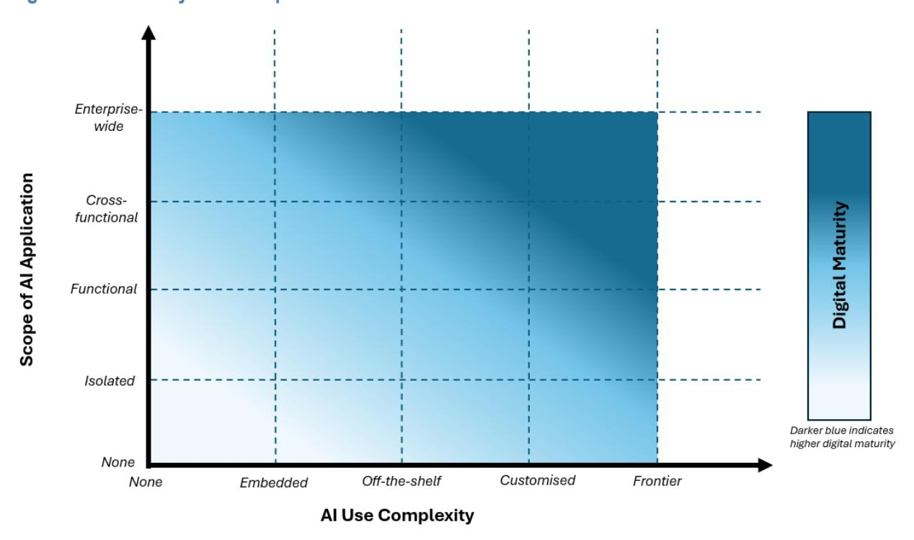

Note: Descriptions and examples of variables provided in Tables 2 and 3 below.

**Table 2. Scope of AI application**

| Label            | Description                                                                                                                                        | Example                                                                                                                                                                                                                                    |
|------------------|----------------------------------------------------------------------------------------------------------------------------------------------------|--------------------------------------------------------------------------------------------------------------------------------------------------------------------------------------------------------------------------------------------|
| None             | The SME does not use AI in any strategic or operational capacity.                                                                               | A local pharmacy relying only on paper-based record keeping.                                                                                                                                                                            |
| Isolated         | The SME applies AI in single use cases by specific individuals or teams, typically for exploration or proof of concept.                      | A customer service team deploys a chatbot to handle frequently asked questions, without integration with other systems.                                                                                                              |
| Functional       | The SME uses AI tools to support discrete tasks within a small number of functions, without integration or shared infrastructure.            | A marketing agency uses ChatGPT or LeChat for drafting content and generating images for campaigns, but without co-ordinated workflows.                                                                                              |
| Cross-functional | The SME uses multiple AI tools in most departments, with growing co-ordination, shared data resources and emerging governance mechanisms. | A mid-sized online retailer uses AI across several departments with growing co-ordination: Claude for product descriptions, Midjourney for promotional visuals, and Shopify-integrated AI for analytics and customer insights. |
| Enterprise-wide  | The SME embeds AI in virtually all functions, driving both strategic and operational decisions, supported by workforce-wide adoption.        | An insurance company embeds AI across underwriting, claims, customer retention and pricing, enabling leadership to make strategic decisions and streamline operations through a unified, intelligent system.                      |

**Table 3. Complexity of AI use**

| Label         | Description                                                                                                                                                        | Example                                                                                                                                                                                                                                            |
|---------------|--------------------------------------------------------------------------------------------------------------------------------------------------------------------|----------------------------------------------------------------------------------------------------------------------------------------------------------------------------------------------------------------------------------------------------|
| None          | The SME does not use AI in any strategic or operational capacity.                                                                                               | A family-run logistics firm using only paper-based systems for inventory tracking and delivery scheduling.                                                                                                                                      |
| Embedded      | The SME uses digital tools that include built-in AI features operating in the background, often without the user actively engaging with the AI itself.       | A small law firm using Microsoft Word's AI features for grammar correction and citation formatting, and an email service that has a spam blocker.                                                                                            |
| Off-the-shelf | The SME uses publicly available AI tools for creative, analytical, or communication tasks, with no internal integration.                                     | A tourism SME using Llama to draft multilingual marketing content; A design agency using Gemini for concept visuals.                                                                                                                         |
| Customised    | The SME tailors AI models to its specific needs by training models on proprietary data or tailoring off-the-shelf solutions to sector-specific applications. | A B2B enterprise embedding generative and retrieval models from Cohere to improve their workflows; A healthcare provider fine-tuning a diagnostic triage model based on local patient data.                                               |
| Frontier      | The SME deploys state-of-the-art AI systems in business critical or cross-task workflows, typically requiring stronger data and compute foundations.         | A consulting firm uses advanced multimodal models to gather, analyse, and summarise heterogeneous industry data for client delivery; An e-commerce SME runs agents to autonomously monitor and optimise ad campaigns across platforms. |

**By mapping SMEs onto the dimensions outlined above, common patterns of usage can be identified, enabling policies to be tailored to different categories of SME adopters.** The proposed taxonomy focuses on SMEs that are at various stages of their AI adoption journey, and whose transformation could be further enabled by targeted policy action. The four categories of SMEs identified – *AI Novices, AI Explorers, AI Optimisers, and AI Champions* – differ in the complexity of their AI use and the breadth of their applications (see [Figure](#page-20-0) 7). Boosting AI adoption amongst each of these groups requires addressing different key enabling factors (see Section 4).

**While not included in the proposed taxonomy, non-users and "AI-first" companies sit at either end of the matrix, with policy needs diverging from those of mainstream adopters.** Non-users often lack awareness, digital readiness, or are wary of potential risks, requiring policies aimed at spreading information that clarifies both the opportunities and limitations of this technology. "AI-first" companies' core products are built around AI, being at the forefront of AI innovation and development. Most firms in the taxonomy rather exhibit a demand for AI and this paper focuses precisely on the broad centre of the spectrum, where public policies are more likely to accelerate AI uptake and deployment among SMEs.

**Figure 7. Categories of SME AI adopters**

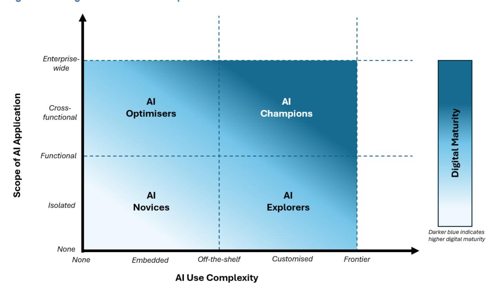

# **3 Case studies**

**Real-life examples of entrepreneurs and small businesses adopting AI provide valuable insights into the varied strategies, challenges, and outcomes of AI adoption among SMEs.** The OECD annual D4SME Survey, covering around 1 000 SMEs across 10 OECD Member countries including Canada, France, Germany, Italy, Japan, United Kingdom and the United States, offers illustrative cases of how generative AI is being embedded in business practices (Bianchini and Lasheras Sancho, 2025[15]; OECD, 2024[16]). While not representative of the entire business population in these countries, the survey highlights diverse adoption pathways across sectors and firm sizes. This section complements the D4SME survey findings with selected case studies from each G7 country, applying the proposed taxonomy of AI adopters to showcase SMEs at different stages of their AI adoption journey.

**Generative AI is a widely used form of AI by SMEs across G7 countries, with SME respondents consistently citing efficiency gains and enhanced innovation as its primary benefits**. In Germany, Italy, Japan, the United Kingdom and the United States, around 70-80% of respondents noted that generative AI can boost innovation. Meanwhile, over 90% of SME of respondents in Japan highlighted generative AI's innovation potential. While efficiency and innovation were the most frequently cited advantages, fewer SMEs mentioned benefits such as generating new revenue streams or reducing staffing needs.

**Despite these benefits, significant adoption challenges remain, as SMEs across G7 countries continue to express concerns about inaccurate information, harmful content, legal and copyright issues**. Harmful content ranked among the top concerns for over 90% of US respondents and more than 80% in the United Kingdom and Canada. Inaccurate information was flagged by over 80% of SMEs in Japan and the United Kingdom, while copyright and legal issues were cited by 90% of Canadian respondents and over 80% in the United Kingdom and the United States.

#### **AI Novices**

**AI Novices are just starting out on their AI journey, leveraging lessons learned from their digital transformation and applying them to the emerging AI wave.** Their AI use is limited either in scope or complexity, often restricted to isolated use cases involving specific individuals or teams, or a small number of business functions, with minimal interconnectivity. In terms of complexity, they typically rely on AI embedded in existing digital tools (also known as "passive AI") or off-the-shelf solutions like LLMs.

**Selected cases show that AI Novices often rely on existing expertise developed through extensive use of digital tools and digital infrastructure.** This foundation gives them confidence to begin experimenting with AI. Their adoption typically involves off-the-shelf AI models – mainly LLMs – for tasks related to writing, marketing, online sales, and optimisation of internal processes.

#### **Box 1. Small coffee roaster in the United States**

**Located in San Francisco, California, a small coffee roaster is using off-the-shelf AI products to optimise its processes.**

The business was using digital tools before the rise of generative AI, relying on them mainly for online sales. The owner of the company notes that "*45% of [their] business comes from [their] e-commerce channel where coffee is sold directly to consumers in the US and Canada. [They] use many tools to build/maintain [their] website, manage orders, print shipping labels, etc*."

The rise of generative AI has allowed the company to take this even further, using off-the-shelf products like ChatGPT for multiple use cases. This includes "*coming up with product descriptions, updating SEO [Search Engine Optimisation], writing marketing emails, and analysing shipping costs*." The owner of the company has even begun to experiment with more creative uses, relying on ChatGPT to explain how to create an automated system to remove static build up from grinding coffee, a previously timeconsuming process.

> *"The biggest benefit is helping me be more efficient with my time. A large issue is to not fully trust it, and always triple check the output that it provides."*

#### **Box 2. Freelance photographer in Germany**

**Located in Hamburg, Germany, a freelance photographer is using AI and digital tools to run his business.** 

A freelance photographer from Germany has begun experimenting with various AI products in his work, ranging from the setting up of appointments to post-production. Even before the rise of AI, he was using digital tools such as a website and online links to set up appointments and manage payments.

The photographer now uses off-the-shelf LLMs for research of potential business opportunities, improving workflows, and educating himself on new trends. He believes that his "*peers are insecure about AI adoption*", but notes that AI can help to "*manage the environment and network of his business."*

| "Now is the time to adopt AI – it's not too far away." |  |
|--------------------------------------------------------|--|
|--------------------------------------------------------|--|

#### **AI Optimisers**

**AI Optimisers are more advanced in their adoption, comfortably using a wide variety of digital tools and integrating off-the-shelf AI products, including LLMs, across multiple departments for a broad range of use cases.** They have incorporated platforms like ChatGPT,

Gemini, LeChat, Cohere, and Shopify into their daily operations. They realise productivity gains in areas such as marketing content creation, cross-departmental writing and drafting, and the generation of creative visual concepts.

**AI Optimisers have advanced beyond the Novice stage and are very comfortable using a wide variety of AI tools**. Moving past simple use cases such as LLMs for writing, they are experimenting with video and music creation, online sales tools, and even 3D printing. They are not creating custom models but rather utilising a wide variety of readily available off-the-shelf tools in a cross-functional way. Unlike AI Novices, there is growing co-ordination amongst the company's use cases.

#### **Box 3. Local artisan bakery in France**

**Located in Sèvres, France, an artisan bakery uses a wide variety of AI tools to create custom-made cookies with personalised wishes and greetings for special occasions.** 

Even before the rise of generative AI, the company was relying on digital tools for its day-to-day operations. The team utilised "*Shopify, Trustpilot and Google my Business for online sales and Google Ads and Meta Ads for better communication and social media management*." They also used 3D printing and graphic design software for personalisation of biscuits.

This relatively high level of digital maturity enabled the company to seamlessly integrate off-the-shelf AI tools into its workflows. This includes using "*ChatGPT for customer service response support and creation of blog and social media content" a well as more creative uses such as "optimisation of recipes and improvement of security and HR processes*." The company also uses "*MidJourney for the creation of visuals, graphic retouching, and product ideation*." The founder of the company highlights that the company must "*remain attentive to the consistency and 'human touch' of their creations*" while using these tools.

> *« L'intégration s'est faite de manière totalement autodidacte, portée par notre curiosité et notre volonté d'innover. »*

English translation: "The integration process was completely self-taught, driven by our curiosity and our desire to innovate".

#### **Box 4. Small bag manufacturer in Italy**

**Located in Provaglio d'Iseo, Brescia, a small bag manufacturer is utilising off-the-shelf AI products to streamline processes.**

Specialising in the production and trade of flexible packaging, this SME is utilising AI products to automate parts of their workflows. They rely mainly on off-the-shelf AI tools such as "*ChatGPT, Gemini, Co-Pilot"* as well as machine learning models. These tools have allowed the company to improve analytics of its production capacities, streamlines processes, and automate operational flows.

In noting the benefits to their company, the manufacturer mentions "*speed, efficiency, deep analysis, finding better solutions, and the ability to solve new tasks."* However, challenges remain such as the integration of AI within the broader ecosystem and the need to calibrate learning amongst employees. The company has benefited from Italian government support along the way in its AI adoption journey.

*"The main challenge is integrating AI within the broader company ecosystem."*

#### **AI Explorers**

**AI Explorers are ready to take the next leap by developing custom AI models, including training models on their own data or experimenting with agentic workflows.** Typically found in data-intensive sectors such as manufacturing and ICT, they possess the high-skilled workforce required for such initiatives. However, their AI use remains function-specific or isolated, not fully realising transformative change across the entire company yet.

**AI Explorers have carved out niche applications by developing or customising AI tools to meet specific needs.** Whether developing their own AI tools for language translation or deploying agentic AI for customer service, they focus on more complex use cases, albeit for a limited number of applications. As micro and small companies, their agility enables them to experiment and deploy effectively these tools in functional use cases.

#### **Box 5. Micro wholesale trade company in Japan**

**Located in Tokyo, Japan, a micro-sized B2B company, specialising in wholesale trade between local manufacturers and global clients, utilises custom AI agents to streamline communications and sales.** 

Taking a service sector perspective, the company identified several challenges that make it difficult for local manufacturers to sell globally, including "*a lack of resources, language barriers, and delays in response times*." Recognising that AI can fill some of these gaps, the SME began creating custom AI agents to handle Q&As, facilitate project negotiations, and power a multi-language translated chat function.

According to the company, the use of these AI tools has had positive effects. For sellers this leads to "*increased revenues and employee time saved on certain tasks such as accepting inquiries, invoicing, and shipping*". For global buyers, this means "*less time spent on market insights and product development as well as shorter negotiation cycles, faster responses despite time zones, and ease of communication*".

> *"Our key value is that AI has helped us connect the two sides with no stress or language barrier, saving cost and time."*

#### **AI Champions**

**AI Champions are leading the way when it comes to AI adoption, deploying AI widely across the business to support a broad range of tasks and inform operational and strategic decision-making.** AI is embedded at all levels of the organisation, enhancing workflows and streamlining operations through unified, intelligent systems. These businesses are characterised by optimised operations and data-driven decision-making processes. AI agents may be used to automate and co-ordinate workflows.

**Selected cases of AI Champions show that some SMEs are deploying highly advanced AI systems throughout the entire enterprise, making advances in both their product offerings and in their internal operations**. SMEs in this category use advanced LLMs, natural language processing, computer vision and other complex AI applications to underpin their product offering and offer a wide variety of services. They note the benefits of such AI-enabled workflows including efficiency and scale as well as the challenges that come with training and proper deployment of these tools.

#### **Box 6. Small healthcare company in Canada**

**Located in Calgary, Alberta, a small healthcare technology company, specialising in advanced electronic medical records, is increasingly using digital tools and AI to enhance both its product offerings and internal efficiency.**

The SME supports an advanced medical record platform and a suite of digital healthcare tools – all built on top of high-performance Amazon Web Services cloud infrastructure. This has enabled the SME to leverage the power of AI - especially large language models (LLMs), natural language processing (NLP), and computer vision - to develop products such as clinical note transcription services and lab reports analysis.

The company leverages AI not just for its product offerings but for improving its own internal processes. It leverages "*HubSpot for customer management and automation, Google Workspace for efficient team collaboration, and JustCall to ensure responsive, high-quality customer interactions"* as well as Gemini and ChatGPT for transcribing internal meetings, conducting research, drafting, ideation workflows, and technical documentation.

The company received government support through Canada's Health Infoway's Vendor Innovation Program (VIP), an initiative designed to support health technology companies driving innovation in Canada's digital health ecosystem.

> *"While AI improves our internal processes, every customer interaction remains personal."*

#### **Box 7. Small biotech company in the United Kingdom**

**Located in Cambridge, England, a small biotech SME is using custom AI tools to underpin drug discovery for rare diseases and to optimise its own processes. and bring effective treatments to rare disease patients.** 

The SME has developed its own machine learning models able to predict hidden therapeutic opportunities for rare diseases. These models are based on the company's own "*knowledge graph and knowledge base systems for rare diseases, capable of integrating more than 50 relevant structured and unstructured data sources, as well as curated data on relevant diseases and drugs*." The SME highlights the many benefits of AI integration while also recognising the need to address some of the challenges.

The company notes that their engineering and scientific teams are also "*extensively using LLM-based coding assistants (Copilot, Sonnet, Gemini, etc.) and development tools (Claude Code, Codex)"* citing efficiency and productivity gains. More recently, they have started "developing AI agents and AI tools to help in identifying relevant data to our drug discovery programmes." The uses go beyond the engineering teams; the company has developed internal LLM-based chat interfaces to make internal documentation and access to internal data easier for the whole organisation.

> *"We use internal LLM-based chat interfaces to expose more freely the power of LLMs to empower the whole company."*

## **4 Key enablers to facilitate AI adoption by SMEs**

**Boosting AI adoption hinges on key enablers.** These include i) connectivity; ii) AI-enabling inputs; iii) skills; and iv) finance. These are at the centre of the key recommendations for policymakers in the OECD Recommendation on Artificial Intelligence (and the [OECD AI principles](https://www.oecd.org/en/topics/ai-principles.html) therein) [\[OECD/LEGAL/0449\]](https://oecd.ai/en/assets/files/OECD-LEGAL-0449-en.pdf), and are critical for SMEs, which often lag in some of these dimensions and could benefit from support in line with their needs, digital maturity, and aspirations as highlighted in the OECD Recommendation on SME and Entrepreneurship Policy [\[OECD/LEGAL/0473\].](https://legalinstruments.oecd.org/en/instruments/OECD-LEGAL-0473)

**Focusing on key enablers can bring double dividends.** Boosting connectivity, enabling access to finance, to quality AI inputs (data, algorithms and compute), and strengthening skills can boost business productivity as well as stimulating greater AI adoption. Recent OECD analysis highlights that digital capabilities of firms and workers are key drivers of both AI adoption and firms' productivity (Calvino and Fontanelli, 2023[10]).

**One size does not fit all: firms with varying levels of digital maturity may require different instruments to boost their capabilities and their ability to leverage the potential of AI.** While the key enablers discussed in this section are critical for AI diffusion among SMEs, their impact depends on SMEs' characteristics, notably in terms of digital maturity, on the scope of AI applications and on the complexity of AI use – as suggested in the proposed taxonomy. Firms with varying levels of digital maturity may require different instruments to boost their capabilities and their ability to leverage the potential of AI. Some AI applications may require higher upfront or complementary investments or more specialised technical skills. This includes considerations about whether applications are computationally or data intensive or rather rely on turnkey AI solutions, such as ready to use generative AI tools. Acknowledging the complementarities among the key enablers outlined and the heterogeneity among SMEs' AI use cases is critical for the effectiveness of policies aimed at boosting AI adoption across the economy.

#### **Connectivity**

**There has been progress in the expansion of high-quality connectivity across OECD Member countries, including G7 members.** "Future-proof" technologies, like fibre and 5G, have expanded their footprint, (OECD, 2025[27]). As of June 2024, OECD Member countries averaged 36 fixed broadband subscriptions per 100 inhabitants. In G7 countries, Japan leads the way with fibre representing 79% of total fixed broadband subscriptions, followed by France with 70%. However, Germany lags below the OECD average in terms of fibre deployment with only 12.2% of fibre connections over total fixed broadband (OECD, 2024[28]) Fixed wireless access (FWA) only represents 5.1% of fixed broadband subscriptions across the OECD, it has also seen notable growth, particularly in the United States and the United Kingdom, which recorded increases of 39% and 30.4% compared to the year before, respectively. FWA is attractive in countries facing geographical challenges with sparsely populated areas, like Canada (OECD, 2025[29]). In Canada, FWA solutions are also gaining traction, accounting for 7% of fixed broadband. At OECD level, the share of small and large firms having access to high-speed broadband has been steadily increasing over the last 5 years, while the gap between different size classes remains approximately constant.

**This increase in high-quality connectivity is crucial because access to fast, reliable, and affordable connectivity is a pre-condition for SMEs' digital uptake** (OECD, 2021[30])**.** Academic literature shows that for SMEs, AI readiness is "intricately linked to their IT and technological infrastructures" (Schwaeke et al., 2025[31]). AI technologies are highly integrated, working alongside other systems, rather than in isolation. Therefore, if AI readiness is low, SMEs may perceive investments in AI as excessive (Chowdhury, Budhwar and Wood, 2024[32]). This underlines the need for a holistic perspective when thinking about AI readiness – one that considers existing digital infrastructure and how AI integration is embedded into companies' processes (Polas et al., 2022[33]).

**Nevertheless, the gap between large and small firms' adoption of high-speed broadband across the OECD has persisted in recent years.** From 2021 to 2024, across the OECD, small and large firms had a consistent difference in adoption rates of around 25 percentage points (see [Figure](#page-29-0) 8) (OECD, 2024[34]). These differences matter because fast broadband can foster the adoption of enabling technologies and management software (Calvino et al., 2022[35]), investments in ICT capital as well as the use of big data analytics (Calvino, Costa and Haerle, forthcoming[17]). This is because advanced AI systems often require specialised computing infrastructure not only during the initial developmental phase (predeployment) but also during the course of operation (post-deployment). Maintaining such high computing power and connectivity requires high-quality internet infrastructure as a critical input (Filippucci et al., 2024[36]). Moreover, connectivity is important not just for specialised computing infrastructure (Scale-up AI policy) but also for the diffusion across sectors of the economy to unlock productivity gains and innovation at scale (Scale-out AI policy) (OECD, 2023[37]) (Filippucci et al., 2024[36]).

**Figure 8. Differences in high-speed broadband adoption between small and large firms in OECD Member countries (%)**

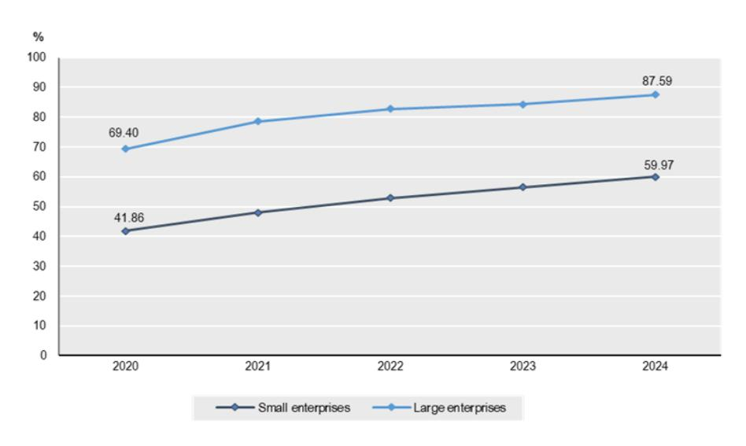

Note: High-speed broadband connection is defined for download speed at least 100 Mbps. Adoption rates are the percentage of enterprises in the ICT survey that answered having access to a high-speed broadband connection in the country. Cross-firm divides are differences in penetration rates between small and large firms in OECD Member countries (median). Data only cover enterprises with 10 or more employees. Small firms employ 10-49 persons, and large firms 250 and more persons.

Source: OECD calculations based on OECD (2024) [OECD ICT Access and Usage Database,](https://oe.cd/dx/ict-access-usage) accessed in July 2025.

**Furthermore, while connectivity performance is vastly improving across all regions, disparities between urban and rural areas remain**. The latest OECD connectivity study, referenced above, leverages novel data for over 60 countries on various broadband indicators, allowing it to assess broadband performance and availability a subnational level in the urban-rural continuum. It finds that while between 2019 and 2024, median fixed broadband speeds more than tripled, from 53 Mbps in Q4 2019 to 178 Mbps in Q4 2024, fixed download speeds in metropolitan areas were, on average, 44% higher than in regions far from urban centres at the end of 2024 (OECD, 2025[27]). There were similar disparities in mobile download speeds, with the absolute gaps in levels of mobile speeds between metropolitan regions and regions far from metropolitan areas growing from 5 Mbps to 45 Mbps between 2019 and 2024 (OECD, 2025[27]).

**These gaps in accessibility in rural areas can hold back both digital innovation and adoption** (OECD, 2023[38]). Evidence shows that broadband adoption can enhance a firm's propensity to engage in trade and increase firm scale and universal broadband policies that may lead to economic benefits for firms in rural areas, in particular, in knowledge-intensive sectors (Kneller and Timmis, 2016[39]) (DeStefano, Kneller and Timmis, 2022). Overall, measures that seek to improve access to communication networks and services in rural regions are crucial to foster productive opportunities for small and medium-sized businesses.

#### **AI-enabling inputs**

**Once firms have access to digital infrastructure, AI-enabling inputs become critical: data, algorithms and compute**. These include other digital technologies such as relevant software, as highlighted by recent OECD analysis across 11 countries (Calvino and Fontanelli, 2023[10]) or by Zolas et al. (2020[40]) and McElheran et al. (2024[11]) focusing on the United States. Access to data, algorithms and compute, sometimes referred to as the "AI production function" (OECD, 2023[37]) is a key enabler for certain types of AI adoption. While the AI production function is usually more relevant for those training or adapting AI systems themselves, such as with foundation models – AI models that can be adapted, or fine-tuned, to a wide range of downstream tasks – it is also a key factor for SMEs deciding if they should deploy their own AI applications or use off-the-shelf AI models.

**Access to quality datasets, algorithms and AI compute resources can unlock the potential of AI.**  An OECD study highlights that "enhancing access to and sharing of both public and private-sector data can help unlock significant social and economic benefits, potentially contributing between 1% and 2.5% of GDP" (OECD, 2019[41]). Many of these benefits derive from the fact that data created in one domain and sector can provide further value when applied in another domain or sector" (OECD, 2019[41]). However, SMEs' internal company data are not always readily available for AI use (OECD, 2024[8]). SMEs often lack the resources to collect or prepare the vast amounts of data needed to train AI systems effectively and poor or suboptimal data may even have inverse effects, leading to suboptimal models (Proietti and Magnani, 2025[42]). At the same time, the volume of data required for SMEs to train their own AI systems is likely to increase the internal capacity for data management and for addressing greater exposure to digital security risks (OECD, 2021[43]).

**Access to compute is important for SMEs looking to develop custom AI solutions.** The more complex and data-driven the AI model, the more computational power is needed to deliver results (OECD, 2023[37]). However, SMEs often struggle with access to compute due to high costs, data security and privacy concerns, and insufficient resources. A survey carried out by the government of Canada in 2024 found that the most common method of accessing compute is through hyperscale public cloud solutions like Amazon Web Services, Microsoft Azure, or Google Cloud Platform (Innovation Science and Economic Development Canada, 2024[44]). The same survey found that, for start-ups especially, there is a problem of availability of short-term contracts for advanced GPUs as well as access to cloud services being limited due to tiered prices (Innovation Science and Economic Development Canada, 2024[44]).

#### **Skills**

**To make efficient and effective use of the above resources, SMEs require the right skills.** The availability of the right skills is a key indicator of a firm's digital maturity and their ability to implement both basic and advanced AI applications. For instance, a 2022 OECD study found that firms with a high share of high-skilled workers are typically more likely to adopt digital technologies (Calvino et al., 2022[35]). This is especially true for smaller firms, where a higher share of skilled top executives – and to some extent high-skilled middle managers – means they are more likely to adopt digital technologies and exhibit higher returns to adoption.

**SMEs consistently cite a lack of skills as a major impediment to AI adoption.** In an OECD survey covering four G7 countries, 50% of SMEs report that their employees lack the skills to use generative AI (OECD, 2025[9]). While skill shortages affect firms of all sizes, SMEs and entrepreneurs tend to be more vulnerable to short-term imbalances compared to large firms (OECD, 2023[45]). In the same survey, approximately one third of SMEs reported worker shortages and a similar proportion cited insufficient skills or experience among staff (see [Figure](#page-31-1) 9). Consistently, the 2025 OECD D4SME survey across six G7 countries found over 50% of nearly 1 000 respondents reported lack of knowledge about how to use generative AI as a barrier to adoption, with wide variation (80% in Japan, 50% in Canada 50%, 40% in the United Kingdom and Germany) (Bianchini and Lasheras Sancho, 2025[15]). Internet research, knowledge sharing between employees and AI literacy were mentioned as some of the most desired skills (Bianchini and Lasheras Sancho, 2025[15]). Even with natural-language interfaces, these complementary capabilities are essential for effective adoption.

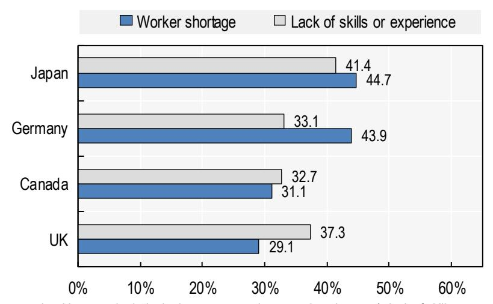

**Figure 9. A third of SMEs report experiencing a skills shortage in the last two years**

Note: SMEs using generative AI were asked: "In the last two years, has a worker shortage/a lack of skills or experience among staff ever been a challenge for your company?"

Source: OECD survey on how SMEs use generative AI to address skill and labour needs, 2024.

**A skilled SME workforce can help unlock the productivity gains of AI, benefitting SMEs and workers alike.** AI can augment (rather than displace) human labour when it complements human abilities, automates tedious work and creates high-value work for humans to do (OECD, 2023[46]), and this is one of the key mechanisms through which it can increase productivity (Calvino, Reijerink and Samek, 2025[14]). As SMEs embed AI into their operations, skill needs change and tasks are reorganised. The OECD AI Principles [\[OECD/LEGAL/0449\]](https://legalinstruments.oecd.org/en/instruments/oecd-legal-0449) call on adherents (including all G7 countries) to build human capacity and prepare for labour market transformation by empowering people to effectively use and interact with AI systems across the breadth of applications, including by equipping them with the necessary skills.

**AI is already increasing the need for skilled human capital in SMEs.** This is evident in the recent OECD survey on generative AI (OECD, 2025[9]), in which SMEs in Canada, Germany and the United Kingdom were twice as likely to say that their use of generative AI increased skills needs as to say that it decreased them (see [Figure](#page-32-0) 10). Only 4 or 5% of Japanese SME reported either effect. The overall shift towards increased skill needs could represent an increasing complexity within existing occupations and/or an emergence of new roles with higher skill requirements.

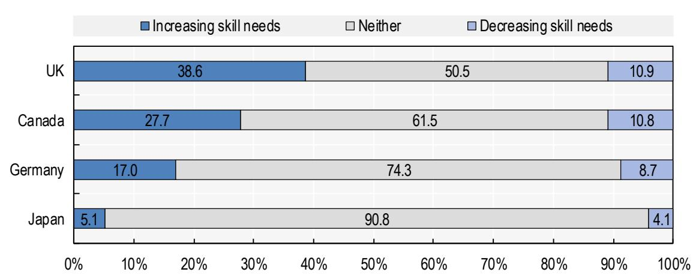

**Figure 10. SMEs associate generative AI with increased skill needs**

Note: SMEs using generative AI were asked: "I'm going to list some aspects of a company's staffing needs. For each of these, can you tell me whether the use of generative AI within your company has increased, decreased, or had no effect on this aspect? The number of highly skilled staff your company needs; The number of lower skilled staff your company needs".

Source: OECD survey on how SMEs use generative AI to address skill and labour needs, 2024.

**AI adoption is increasing the demand for ICT and specialised AI skills.** Jobs to develop and maintain AI systems are usually technical in nature and rely on skills at the intersection of computer programming, database management and statistics (Green and Lamby, 2023[47]). Demand for specialised AI skills in online job postings has risen in recent years, as documented for instance by Borgonovi et al. (2023[48]), across 14 OECD Member countries (including Canada, France, Italy, Germany, United Kingdom and United States). The authors report an average increase of 33% between 2019 and 2022, with shares of AI-related vacancies remaining however below 1% over that period. The authors also highlight relevant sectoral heterogeneity in the shares of online vacancies requiring AI skills. These highly demanded skills are well remunerated: an OECD study shows that job postings where skills related to AI are highly relevant offer higher wages than the average even after accounting for average years of schooling, skill complexity of the job and geographical factors (Manca, 2023[49]). At the same time, researchers (Brynjolfsson, Chandar and Chen, 2025[50]) have observed early signs of declining employment in the United States for early-career workers (aged 22 to 25) in software development and in other occupations highly exposed to AI. While evidence of the impact of AI on aggregate employment and job postings is mixed, these recent findings underscore the need to monitor the impacts of AI in different countries, in different occupations and for different socio-demographic groups.

**Both technical and non-technical skills are critical in the age of AI.** ICT skills are significantly correlated to AI adoption, and this is already evident in AI's early stages of diffusion. The presence of ICT specialists is associated with the use of AI in several OECD Member countries, even when accounting for the role of relevant confounding factors such as firm size, age or sectoral specificities (Calvino and Fontanelli, 2023[10]), with ICT engineers playing a critical role (Fontanelli et al., 2025[51]). Furthermore, top AI employers – i.e. those posting the largest share of AI vacancies within and across industries – exhibit a higher demand for AI professionals who combine technical expertise with leadership, innovation and problem-solving, highlighting a key role of a broader set of competencies. For instance, over 30% of online job postings by top AI employers in the United States mention skills related to management or leadership (Borgonovi et al., 2023[48]). Such broad set of skills will likely play a central role as new forms of AI continue to emerge. In this respect, critical thinking is especially important as it helps users understand when and how to use the technology (Calvino, Reijerink and Samek, 2025[14]).

**The SME workforce will need broader complementary skills to interact with AI and to do the things that AI cannot do.** While one in three job vacancies have high exposure to AI, only 1% of these jobs require specific, complex AI skills (Green, 2024[52]). An OECD survey of SMEs across seven countries, including four G7 countries, (OECD, 2025[9]) shows that generative AI has increased the importance of a broad range of skills (see [Figure](#page-33-0) 11), ranging from data analysis and interpretation skills to creativity and innovation skills. This is in line with existing OECD research, which has found that management, business, digital, emotional and social skills are highly demanded in occupations highly exposed to AI (e.g. Green and Lamby (2023[47])).

**Figure 11. Generative AI has increased the importance of data analysis and interpretation skills, along with a broad range of other skills** 

% of SMEs that report generative AI made each skill more or less important

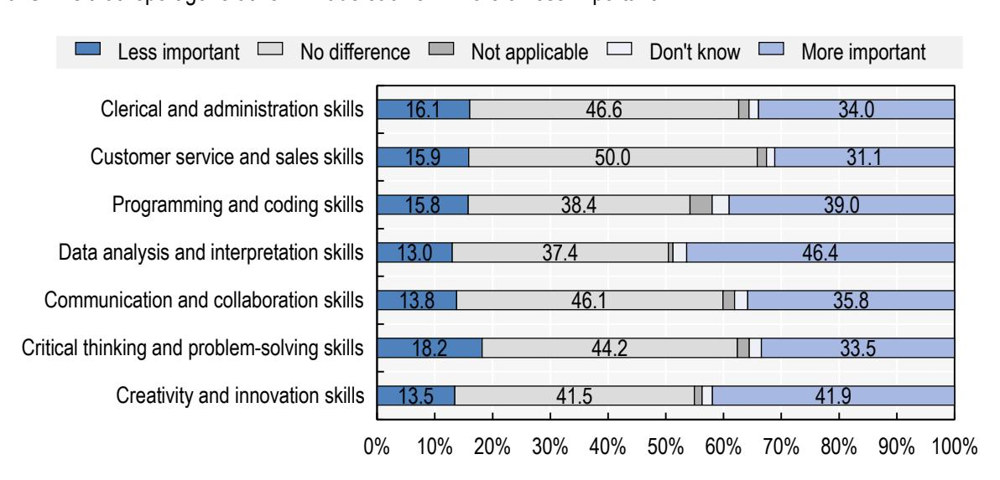

Note: Respondents were asked: "I'm going to read to you a number of skills. For each of them, can you tell me whether you think generative AI has made the skill more important, less important or whether it has made no difference to the importance of the skill for workers in your industry?" Results include users' and non-users' responses.

Source: OECD survey on how SMEs use generative AI to address skill and labour needs, 2024.

**AI-related training can help workers seize the benefits of AI and support the safe and trustworthy use of AI in line with SME objectives.** Humlum and Vestergaard (2025[53]) found that firm-provided training significantly boosts workers' use of generative AI and reduces demographic gaps in use, while an OECD survey of workers in the financial and manufacturing sectors (Lane, Williams and Broecke, 2023[54]) found that workers who had received training were significantly more likely to report positive impacts of AI on their working conditions. While some AI-related training can be technical in nature, many countries are turning their attention to AI literacy, which refers to a non-technical understanding of and an ability to critically reflect on AI applications and their limitations. A 2024 OECD review suggests that supply of AIspecific skills programmes does not necessarily match the demand for such trainings as most countries place a bigger focus on developing AI professionals than expanding the general public's AI literacy (OECD, 2024[55]).

**AI-related training is not common among the SME workforce.** In all G7 countries included in the OECD survey on generative AI (OECD, 2025[9]), under 30% of SMEs using generative AI report that their employees participate in training related to AI, ranging from 11.3% for SMEs in Japan to 29.4% for SMEs in Canada. Across OECD Member countries, time constraints due to work are the most cited barrier to participation in job-related non-formal learning (OECD, 2025[56]). With fewer employees, SMEs have less flexibility to release staff from revenue-generating activities to undertake training (OECD, 2023[45]). Additionally, SMEs face higher unit costs of training per worker and may be discouraged by concerns about worker poaching (OECD, 2023[45]).

**Figure 12. Where SMEs use generative AI, employees' participation in AI-related training is not common**

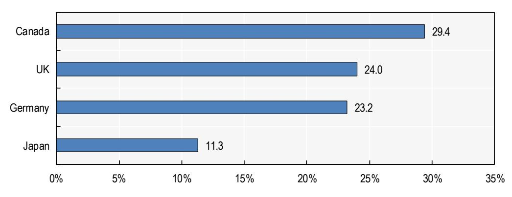

Note: Respondents were asked: "Do employees in your company currently participate in training related to AI?" Results are limited to SMEs using generative AI.

Source: OECD survey on how SMEs use generative AI to address skill and labour needs, 2024.

**Skills divides are also evident across regional and local labour markets**. A recent OECD analysis found that around a quarter of workers in OECD Member countries are exposed to generative AI, meaning 20% of their job tasks could be done at least 50% faster with the help of generative AI (OECD, 2024[57]). This exposure will continue to grow as generative AI becomes more ingrained in new technologies, with the share of workers who could be highly exposed ranging from 16% to more than 70% across OECD regions (OECD, 2024[57]). The same study found that generative AI has the potential to alter a significantly higher share of jobs in metropolitan areas, as compared to the previous rounds of technology-led automation, which affected mainly non-metropolitan and manufacturing jobs (OECD, 2024[57]).

#### **Finance**

**AI adoption by SMEs hinges on their ability to access finance to fuel their technological transition.** Financial resources area key enabler allowing SMEs to acquire AI software and hardware, invest in upskilling, hire the talent needed to implement the adoption, or undertake broader organisational changes to fully embed AI in firm-wide processes. Access to finance is especially key to increase investments in R&D and in the development of custom AI solutions (Wei and Pardo, 2022[58]). Research evidence suggests that a lack of financial resources is one of the main barriers in the digital transition of SMEs (e.g. Dörr et al. (2023[59]); Schwaeke et al. (2025[31]).

**SMEs face longstanding challenges in accessing finance, including bank credit**. Compared to large firms, SMEs typically struggle more to obtain credit, due to a wide variety of factors, including opaqueness, asymmetric and imperfect information, limited credit history, lack of collateral, or limited asset ownership Traditional bank finance poses challenges in particular to newer, innovative and fast-growing companies, with a higher risk-return profile, as well as for companies undertaking important transitions in their activities. Yet, for most enterprises, there are a few alternatives to traditional debt (OECD, 2015[60]).

**Moreover, at a time when SMEs should be investing in newer technologies, such as generative AI, the tightening of credit conditions has slowed down long-term investments.** The cost of SME financing has increased at a record pace in recent years due to global uncertainty, inflationary pressures, and subsequent tightening of monetary policy. As illustrated by the OECD Financing SMEs and Entrepreneurs Scoreboard, this has resulted in sharp declines in SME lending, with other forms of finance, from asset-based finance to equity finance, not picking up the slack. In addition, these developments across the range of financing instruments have impacted the structure and uses of financing for SMEs, with higher shares of smaller scale, short-term financing for immediate needs. As a result, less finance has been going towards longer-term investments (OECD, 2025[61]).

**Strengthening access to credit and broadening the range of financing instruments can facilitate SMEs' access to new technologies.** The [OECD Recommendation on SME Financing](https://legalinstruments.oecd.org/en/instruments/OECD-LEGAL-0493) recognises that that while bank financing will continue to be crucial for SMEs, the need to develop a more diversified set of options for SME financing remains pressing, in order to reduce the vulnerability of SMEs to changes in credit market conditions, strengthen their capital structure, seize growth opportunities and boost long-term investment.

**Beyond institutional lenders, innovative financing solutions are increasingly important**. These leverage digital technologies to address long-standing SME finance gaps. As evidenced in the OECD Financing SMEs and Entrepreneurs Scoreboard, the growth of the Fintech industry has reshaped the financing landscape for SMEs: many traditional lenders now partner with online platforms, while openbanking frameworks enable innovative, tailored products and services (OECD, 2025[61]). The Scoreboard also documents the continuous growth of online alternative finance, such as raising funds via intermediary platforms, expanding access for underserved SME segments.

**AI is unlocking new opportunities to expand SME access to finance.** Recent advances in AI and machine learning are transforming financial technologies, with significant implications for SME lending (OECD, 2021[62]). Fintech firms are increasingly embedding these tools into their business models, particularly in credit scoring. By analysing large datasets, AI and machine learning can identify signals of creditworthiness, automate data processing, and deliver faster, more comprehensive assessments dramatically lowering costs. These models also enable lending to businesses with limited credit histories or insufficient collateral, such as start-ups and women-owned enterprises, thereby enhancing financial inclusion. At the same time, fintech advancements may also increase financial exclusion due to favouring of high-return businesses or algorithms that typically rely on previous investment opportunities. Therefore, while fintech may increase opportunities such as access to and supply of finance and lower transaction costs for investors and entrepreneurs, there exists a need to mitigate the challenges as well (OECD & European Commission, 2022[63]).

**At the same time, governments increasingly recognise the value of complementing financial support with non-financial measures that enhance SME awareness, capabilities, and investment readiness.** These include targeted training programmes, tailored advice and consultancy services, mentoring schemes, and the development of digital platforms or online hubs that offer self-assessment tools, financial planning resources, and access to networks (OECD, 2024[64]).

## **5 Policy approaches to AI adoption by SMEs**

**Unlocking AI's potential across the economy – not only within large technology firms or research laboratories – requires tackling persistent barriers to adoption**. These barriers are especially pronounced for SMEs, which often lack the skills, funding, resources and digital infrastructure needed to integrate AI into their operations. Recognising these challenges, governments worldwide have made AI diffusion a key policy objective, with efforts to develop strategies and initiatives that aim to foster adoption across businesses of all sizes, sectors and regions. Despite this broad commitment, many SMEs continue to face difficulties in adopting AI tools and accessing the support needed to harness their potential.

G7 countries are leading efforts to build enabling ecosystems for AI adoption, underpinned by well-funded national strategies and multi-pronged policy frameworks (OECD.AI, 2025[65]) (OECD, 2025[66]). These strategies typically align with the four key enablers discussed in the previous section: i) connectivity, ii) AIenabling inputs, iii) skills, and iv) finance.

**In practice, these frameworks are operationalised through a variety of measures.** The technical foundation for AI deployment is provided by high-speed connectivity (such as 5G and broadband) and advanced infrastructure (including data centres and supercomputers), while education and training initiatives aim to equip the workforce with both specialised AI expertise and broader digital skills. At the same time, many governments are releasing open government datasets, promoting open-source AI models, and supporting SMEs with affordable access to cloud services and high-performance computing. To reduce the cost and risk of adoption, policymakers are providing a range of financial incentives, such as subsidies and grants for pilot projects, vouchers schemes to acquire AI solutions or consulting services, and tax credits. Public loans and equity funding are also being mobilised, often through national investment banks or dedicated funds targeting AI start-ups.

**Beyond these measures, institutional and collaborative frameworks are essential.** Many governments have established dedicated AI agencies or task forces to co-ordinate implementation, while public-private partnerships (PPPs) bring in industry expertise and agility. Regional and local initiatives complement national-level efforts, with subnational authorities managing targeted adoption programmes and funding support for SMEs. Entrepreneurial ecosystems – anchored by universities, research centres and business associations – also help SMEs develop the technical and organisational capabilities needed to adopt emerging technologies like AI. These networks offer training, mentorship and opportunities for collaboration. In addition, governments are introducing 'light-touch' regulatory frameworks that seek to foster innovation while ensuring appropriate oversight.

**SMEs often face distinct challenges that require targeted forms of assistance.** These challenges do not reflect a simple gap between SMEs and large firms but arise from the significant heterogeneity within the SME segment itself, including differences in size, sector, leadership, digital maturity and stage in the AI adoption journey. Government support is therefore critical not only in helping SMEs overcome initial barriers to AI adoption, but also in enabling those already experimenting with the technology to deepen and scale its use. Such support must be tailored, as SME needs and constraints vary considerably across national contexts.

Indeed, insights from the OECD survey on generative AI (OECD, 2025[9]) reveal marked differences across countries when SMEs were asked about the main barriers to use and preferences for government support. [Table](#page-38-1) 4 shows the top answer for each surveyed G7 country. SMEs in the United Kingdom and Canada were aligned in identifying training as the most helpful form of government support, whereas financial assistance was seen as most useful in Japan, and information campaigns in Germany. Attitudes towards generative AI did not appear to be a barrier to use with 86% of SMEs reporting either a neutral or favourable attitude within the company.

**Table 4. Barriers and preferences for government support vary by country**

| Country        | Main barrier                                                             | Main support          |
|----------------|--------------------------------------------------------------------------|-----------------------|
| Canada         | Generative AI is not suited to the type of work my company does          | Training              |
| Germany        | Clients would not approve of the company using generative AI             | Information campaigns |
| Japan          | My company's employees do not have the right skills to use generative AI | Financial assistance  |
| United Kingdom | Generative AI is not suited to the type of work my company does          | Training              |

Note: For the main barrier, non-users of generative AI were asked: "I will read you a few possible reasons why a company might not use generative AI. Can you tell me whether you agree or disagree with these reasons?". For the main support, all SMEs surveyed were asked: "In your opinion, would it be very helpful, somewhat helpful or not helpful if your national government offered the following support to help your company use generative AI?".

Source (OECD, 2025[9])

#### **Country profiles**

**This section reviews policy efforts underway in G7 countries, showing how each uses different policy levers to foster AI adoption and diffusion across the economy**. These range from national strategies to investments in infrastructure and research capacity, as well as targeted measures to support firms, particularly SMEs. These country overviews are illustrative rather than exhaustive; they do not capture every policy initiative but highlight how governments combine these approaches to promote AI adoption.

#### *Canada*

**Canada's AI policy combines a national strategic vision with regional delivery mechanisms, aiming to enhancing innovation capacity and technological sovereignty while ensuring interventions are adapted to local conditions and accessible to SMEs**. In Budget 2024, the federal government committed CAD 2.4 billion over five years (2024-2029) to support the development, scaling and adoption of AI technologies across the economy, with a strong emphasis on SMEs as drivers of innovation and productivity (Government of Canada, 2024[67]). These measures form part of the broader Pan-Canadian AI Strategy, launched in 2017 as one of the world's first national AI strategies, and co-ordinated nationally by the Canadian Institute of Advanced Research (CIFAR) and Innovation, Science and Economic Development Canada (ISED) (Innovation, Science and Economic Development Canada, 2022[68]) (Department of Finance Canada, 2017[69]).

**To address structural barriers to AI adoption, the Canadian government has made compute access a priority.** The AI Compute Access Fund, announced in December 2024, provides up to CAD 300 million over five years to help firms access advanced infrastructure for training and deploying GPU-intensive models (Government of Canada, 2025[70]) (Innovation, Science and Economic Development Canada, 2025[71]). The fund addresses the high cost of training and deployment, and also supports partnerships with national computing platforms, ensuring domestic firms can compete at scale.

**Several initiatives specifically target SMEs, providing resources, expertise and infrastructure for AI adoption and commercialisation.** The Regional Artificial Intelligence Initiative (RAII) allocates CAD 200 million through Canada's Regional Development Agencies (RDAs), which use their proximity to local ecosystems to support SMEs in addressing locally specific barriers, such as skills gaps, integration challenges and regulatory compliance (Atlantic Canada Opportunities Agency, 2024[72]). The AI Assist Programme, administered by the National Research Council's Industrial Research Assistance Programme (NRC IRAP), supports SME-led R&D and commercialisation efforts in generative AI and deep learning (Innovation, Science and Economic Development Canada, 2024[73]). This initiative connects firms with a decentralised network of industrial technology advisers and provides access to regionally distributed research infrastructure, including computational resources and facilities for testing and validation.

#### *France*

**France's AI policy is embedded within the broader France 2030 investment plan, a government-led initiative that places technological sovereignty, industrial competitiveness, and strategic autonomy at its core**. The AI strategy advances along two complementary axes: research excellence and economic diffusion (Ministère de l'Économie, des Finances et de la Souveraineté industrielle et numérique, 2025[74]). This dual ambition was reaffirmed in the 2025 Strategic Review, which highlights the development of supercomputers, data centres, and a national private cloud as central priorities (Secrétariat général de la Défense et de la Sécurité nationale (SGDSN), 2025[75]).

**To operationalise this vision, France has made substantial commitments to infrastructure and research ecosystems.** In 2025, France announced a plan to mobilise EUR 109 billion for AI over the coming years, much of it directed towards expanding data-centre capacity, and launched the 'Current AI' foundation, a public-interest initiative to improve access to high-quality public and private datasets (Le Monde with AFP, 2025[76]) (OECD.AI, 2025[77]). The government also has allocated EUR 360 million over five years to create nine *IA-Clusters*, interdisciplinary hubs that link start-ups, universities, research bodies and industry to advance strategic domains including generative AI and responsible AI governance (Direction générale des Entreprises, 2024[78]). At the European level, France also participates in the network of **EuroHPC AI Factories** (European Commission, 2025[79]). In March 2025, it was selected to host AI Factory France (AI2F), which consolidates national HPC resources to provide sovereign compute, data spaces, domain-specific models and training services to accelerate AI adoption.

**To ensure SMEs also benefit from these investments, France has introduced targeted programmes.**  The *IA Booster* programme, launched in 2023 and delivered by Bpifrance, guides firms with 10 to 2 000 employees and an annual turnover above EUR 250 000 through a four-stage process from awareness and 'data diagnostics' to pilot deployment, with subsidies covering up to 80% of consulting costs, depending on firm size and project maturity (Ministère de l'economie, des finances et de l'industrie, 2023[80]) (Bpifrance, 2024[81]). The *France Num* programme, implemented with chambers of commerce and Bpifrance, has already provided nearly 150 000 digital support services to SMEs (Direction générale des Entreprises, 2024[82]). Complementing this, the **Cyber SME** initiative dedicates EUR 12.5 million to strengthen the cyber skills of small businesses.

**In July 2025, France launched** *Osez l'IA***, a national programme aimed at accelerating AI adoption across firms of all sizes, with a strong focus on SMEs and intermediate-sized enterprises** (Direction générale des Entreprises, 2025[83]). Backed by EUR 200 million, the initiative targets three pillars: (i) awareness, via 300 "AI ambassadors" who showcase concrete use cases across regions and sectors; (ii) skills development, through the creation of an AI Academy, a national digital training platform targeting up to 15 million professionals by 2040; and (iii) deployment support, including subsidised diagnostics and a curated catalogue of ready-to-use AI solutions.

#### *Germany*

**Germany's AI strategy combines a commitment to trustworthy, human-centred AI with a focus on diffusion to the Mittelstand.** Since launching its National AI Strategy in November 2018, the country has expanded funding from EUR 3 billion to EUR 5 billion by 2025, positioning "AI Made in Germany" as a global quality mark (Federal Government of Germany, 2020[84]). Implementation is co-ordinated across federal ministries to balance competitiveness with social welfare, and diffusion is supported through research transfer, technical enablement and SME-readiness instruments (OECD, 2024[85]).

**Large-scale infrastructure anchors this approach**. In December 2024, Germany was selected as one of the first hosts for **EuroHPC AI Factories** (European Commission, 2025[79]). The HammerHAI initiative at HLRS Stuttgart was awarded funding to provide a cloud-native platform offering web-based access to AI tools, curated datasets, and pre-trained models. The Jupiter AI Factory (JAIF) was established in March 2025, linked to Europe's first exascale supercomputer, offering SMEs and researchers advanced AI development and hybrid AI-simulation workloads and specialised expertise. Complementing this, four **AI Service Centres**, launched in 2022, offer computer resources and advisory services on topics ranging from transferable models to critical-infrastructure applications, helping SMEs and universities without inhouse resources engage in AI development.

**Targeted SME programmes further support adoption**. The *KI4KMU* programme (2020-2022), administered by the Federal Ministry of Education and Research, provided grants covering up to 50% of project costs for SME-led AI innovation, with regional initiatives such as KI4KMU-RLP still active. In 2025, the Federal Ministry for Economic Affairs and Climate Action launched the **"Generative AI for SMEs"** programme, allocating about EUR 30 million to projects in areas such as automated design, predictive maintenance, and natural-language interfaces (BMWK, 2025[86]).

**Germany is also investing in practical AI learning environments to boost SME adoption and workforce engagement**. The Federal Ministry of Labour and Social Affairs funds AI Studios, which offer low-threshold learning and hands-on demonstrators from the employee's perspective, delivered via permanent sites in Munich and Stuttgart and mobile information units that visit company locations nationwide with a special focus on SMEs. The programme aims to reach more than 2 600 companies by 2026, strengthening skills and worker involvement in adoption. These measures complement the AI Learning and Experimentation Spaces, which provide testbeds to test AI in operational settings, and the funding priority Mitterstand-Digital, which continues to support SMEs through regional and sector-specific Mittelstand-Digital Innovation Hubs as well as the initiative "Cybersecurity for SMEs" (Lübbers and Plöger, 2025[87]).

#### *Italy*

**Italy's AI policy strategy applies ethical and human-centric principles to support diffusion of AI across research, business and the public sector, while expanding compute capacity and developing a registry of trustworthy datasets and models.** The Italian Strategy for Artificial Intelligence 2024–2026,embedded in the country's broader digital and ecological transition agenda, emphasises the critical role of SMEs within the national ecosystem, alongside large enterprises, universities, and research institutions (Agenzia per l'Italia Digitale, 2024[88]). It seeks to foster a network of "AI facilitators" to connect ICT providers with potential adopters in key economic sectors, while also supporting application laboratories in industrial contexts with high technology readiness levels.

**Infrastructure investments and European partnerships play a central role in supporting the strategy**. In December 2024, the IT4LIA AI Factory consortium, led by CINECA with Austria and Slovenia, was selected as one of the first seven pan-European **EuroHPC AI Factories** (European Commission, 2025[79]) (Italian Research Center on HPC, Big Data, and Quantum Computing, 2024[89]). Hosted at Bologna's Tecnopolo, IT4LIA integrates supercomputing, data resources and expert networks to support SMEs, research centres and industry in deploying AI in priority sectors.

**The National Recovery and Resilience Plan (NRRP) is the main catalyst for SME-focused measures**. Under its EUR 6 billion Transition 5.0 plan, the government provides fiscal and institutional incentives for digital and AI adoption, including enhanced tax credits and accelerated depreciation for AI and other Industry 4.0 technologies (Italia Domani, 2024[90]). This package is complemented by training and technical assistance to strengthen AI readiness. Within the NRRP framework, EUR 350 million are allocated specifically for the digital transition of SMEs, in part through the expansion of eight *Centri di Competenza ad Alta Specializzazione* **(High-Specialisation Competence Centres)** (Spallone and Bandiera, 2024[2])**.**  Established in 2018 as public-private partnerships, these centres function as regional hubs that provide diagnostics, training, and deployment support in collaboration with universities and research institutes (Ministero delle Imprese e del Made in Italy, 2024[91]).

#### *Japan*

**Japan has embedded its AI policy within its broader "Society 5.0" vision, a long-term framework for building a data-driven, cyber-physical economy that strengthens social and industrial resilience** (Government of Japan, 2016[92]). The AI Act gives this vision a new institutional weight by creating the AI Strategic Headquarters to co-ordinate across ministries and mandating the development of a comprehensive AI Basic Plan. The Act affirms the voluntary efforts by AI developers and business operators, providing a legal framework for co-ordination and support. At the international level, Japan has positioned itself as a normative leader by launching the Hiroshima AI Process (HAIP) during its 2023 G7 Presidency, including the adoption of the International Code of Conduct for Organisations Developing Advanced AI Systems (Ministry of Foreign Affairs of Japan, 2023[93]).

**To back these ambitions, Japan is mobilising large-scale investments in compute and digital infrastructure.** The government has pledged about USD 65 billion by 2030, supplemented by corporate and international capital, to expand data centres, GPU-rich systems, and compute capacity. On the semiconductor front, the government-supported consortium Rapidus is leading efforts to restart domestic advanced chip manufacturing, with mass production targeted for 2027. These investments are designed both to secure technological sovereignty and to reinforce Japan's role as a key node in global supply chains.

**SME policy is tightly linked to this agenda, recognising small firms' role in sustaining productivity amid labour shortages.** The Catalog-Type Labor-Saving Investment Subsidy allocates ¥500 billion over three years to help SMEs adopt pre-approved automation tools through a simplified application process. Complementary General-Type Subsidies cover up to 50% of costs for more flexible AI and automation solutions, such as autonomous mobile robots in logistics and smart inspection systems in manufacturing. These measures are reinforced by extensive support of chambers of commerce, regional banks, and SME advisory centres. To guide adoption, the Ministry of Economy, Trade and Industry (METI) and the Ministry of Internal Affairs and Communications (MIC) jointly published the *AI Guidelines for Business* in 2022, offering SMEs step-by-step planning tools, self-diagnostic checklists, sectoral case studies, and digital maturity templates.

#### *United Kingdom*

**The United Kingdom's AI policy is state-led and market-enabled, balancing strong government direction with private-sector investment.** It is anchored in two overarching strategies. First, the **UK's Modern Industrial Strategy** (UK Government, Department for Business and Trade, 2025[94]) sets wider economic and technological priorities, placing AI alongside other frontier technologies and tying its development to funding, skills and regulatory reform. Second, the **AI Opportunities Action Plan** (Department for Science, Innovation and Technology, 2025[95]) outlines 50 recommendations to grow the AI sector, accelerate adoption across the economy and enhance public services.

**The United Kingdom has introduced several infrastructure and industry-wide measures to support AI**. **The UK Compute Roadmap**, published in 2025, commits up to GBP 2 billion by 2030 to build a public compute ecosystem (UK Department for Science, Innovation & Technology, 2025[96]). It earmarks over GBP 1 billion to expand the **AI Research Resource** (AIRR) twenty-fold and up to GBP 750 million for a new national supercomputer in Edinburgh (UK Government, 2025[97]). The government has also launched the **AI Growth Zones** (AIGZs) to attract private investment in AI-enabled data centres (UK Department for Science, Innovation & Technology, 2025[96]). Zones must demonstrate access to at least 500 MW of power by 2030, suitable land, and credible planning pathways (Department for Science, Innovation and Technology, 2025[95]). Another initiative is the **National Data Library** (NDL), announced in the AI Opportunities Action Plan, to unlock high-value public datasets.

**The new UK's SME strategy,** *"Backing your business: our plan for small and medium-sized enterprises"***, embeds AI within a broader digitalisation and skills agenda** (Department for Business and Trade, 2025[98]). It pledges GBP 1.2 billion in additional skills investment annually by 2028–29, including reforms to create shorter, more flexible apprenticeships and new digital and AI training pathways. The plan also incorporates the findings of the SME Digital Adoption Taskforce, endorsing its ambition for the United Kingdom to become the most digitally capable and AI-confident SME ecosystem in the G7 by 2035 (Department for Business & Trade, 2025[99]).

**Complementing this are targeted initiatives.** The **Flexible AI Upskilling Fund**, piloted in 2024, subsidised up to 50% of training costs for SMEs in the professional and business services sector, setting a precedent for future skills interventions (UK Department for Science, Innovation and Technology, 2024[100]). **BridgeAI**, launched in 2023 with an indicative GBP 100 million programme envelope, supports AI adoption in under-digitised but high-growth sectors such as agrifood, construction, the creative industries, and transport and logistics (The Alan Turing Institute, 2024[101]). Delivered by Innovate UK with funding through the UKRI Technologies Mission Fund, the programme combines grants, technical mentoring, challenge-led collaborations, and SME-provider matchmaking through rolling competitions.

#### *United States*

**The United States follows a market-driven approach to AI, positioning the private sector as the primary engine of innovation, while the federal government focuses on enabling infrastructure, standards, and research**. This orientation was reinforced in the **AI Action Plan** of July 2025, which sets near-term policy goals while articulating the President's vision for US leadership in AI (The White House, 2025[102]). The plan calls for scaling back regulatory burdens, fostering open-source leadership, strengthening public-private partnerships, and studying labour market impacts through existing surveys. The plan also places a strong emphasis on workforce development in the age of AI, promoting the integration of AI skill development into vocational training and other federally supported skills initiatives and proposing modifications to its tax code to qualify AI literacy as eligible educational assistance.

**Federal action focuses heavily on infrastructure and research, implemented through a decentralised network of agencies**. The National AI Initiative Office (NAIIO), created under the National AI Initiative Act of 2020, co-ordinates strategy across agencies to ensure cohesive federal efforts. The National Institute of Standards and Technology (NIST) develops socio-technical standards, notable the widely adopted **Risk Management Framework**, and hosts the **Center for AI Standards and Innovation (CAISI)** to drive trustworthy AI guidance. The National Science Foundation (NSF) remains the largest federal funder of pre-competitive research, investing hundreds of millions annually, supports 27 **National AI Research Institutes** (National Science Foundation, 2025[103]) and leads the National AI Research Resource (NAIRR) pilot, a proof-of-concept national infrastructure launched in 2024 to democratise access to high-performance computing, data, models, software, training, and support for the US research community (National Science Foundation, 2025[104]). Legislatively, the proposed CREATE AI Act on 2025 seeks to expand access to include small businesses and entrepreneurs by delivering cloud compute, curated datasets, APIs, and educational tools under a shared national AI infrastructure model (ExecutiveGov, 2025[105]). Other agency-led initiatives include regulatory sandboxes, AI Centres of Excellence, and domain-specific programmes in sectors such as healthcare, energy, and agriculture.

**SMEs and start-ups are explicitly recognised as engines of AI-driven growth.** The federal government relies on long-standing programmes such as the **Small Business Innovation Research (SBIR) and Small Business Technology Transfer (STTR)** initiatives, also branded as "America's Seed Fund", which provide non-dilutive capital for high-risk, high-reward AI innovations. Complementing these funding mechanisms, the Small Business Administration (SBA) operates an **AI Resource Hub**, offering digital tool libraries, AI-focused workshops, and counselling services through its nationwide network of Small Business Development Centers (SBDCs), SCORE mentors, and Women's Business Centers (US SBA, 2025[106]). These measures aim to raise awareness, lower barriers to adoption, and ensure that smaller firms can participate in the emerging AI economy.

#### **Selected policy examples beyond the G7**

**Nearly 70 countries have already adopted national AI strategies and policies** (OECD.AI, 2025[65]). While each reflects domestic priorities, they share common elements aligned with the OECD AI Principles that promote innovative and trustworthy AI, such as investment in enabling infrastructure, skills development, data access and funding. This trend reflects the growing interest in AI and AI policy globally, supported by multilateral fora like the G7, the G20 and the Global Partnership on AI (GPAI), which facilitate the exchange of best practices. The forthcoming AI Policy Toolkit for the OECD AI Principles will provide practical guidance for countries, including developing and emerging economies, to foster trustworthy AI innovation.

**Among the countries outside of the G7 leading this global momentum, several in the Asia-Pacific have moved decisively to promote AI adoption, blending state co-ordination with practical support for businesses.** Singapore, for instance, is frequently cited as a leader. Its first National AI Strategy (2019) identified key sectors for flagship deployment projects, and in 2023 was expanded with 16 actions covering industry, infrastructure and talent (Smart Nation Singapore, 2025[107]).

**Crucially, Singapore has embedded SME support at the heart of this strategy**. The Productive Solutions Grant (PSG) subsidises up to 50% of costs for pre-approved AI and digital solutions (Enterprise Singapore, 2025[108]). For more complex use cases, the Advanced Digital Solutions (ADS) programme provides funding of up to 70% (Infocomm Media Development Authority (IMDA) - Singapore, 2024[109]). These measures are delivered alongside governance initiatives, including the Model AI Governance Framework and implementation tools like the ISAGO self-assessment guide and a Compendium of Use Cases, which give SMEs accessible models for responsible AI development (Personal Data Protection Commission (PDPC) - Singapore, 2025[110]).

**In emerging economies, AI is increasingly viewed as a driver for competitiveness, with national strategies and industrial policy often linking AI to SME digitalisation**. For example, Brazil's National AI Strategy (EBIA), launched in 2021, includes the creation of applied research centres to connect firms with universities and promote technology transfer (Ministry of Science, Technology and Innovations of Brazil, 2021[111]). Building on this, Brazil's Industrial AI Programme (2025) provides SMEs and their workers with combined technical assessments, immersion training and applied proof-of-concept projects, directly addressing adoption gaps (Serviço Nacional de Aprendizagem Industrial, 2025[112]). Likewise, in Brazil and other middle-income economies, innovation agencies and development banks are rolling out vouchers, toolkits, and subsidised services for SME adoption, while also creating grant competitions and early-stage financing mechanisms for AI start-ups.

#### **From AI Novices to AI Champions: Policy pathways for SME adoption**

**To accelerate AI adoption across the economy, G7 countries are building on existing strategies and programmes by tailoring policies to the diverse needs of SMEs, which vary significantly based on their size, sector, level of digital maturity, and the scope and complexity of AI applications they pursue.** Categorising SMEs into distinct profiles of AI adoption provides a practical framework for analysing how policy interventions can be appropriately targeted. Differentiated tools, mapped to the proposed taxonomy and the key enablers previously discussed, may support firms effectively as they move along their AI adoption journey, from basic experimentation to the development of customised or agentic AI solutions.

#### *AI Novices: Building awareness and foundational capabilities*

**AI Novices are SMEs at the very start of their AI journey.** These businesses face significant barriers, primarily a lack of awareness, limited internal skills and restricted access to early-stage financing. Effective policy responses should focus on raising awareness and building foundational capabilities.

**To tackle the knowledge and capability gap, several countries offer tailored learning and advisory initiatives.** Japan's AI Introduction Guidebook for SMEs, developed by METI, provides modular, sectorspecific materials to help novice firms understand AI basics. In France, the AI Booster programme combines advisory services with financial incentives to support early exploration. France Num further extends this support, having enabled the deployment of nearly 150 000 digital transition services to SMEs. In the United Kingdom, the Digital Adoption Pilots, delivered in partnership with industry, help SMEs trial new digital technologies, with a focus on AI readiness.

**To reduce financial and infrastructure-related barriers, other programmes focus on funding and access to digital tools.** Germany's "Generative AI for SMEs" provides grants to offset the cost of initial AI experimentation. This builds on the broader funding priority Mittelstand-Digital, which supports SMEs through Mittelstand-Digital Innovation Hubs and the initiative "Cybersecurity for SMEs". The United Kingdom has complemented its adoption efforts by offering 69 000 start-up loans and delivering a GBP 3 billion capital boost to the British Business Bank, enhancing financing for small firms investing in digital technologies, including AI adoption.

#### *AI Optimisers: Targeted support for embedding AI across functions*

**AI Optimisers are SMEs that have moved beyond experimentation and are beginning to integrate AI across business functions.** These firms often encounter more complex challenges, including workforce preparedness, operational restructuring and the risks associated with scaling investment. Targeted support can help SMEs navigate this next phase of adoption.

**One major area of policy response is workforce development and skills integration**. The UK's AI Upskilling Fund supports SMEs in the professional business services sector by co-financing employee training aligned with business needs. Canada's AI Assist programme embeds skills development into ongoing R&D, helping firms build internal capacity alongside innovation. Italy is also exploring the creation of "AI facilitators" to bridge the gap between ICT providers and traditional industries, encouraging collaboration and knowledge transfer.

**A second set of initiatives targets financial and operational barriers to scaling AI use**. Japan's Catalog-Type Labor-Saving Investment Subsidy simplifies adoption by supporting pre-approved automation tools. Italy's Transition 5.0 tax credits reward AI investments that also advance digitalisation and environmental goals. The UK's BridgeAI programme provides structured support for AI uptake in highgrowth but under-digitised sectors such as agriculture and manufacturing.

**Several countries are also investing in supportive infrastructure and sector-specific adoption**. In the United States, the National AI Action Plan calls for regulatory sandboxes and AI Centres of Excellence, where researchers, start-ups and businesses can trial AI tools in real-world conditions. It also includes domain-specific initiatives for healthcare, energy and agriculture to develop national standards and promote sector-wide adoption. Complementary infrastructure efforts, such as 5G deployment, are critical at this stage to enable real-time, cloud-based AI services.

#### *AI Explorers: Enabling innovation through compute, data and funding access*

**AI Explorers represent a more advanced group of SMEs that aim to develop bespoke AI tools tailored to their specific operational needs**. These firms typically require sustained access to highperformance computing, high-quality datasets and long-term R&D funding.

**To address infrastructure gaps, several national strategies have prioritised access to advanced computing resources**. Canada's AI Compute Access Fund subsidises the use of high-performance computing facilities, while the UK's AI Research Resource (AIRR) and the US NAIRR Pilot both expand sovereign compute capacity to support domestic AI innovation. The NAIRR Pilot currently serves academic researchers and educators based in the United States; however, proposed legislation would expand access to include small businesses with federal R&D funding, while still excluding large firms. In Germany, SMEs and research institutions benefit from AI Service Centres, which provide access to advanced infrastructure alongside tailored technical support.

**Access to data is another key enabler**. The United Kingdom is developing a National Data Library to provide centralised access to anonymised public datasets, while France's Current AI initiative, structured as a public interest foundation, is working to expand the availability of both public and private datasets. Recognising that many SMEs struggle to prepare their own data for AI use, some countries are introducing initiatives to support data readiness, including help with digitising, structuring, and labelling internal data.

**On the funding side, tailored support is essential to help AI Explorers undertake advanced research and develop bespoke tools**. US-based SMEs benefit from the Small Business Innovation Research and Small Business Technology Transfer programmes. These offer early-stage, non-dilutive grants to AI-native start-ups, particularly in high-risk, high-reward sectors such as defence, healthcare and agriculture.

**Finally, governance frameworks can influence the pace and safety of experimentation**. For instance, Japan supports innovation through a sector-specific, soft-law approach to data governance, enabling responsible AI experimentation without imposing rigid legal constraints.

#### *AI Champions: Unlocking scale through strategic infrastructure and ecosystems*

**AI Champions are SMEs that have integrated AI systems across most of their operations and now operate near the frontier of AI innovation.** For these firms, policy needs shift from basic support towards enabling access to advanced computing infrastructure, world-class talent and integration into dynamic innovation ecosystems. While firms at this stage rely less on direct public subsidies, a stable and supportive business environment remains important.

**Supporting firms operating at the AI frontier involves building strong, interconnected innovation ecosystems that combine compute, talent and data.** The EU's AI Factories, for example, are designed to aggregate these elements at scale, with facilities planned in Germany, France and Italy. These hubs also benefit AI Optimisers and AI Explorers by providing access to pre-trained models and curated datasets. Dedicated support for regional and interdisciplinary collaboration helps concentrate AI excellence and strengthen national innovation capacity. France's AI Clusters, for instance, link start-ups, universities and public labs.

**Strategic infrastructure planning, including sustained investment in compute capacity and physical development zones, has emerged as a key feature of national approaches to scaling AI.**  In the United Kingdom, the Compute Roadmap commits up to GBP 2 billion through 2030, including a major expansion of the AI Research Resource (AIRR) and the creation of AI Growth Zones to support nextgeneration data centre development. Japan is also expanding its AI infrastructure, with a government pledge of around USD 65 billion by 2030, reinforced by additional corporate and international contributions.

## **6 Proposed policy recommendations for governments to enhance AI adoption by SMEs**

The OECD AI Principles include a set of recommendations for governments to implement in their national policies, to foster innovation and trust in AI by promoting the responsible stewardship of trustworthy AI, with special attention to SMEs.

In line with the OECD AI Principles, and on the basis of the analysis provided in this discussion paper, countries could consider the following measures to accelerate adoption of AI by SMEs.

- **Expand targeted R&D support for SME-led AI Innovation**
  - o Establish dedicated funding programmes, such as grant and voucher schemes, for SMEled AI R&D, including experimental development and pilot testing.
  - o Encourage collaborative R&D e.g. through public-private partnerships and regional innovation clusters that connect SMEs with universities and research institutes.
- **Foster an AI-enabling ecosystem for SMEs by improving connectivity and facilitating access to data, algorithms and compute for AI deployment including:**
  - o Addressing persistent connectivity gaps between firm of different sizes and operating in different regions, including urban–rural divides, and promoting the deployment of futureproof infrastructure such as fibre and 5G.
  - o Facilitating mechanisms for data sharing and cloud access that enable SMEs to develop or customise AI solutions, while upholding privacy and intellectual property rights.
  - o Supporting SME data readiness for AI by helping SMEs digitise core records, standardise and label data with clear ownership and quality checks, and adopt light-touch governance (access, retention, security), using appropriate policy instruments tailored to context.
- **Shape an enabling policy environment for diffusion and uptake of AI by SMEs, tailoring interventions to the diverse needs of SMEs, including expanding access to finance to support AI-related investment.** 
  - o Policies should reflect differences in firm size, sector, digital maturity, and AI use cases. Interventions should distinguish between entry-level and scaling adoption needs and also be sensitive to regional contexts. The taxonomy of AI adopters proposed in this paper offers a possible approach to guide differentiated support.
  - o Policymakers can support measures to strengthen access to credit and broaden the range of financing instruments to facilitate SMEs' access to AI technologies. Complementing financing with advisory services to improve investment readiness can be beneficial for SMEs.
- **Build human capacity in the SME workforce through skills development.**

- o Promote investment in training programmes along the working life, including digital literacy but also skills for ICT specialists, complemented by support for socio-emotional and foundational skills such as problem-solving, leadership, and critical thinking.
- o Facilitate access to training to SMEs with limited resources and strengthen managerial capabilities to optimise AI adoption.

#### • **Advance international co-operation for trustworthy AI.**

- o Facilitate greater engagement by SMEs with international efforts for AI policymaking.
- o Develop and disseminate publicly available reporting mechanisms to promote knowledge sharing, transparency and accountability with respect to existing practices for use of AI by SMEs.
- o Improve data and knowledge sharing and promote internationally comparable indicators to track AI adoption in SMEs.

## **References**

| Acemoglu, D. et al. (2022), Automation and the Workforce: A Firm-Level View from the 2019 Annual Business Survey, National Bureau of Economic Research, Cambridge, MA, https://doi.org/10.3386/w30659.                             | [18] |
|------------------------------------------------------------------------------------------------------------------------------------------------------------------------------------------------------------------------------------------|------|
| Agenzia per l'Italia Digitale (2024), The Italian Strategy for Artificial Intelligence 2024–2026, https://www.agid.gov.it/en/agenzia/stampa-e-comunicazione/notizie/2024/07/22/italian strategy-artificial-intelligence-2024-2026. | [88] |
| Agrawal, A., J. Gans and A. Goldfarb (2023), "Artificial intelligence adoption and system‐wide change", Journal of Economics & Management Strategy, Vol. 33/2, pp. 327-337, https://doi.org/10.1111/jems.12521.                    | [23] |
| Appel, R. et al. (2025), The Anthropic Economic Index report: Uneven geographic and enterprise AI adoption, https://www.anthropic.com/research/anthropic-economic-index-september-2025- report.                                    | [7]  |
| Atlantic Canada Opportunities Agency (2024), Regional Artificial Intelligence Initiative, https://www.canada.ca/en/atlantic-canada-opportunities/services/regional-artificial intelligence-initiative.html.                        | [72] |
| Bianchini, M. and M. Lasheras Sancho (2025), "SME digitalisation for competitiveness: The 2025 OECD D4SME Survey", OECD SME and Entrepreneurship Papers 68, https://doi.org/10.1787/197e3077-en.                                   | [15] |
| Bick, A., A. Blandin and D. Deming (2024), The Rapid Adoption of Generative AI, Federal Reserve Bank of St. Louis, https://doi.org/10.20955/wp.2024.027.                                                                              | [4]  |
| BMWK (2025), KI-Innovationswettbewerb – Generative KI für den Mittelstand, https://www.digitale-technologien.de/DT/Navigation/DE/Foerderaufrufe/KI Innovationswettbewerb/ki-innovationswettbewerb.html.                            | [86] |
| Borgonovi, F. et al. (2023), "Emerging trends in AI skill demand across 14 OECD countries", OECD Artificial Intelligence Papers, No. 2, OECD Publishing, Paris, https://doi.org/10.1787/7c691b9a-en.                               | [48] |

| Bpifrance (2024), Lancement du programme IA Booster France 2030 pour accompagner la transformation numérique des PME et ETI, https://presse.bpifrance.fr/lancement-du                                                                                                                       | [81] |
|------------------------------------------------------------------------------------------------------------------------------------------------------------------------------------------------------------------------------------------------------------------------------------------------|------|
| programme-ia-booster-france2030-pour-accompagner-la-transformation-numerique-des-pme et-eti.                                                                                                                                                                                                |      |
| Brynjolfsson, E., B. Chandar and R. Chen (2025), Canaries in the Coal Mine? Six Facts about the Recent Employment Effects of Artificial Intelligence, https://digitaleconomy.stanford.edu/wp                                                                                             | [50] |
| content/uploads/2025/08/Canaries_BrynjolfssonChandarChen.pdf.                                                                                                                                                                                                                                  |      |
| Brynjolfsson, E., D. Rock and C. Syverson (2021), "The Productivity J-Curve: How Intangibles Complement General Purpose Technologies", American Economic Journal: Macroeconomics, Vol. 13/1, pp. 333-372, https://doi.org/10.1257/mac.20180386.                                          | [22] |
| Calvino, F., H. Costa and D. Haerle (forthcoming), Digital technology diffusion in the age of AI: Cross-country evidence from microdata.                                                                                                                                                    | [17] |
| Calvino, F., C. Criscuolo and A. Ughi (2024), "Digital adoption during COVID-19: Cross-country evidence from microdata", OECD Science, Technology and Industry Working Papers, No. 2024/03, OECD Publishing, Paris, https://doi.org/10.1787/f63ca261-en.                                 | [24] |
| Calvino, F. et al. (2024), "A sectoral taxonomy of AI intensity", OECD Artificial Intelligence Papers, No. 30, OECD Publishing, Paris, https://doi.org/10.1787/1f6377b5-en.                                                                                                                 | [13] |
| Calvino, F. et al. (2022), "Closing the Italian digital gap: The role of skills, intangibles and policies", OECD Science, Technology and Industry Policy Papers, No. 126, OECD Publishing, Paris, https://doi.org/10.1787/e33c281e-en.                                                   | [35] |
| Calvino, F. and L. Fontanelli (2025), Decoding AI: Nine facts about How Firms use Artificial Intelligence in France, Elsevier BV, https://doi.org/10.2139/ssrn.5196940.                                                                                                                     | [26] |
| Calvino, F. and L. Fontanelli (2024), AI Users Are Not All Alike: The Characteristics of French Firms Buying and Developing AI, Elsevier BV, https://doi.org/10.2139/ssrn.5045569.                                                                                                          | [20] |
| Calvino, F. and L. Fontanelli (2023), "A portrait of AI adopters across countries: Firm characteristics, assets' complementarities and productivity", OECD Science, Technology and Industry Working Papers, No. 2023/02, OECD Publishing, Paris, https://doi.org/10.1787/0fb79bb9-en. | [10] |
| Calvino, F., D. Haerle and S. Liu (2025), "Is generative AI a General Purpose Technology? : Implications for productivity and policy", OECD Artificial Intelligence Papers, No. 40, OECD Publishing, Paris, https://doi.org/10.1787/704e2d12-en.                                         | [5]  |
| Calvino, F., J. Reijerink and L. Samek (2025), "The effects of generative AI on productivity, innovation and entrepreneurship", OECD Artificial Intelligence Papers, No. 39, OECD                                                                                                           | [14] |

Publishing, Paris, https://doi.org/10.1787/b21df222-en.

| Calvino, F. et al. (2022), "Identifying and characterising AI adopters : A novel approach based on big data", OECD Science, Technology and Industry Working Papers, No. 2022/06, OECD Publishing, Paris, https://doi.org/10.1787/154981d7-en.                                                                  | [12] |
|----------------------------------------------------------------------------------------------------------------------------------------------------------------------------------------------------------------------------------------------------------------------------------------------------------------------|------|
| Chatterji, A. et al. (2025), How People Use ChatGPT, National Bureau of Economic Research, Cambridge, MA, https://doi.org/10.3386/w34255.                                                                                                                                                                         | [6]  |
| Chowdhury, S., P. Budhwar and G. Wood (2024), "Generative Artificial Intelligence in Business: Towards a Strategic Human Resource Management Framework", British Journal of Management, Vol. 35/4, pp. 1680-1691, https://doi.org/10.1111/1467-8551.12824.                                                     | [32] |
| Czarnitzki, D., G. Fernández and C. Rammer (2023), "Artificial intelligence and firm-level productivity", Journal of Economic Behavior & Organization, Vol. 211, pp. 188-205, https://doi.org/10.1016/j.jebo.2023.05.008.                                                                                      | [19] |
| Department for Business & Trade (2025), The UK government SME Digital Adoption Taskforce: final report, https://www.gov.uk/government/publications/sme-digital-adoption-taskforce-final report.                                                                                                                | [99] |
| Department for Business and Trade (2025), Backing your business: our plan for small and medium-sized businesses, https://www.gov.uk/government/publications/backing-your business-our-plan-for-small-and-medium-sized-businesses.                                                                              | [98] |
| Department for Science, Innovation and Technology (2025), AI Opportunities Action Plan, https://www.gov.uk/government/publications/ai-opportunities-action-plan.                                                                                                                                                  | [95] |
| Department of Finance Canada (2017), Growing Canada's Advantage in Artificial Intelligence, http://ttps://www.canada.ca/en/department finance/news/2017/03/growing_canada_sadvantageinartificialintelligence.html.                                                                                             | [69] |
| Direction générale des Entreprises (2025), « Osez l'IA » : le plan pour diffuser l'IA dans toutes les entreprises, https://www.entreprises.gouv.fr/la-dge/actualites/osez-lia-le-plan-pour diffuser-lia-dans-toutes-les-entreprises.                                                                           | [83] |
| Direction générale des Entreprises (2024), Accompagner les entreprises dans leur transition numérique, Ministry of the Economy, France, and Industrial and Digital Sovereignty, https://www.entreprises.gouv.fr/priorites-et-actions/transition-numerique/accompagner-les entreprises-dans-leur-transition. | [82] |
| Direction générale des Entreprises (2024), Annonce de 9 nouveaux lauréats pour l'appel à manifestation d'intérêt « IA-clusters », https://www.entreprises.gouv.fr/la dge/actualites/annonce-de-9-nouveaux-laureats-pour-lappel-manifestation-dinteret-ia clusters.                                          | [78] |
| Dörr, L. et al. (2023), "A Taxonomy on Influencing Factors Towards Digital Transformation in SMEs", Journal of Small Business Strategy, Vol. 33/1, https://doi.org/10.53703/001c.66283.                                                                                                                           | [59] |

| Humlum, A. and E. Vestergaard (2025), "Large Language Models, Small Labor Market Effects", NBER Working Paper 33777, https://doi.org/10.3386/W33777.                                                                                                                                                                                                                                                                          | [53]  |
|----------------------------------------------------------------------------------------------------------------------------------------------------------------------------------------------------------------------------------------------------------------------------------------------------------------------------------------------------------------------------------------------------------------------------------|-------|
| Infocomm Media Development Authority (IMDA) - Singapore (2024), New Advanced Digital Solution Categories to Empower SMEs, http://ttps://www.imda.gov.sg/resources/press releases-factsheets-and-speeches/press-releases/2024/new-advanced-digital-solution categories-to-empower-smes.                                                                                                                                  | [109] |
| Innovation Science and Economic Development Canada (2024), What We Heard Report: Consultations on AI Compute, https://ised-isde.canada.ca/site/ised/en/what-we-heard-report consultations-ai-compute.                                                                                                                                                                                                                      | [44]  |
| Innovation, Science and Economic Development Canada (2025), Canadian Sovereign AI Compute Strategy, https://ised-isde.canada.ca/site/ised/en/canadian-sovereign-ai-compute strategy.                                                                                                                                                                                                                                       | [71]  |
| Innovation, Science and Economic Development Canada (2024), Federal government launches programs to help small and medium-sized enterprises adopt and adapt artificial intelligence solutions, https://www.canada.ca/en/innovation-science-economic development/news/2024/10/federal-government-launches-programs-to-help-small-and medium-sized-enterprises-adopt-and-adapt-artificial-intelligence-solutions.html. | [73]  |
| Innovation, Science and Economic Development Canada (2022), Pan-Canadian Artificial Intelligence Strategy, https://ised-isde.canada.ca/site/ai-strategy/en.                                                                                                                                                                                                                                                                   | [68]  |
| Italia Domani (2024), Transition 5.0, https://www.italiadomani.gov.it/content/sogei ng/it/en/Interventi/investimenti/transizione-5-0.html.                                                                                                                                                                                                                                                                                    | [90]  |
| Italian Research Center on HPC, Big Data, and Quantum Computing (2024), European AI Factories: In Italy One of the European Commission's First Strategic Artificial Intelligence Platforms, https://www.supercomputing-icsc.it/en/2024/12/10/european-ai-factories-in-italy one-of-the-european-commissions-first-strategic-artificial-intelligence-platforms/.                                                         | [89]  |
| Kneller, R. and J. Timmis (2016), "ICT and Exporting: The Effects of Broadband on the Extensive Margin of Business Service Exports", Review of International Economics, Vol. 24/4, pp. 757- 796, https://doi.org/10.1111/roie.12237.                                                                                                                                                                                       | [39]  |
| Lane, M., M. Williams and S. Broecke (2023), "The impact of AI on the workplace: Main findings from the OECD AI surveys of employers and workers", OECD Social, Employment and Migration Working Papers, No. No. 288, OECD Publishing, Paris, https://doi.org/10.1787/ea0a0fe1-en.                                                                                                                                      | [54]  |
| Le Monde with AFP (2025), Macron urges European action to attract AI projects, Le Monde, https://www.lemonde.fr/en/france/article/2025/02/10/macron-urges-european-action-to-attract ai-projects_6738003_7.html.                                                                                                                                                                                                           | [76]  |

releases/2025/05/fibre-and-5g-continue-to-expand-their-footprint-while-fixed-wireless-access-

gains-ground-in-oecd-countries.html.

| OECD (2025), Generative AI and the SME Workforce: New Survey Evidence, OECD Publishing, Paris, https://doi.org/10.1787/2d08b99d-en.                                                                      | [9]  |
|-------------------------------------------------------------------------------------------------------------------------------------------------------------------------------------------------------------|------|
| OECD (2025), "OECD Financing SMEs and Entrepreneurs Scoreboard: 2025 Highlights", OECD SME and Entrepreneurship Papers 67, https://doi.org/10.1787/64c9063c-en.                                          | [61] |
| OECD (2025), Progress in Implementing the European Union Coordinated Plan on Artificial Intelligence (Volume 1): Member States' Actions, OECD Publishing, Paris, https://doi.org/10.1787/533c355d-en. | [66] |
| OECD (2025), Trends in Adult Learning: New Data from the 2023 Survey of Adult Skills, OECD Publishing, Paris, https://doi.org/10.1787/ec0624a6-en.                                                       | [56] |
| OECD (2024), Financing SMEs and Entrepreneurs 2024: An OECD Scoreboard, https://doi.org/10.1787/fa521246-en.                                                                                             | [64] |
| OECD (2024), "Fostering an inclusive digital transformation as AI spreads among firms", OECD Policy Briefs 8, https://doi.org/10.1787/5876200c-en.                                                       | [21] |
| OECD (2024), ICT Access and Usage by Business, OECD.                                                                                                                                                        | [34] |
| OECD (2024), Job Creation and Local Economic Development 2024: The Geography of Generative AI, OECD Publishing, Paris, https://doi.org/10.1787/83325127-en.                                              | [57] |
| OECD (2024), OECD Artificial Intelligence Review of Germany, OECD Publishing, Paris, https://doi.org/10.1787/609808d6-en.                                                                                | [85] |
| OECD (2024), OECD Digital Economy Outlook 2024 (Volume 1): Embracing the Technology Frontier, OECD Publishing, Paris, https://doi.org/10.1787/a1689dc5-en.                                               | [8]  |
| OECD (2024), Percentage of fibre connections in total broadband, OECD, https://www.oecd.org/en/topics/sub-issues/broadband-statistics.html.                                                              | [28] |
| OECD (2024), "SME digitalisation to manage shocks and transitions: 2024 OECD D4SME survey", OECD SME and Entrepreneurship Papers 62, https://doi.org/10.1787/eb4ec9ac-en.                                | [16] |
| OECD (2024), Training Supply for the Green and AI Transitions: Equipping Workers with the Right Skills, Getting Skills Right, OECD Publishing, Paris, https://doi.org/10.1787/7600d16d en.            | [55] |
| OECD (2023), "A blueprint for building national compute capacity for artificial intelligence", OECD Digital Economy Papers, Vol. 350, https://doi.org/10.1787/876367e3-en.                               | [37] |
| OECD (2023), Enhancing Rural Innovation in the United States, OECD Rural Studies, OECD Publishing, Paris, https://doi.org/10.1787/22a8261b-en.                                                           | [38] |

|                                                                                                                                                                                                                                                                                                 |  57 |
|-------------------------------------------------------------------------------------------------------------------------------------------------------------------------------------------------------------------------------------------------------------------------------------------------|---------|
| OECD (2023), OECD Employment Outlook 2023: Artificial Intelligence and the Labour Market, OECD Publishing, Paris, https://doi.org/10.1787/08785bba-en.                                                                                                                                       | [46]    |
| OECD (2023), OECD SME and Entrepreneurship Outlook 2023, OECD Publishing, Paris, https://doi.org/10.1787/342b8564-en.                                                                                                                                                                        | [45]    |
| OECD (2021), OECD Business and Finance Outlook: AI in Business and Finance, OECD Publishing, Paris, https://doi.org/10.1787/ba682899-en.                                                                                                                                                     | [62]    |
| OECD (2021), "SME digitalisation to "Build Back Better": Digital for SMEs (D4SME) policy paper", OECD SME and Entrepreneurship Papers 31, https://doi.org/10.1787/50193089-en.                                                                                                               | [30]    |
| OECD (2021), The Digital Transformation of SMEs, OECD Studies on SMEs and Entrepreneurship, OECD Publishing, Paris, https://doi.org/10.1787/bdb9256a-en.                                                                                                                                     | [43]    |
| OECD (2019), Enhancing Access to and Sharing of Data: Reconciling Risks and Benefits for Data Re-use across Societies, OECD Publishing, Paris, https://doi.org/10.1787/276aaca8-en.                                                                                                          | [41]    |
| OECD (2015), New Approaches to SME and Entrepreneurship Financing: Broadening the Range of Instruments, OECD Publishing, Paris, https://doi.org/10.1787/9789264240957-en.                                                                                                                    | [60]    |
| OECD & European Commission (2022), "Policy brief on access to finance for inclusive and social entrepreneurship: What role can fintech and financial literacy play?", OECD Local Economic and Employment Development (LEED) Papers, Vol. 2022/06, https://doi.org/10.1787/77a15208-en. | [63]    |
| OECD.AI (2025), CurrentAI, https://oecd.ai/en/dashboards/policy-initiatives/currentai-7487.                                                                                                                                                                                                     | [77]    |
| OECD.AI (2025), GAIIN: The Global AI Initiatives Navigator, https://oecd.ai/en/dashboards/overview.                                                                                                                                                                                          | [65]    |
| OECD/BCG/INSEAD (2025), The Adoption of Artificial Intelligence in Firms: New Evidence for Policymaking, OECD Publishing, Paris, https://doi.org/10.1787/f9ef33c3-en.                                                                                                                        | [25]    |
| Personal Data Protection Commission (PDPC) - Singapore (2025), Model AI Governance Framework, https://www.pdpc.gov.sg/help-and-resources/2020/01/model-ai-governance framework.                                                                                                           | [110]   |
| Polas, M. et al. (2022), "Artificial Intelligence, Blockchain Technology, and Risk-Taking Behavior in the 4.0IR Metaverse Era: Evidence from Bangladesh-Based SMEs", Journal of Open Innovation: Technology, Market, and Complexity, Vol. 8/3, https://doi.org/10.3390/joitmc8030168.  | [33]    |
| Proietti, S. and R. Magnani (2025), "Assessing AI Adoption and Digitalization in SMEs: A Framework for Implementation", http://arxiv.org/abs/2501.08184.                                                                                                                                     | [42]    |

| Schwaeke, J. et al. (2025), "The new normal: The status quo of AI adoption in SMEs", Journal of Small Business Management, Vol. 63/3, pp. 1297-1331, https://doi.org/10.1080/00472778.2024.2379999.                                                                                                     | [31]  |
|---------------------------------------------------------------------------------------------------------------------------------------------------------------------------------------------------------------------------------------------------------------------------------------------------------------|-------|
| Secrétariat général de la Défense et de la Sécurité nationale (SGDSN) (2025), France National Strategic Review 2025, https://www.sgdsn.gouv.fr/files/files/Publications/20250713_NP_SGDSN_RNS2025_EN_0.pd f.                                                                                         | [75]  |
| Serviço Nacional de Aprendizagem Industrial (2025), SENAI lança Programa de Inteligência Artificial Industrial para trabalhadores e empresas, https://noticias.portaldaindustria.com.br/noticias/educacao/senai-lanca-programa-de inteligencia-artificial-industrial-para-trabalhadores-e-empresas/. | [112] |
| Smart Nation Singapore (2025), National AI Strategy, https://www.smartnation.gov.sg/initiatives/national-ai-strategy.                                                                                                                                                                                      | [107] |
| Spallone, R. and M. Bandiera (2024), G7 Report on Driving Factors and Challenges of AI Adoption and Development among Companies, Especially Micro and Small Enterprises, Italian G7 Presidency, https://www.g7italy.it/wp content/uploads/FINAL_REPORT_AI_MSMEs_Ministerial_10_Oct_2024.pdf.         | [2]   |
| The Alan Turing Institute (2024), Innovate UK BridgeAI, https://www.turing.ac.uk/partnering turing/current-partnerships-and-collaborations/innovateukbridgeai.                                                                                                                                             | [101] |
| The White House (2025), Americas's AI Action Plan, https://www.whitehouse.gov/wp content/uploads/2025/07/Americas-AI-Action-Plan.pdf.                                                                                                                                                                      | [102] |
| UK Department for Science, Innovation & Technology (2025), UK Compute Roadmap, https://www.gov.uk/government/publications/uk-compute-roadmap/uk-compute-roadmap.                                                                                                                                           | [96]  |
| UK Department for Science, Innovation and Technology (2024), AI Upskilling fund, https://www.gov.uk/government/publications/flexible-ai-upskilling-fund.                                                                                                                                                   | [100] |
| UK Government (2025), Sovereign AI AIRR Launch Opportunity: Call for Researchers, https://www.gov.uk/government/publications/sovereign-ai-airr-launch-opportunity-call-for researchers.                                                                                                                 | [97]  |
| UK Government, Department for Business and Trade (2025), The UK's Modern Industrial Strategy, https://assets.publishing.service.gov.uk/media/68595e56db8e139f95652dc6/industrial_strateg y_policy_paper.pdf.                                                                                         | [94]  |
| US SBA (2025), AI for small business, https://www.sba.gov/business-guide/manage-your business/ai-small-business.                                                                                                                                                                                           | [106] |

Wei, R. and C. Pardo (2022), "Artificial intelligence and SMEs: How can B2B SMEs leverage AI platforms to integrate AI technologies?", *Industrial Marketing Management*, Vol. 107, pp. 466- 483, https://doi.org/10.1016/j.indmarman.2022.10.008.

[58]

[40]

Zolas, N. et al. (2020), *Advanced Technologies Adoption and Use by U.S. Firms: Evidence from the Annual Business Survey*, National Bureau of Economic Research, Cambridge, MA, https://doi.org/10.3386/w28290.

### **Annex A. Additional tables and figures**

This Annex reports relevant metadata information about the share of enterprises using AI across OECD Member countries, sourced from the OECD ICT Access and Usage by Businesses database, as well as the latest available AI adoption rates from national sources, focusing on G7 countries. These measures are based on business surveys, with further methodological details available at the links below. Crosscountry comparisons should be made with caution, given relevant methodological differences. Additional measures of AI use – e.g. focusing on core business functions, or on AI use by workers – as well as measures of sectoral AI intensity have been also discussed in Section 1, capturing complementary aspects in relation to the complexity of AI use patterns.

**Table A.1. Share of enterprises using AI across OECD Member countries, by size or by sector**

Key metadata information, G7 countries

|                   | Data source                                                                  | Latest available year | Link to further metadata information                                          |
|-------------------|------------------------------------------------------------------------------|--------------------------|-------------------------------------------------------------------------------|
| Canada            | Statistics Canada - Survey of Digital Technology and Internet Use (SDTIU) | 2023                     | https://www23.statcan.gc.ca/imdb/p2 SV.pl?Function=getSurvey&SDDS=4 225 |
| France            | Eurostat - Survey on ICT Usage and E-Commerce in Enterprises              | 2024                     | https://ec.europa.eu/eurostat/cache/m etadata/en/isoc_e_esms.htm           |
| Germany           | Eurostat - Survey on ICT Usage and E-Commerce in Enterprises              | 2024                     | https://ec.europa.eu/eurostat/cache/m etadata/en/isoc_e_esms.htm           |
| Italy             | Eurostat - Survey on ICT Usage and E-Commerce in Enterprises              | 2024                     | https://ec.europa.eu/eurostat/cache/m etadata/en/isoc_e_esms.htm           |
| Japan             | Japanese National Innovation Survey                                          | 2021                     | https://www.nistep.go.jp/en/?page_id =2276                                 |
| United Kingdom | Eurostat - Survey on ICT Usage and E-Commerce in Enterprises              | 2020                     | https://ec.europa.eu/eurostat/cache/m etadata/en/isoc_e_esms.htm           |
| United States     | US Census - Annual Business Survey (ABS)                                     | 2021                     | https://www.census.gov/programs surveys/abs.html                           |

Note: This table provides key metadata information for G7 countries in relation to the figures sourced from the OECD ICT Access and Usage by Businesses database [\(Figure](#page-8-2) 1, [Figure](#page-10-0) 2, an[d Figure](#page-12-0) 4).

Source[: OECD ICT Access and Usage Database,](https://oe.cd/dx/ict-access-usage) accessed in July 2025.

**Table A.2. Latest available AI adoption rates from national sources**

Key metadata information, G7 countries

|                  | Data source                                                                           | Latest available year | Link to further metadata information                                                                                             |
|------------------|---------------------------------------------------------------------------------------|--------------------------|----------------------------------------------------------------------------------------------------------------------------------|
| Canada           | Statistics Canada - Canadian Survey on Business Conditions (CSBC)                  | 2025                     | https://www.statcan.gc.ca/en/survey/busi ness/5318                                                                            |
| France           | Eurostat - Survey on ICT Usage and E-Commerce in Enterprises                       | 2024                     | https://ec.europa.eu/eurostat/cache/meta data/en/isoc_e_esms.htm                                                              |
| Germany          | Eurostat - Survey on ICT Usage and E-Commerce in Enterprises                       | 2024                     | https://ec.europa.eu/eurostat/cache/meta data/en/isoc_e_esms.htm                                                              |
| Italy            | Eurostat - Survey on ICT Usage and E-Commerce in Enterprises                       | 2024                     | https://ec.europa.eu/eurostat/cache/meta data/en/isoc_e_esms.htm                                                              |
| Japan i          | Ministry of Internal Affairs and Communications - Communication Usage Trend Survey | 2024                     | https://www.soumu.go.jp/main_sosiki/joh o_tsusin/eng/pressrelease/2025/5/30_2. html                                        |
| United Kingdom   | ONS - Business Insights and Conditions Survey (BICS)                                  | 2025                     | https://www.ons.gov.uk/economy/econo micoutputandproductivity/output/datasets /businessinsightsandimpactontheukecon omy |
| United States ii | US Census - Business Trend and Outlook Survey (BTOS)                               | 2025                     | https://www.census.gov/programs surveys/btos.html                                                                             |

Note : This table provides key metadata information about the latest available AI adoption data leveraged in Figures A.1 and A.2 below. Comparisons across countries should be made with great caution given differences in the collected statistics (e.g. in terms of underlying definitions or survey questions). The 2025 figures for Canada refer to Q2 2025 while those for the United Kingdom refer to June 2025. i In Japan data from the Communications Usage Trend Survey report the share of firms that "have introduced IoT and AI systems or services to collect and analyse digital data". ii The BTOS data are collected bi-weekly. The figures displayed for the year N correspond to the average of the last two available waves for year N. For 2023 and 2024 this corresponds to the month of December. For 2025 it corresponds to the month of June. Source : Sources are reported in the column "Data source".

**Figure A.1. AI adoption rates have been increasing across all G7 countries** 

Latest available AI adoption rates from national sources, G7 countries

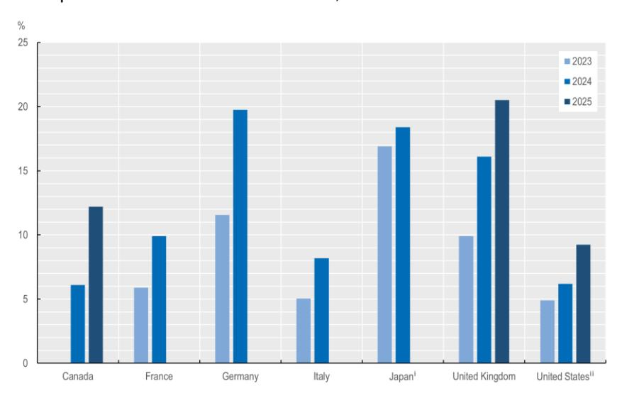

Note: This figure displays the latest available AI adoption rates from national sources (see [Table](#page-60-1) A.2). Comparisons across countries should be made with great caution given differences in the collected statistics (e.g. in terms of underlying definitions or survey questions). The 2025 figures for Canada refer to Q2 2025 while those for the United Kingdom refer to June 2025. i In Japan data from the Communications Usage Trend Survey report the share of firms that "have introduced IoT and AI systems or services to collect and analyse digital data". ii The BTOS data are collected bi-weekly. The figures displayed for the year N correspond to the average of the last two available waves for year N. For 2023 and 2024 this corresponds to the month of December. For 2025 it corresponds to the month of June. Source: see [Table](#page-60-1) A.2, sources were accessed in July 2025.

**Figure A.2. AI adoption gaps between larger and smaller firms** 

#### Latest available figures, G7 countries

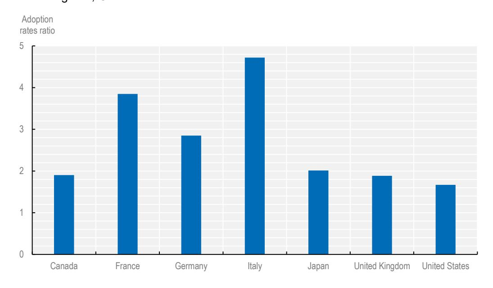

Note: The figure displays the ratio of the latest available adoption rates between larger and smaller firms, by firm size classes across G7 countries. The ratios are computed based on the data sources reported in [Table](#page-60-1) A.2. Firm size classes used to compute the ratios are not homogeneous across G7 countries due to data availability. In Italy, France, Germany and the United Kingdom smaller firms are defined as those with 10-49 employees. In Canada, Japan and the United States these are respectively defined as those with 5-19 employees, 100-199 employees and 20-49 employees. In Italy, France, Germany, the United Kingdom and the United States larger firms are defined as firms with 250+ employees. In Canada and Japan, they are respectively defined as those with 100+ employees and 300+ employees. Comparisons across countries should be made with great caution given differences in the definitions, collected statistics and timing. Notes to [Table](#page-60-1) A.2 also apply to this figure, see [Table](#page-60-1) A.2 for further details.

Source: see [Table](#page-60-1) A.2, sources were accessed in July 2025.