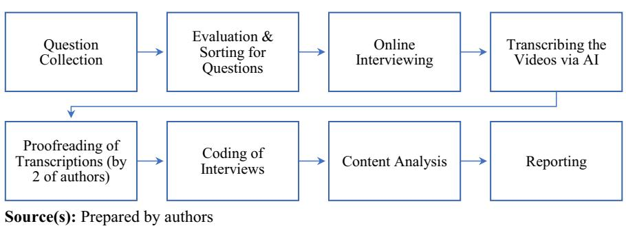
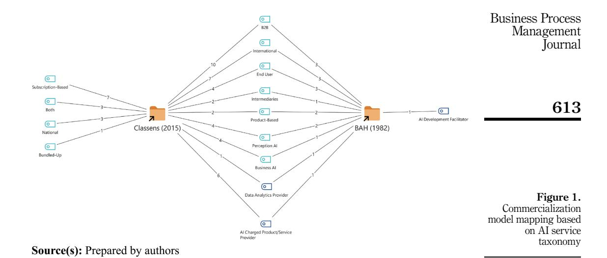
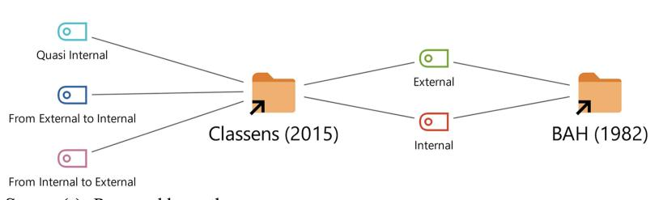
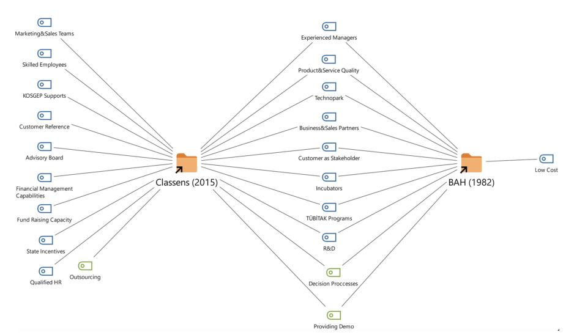
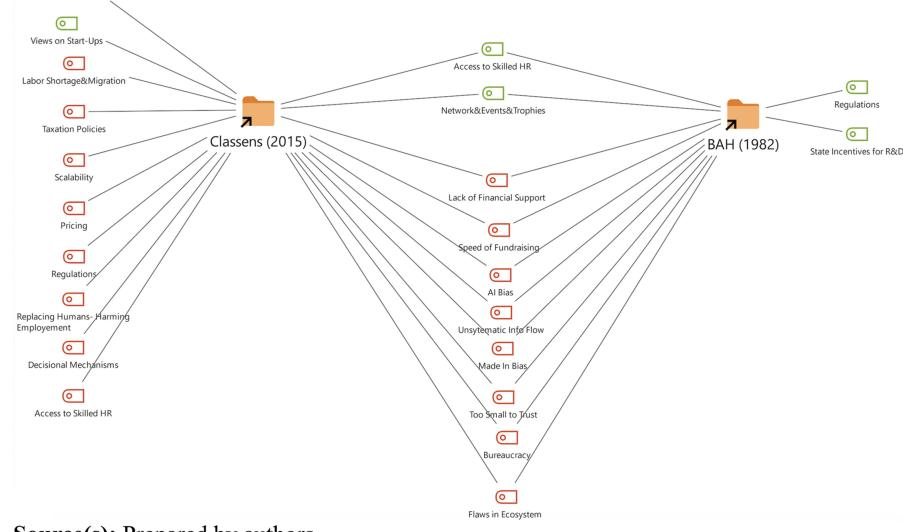
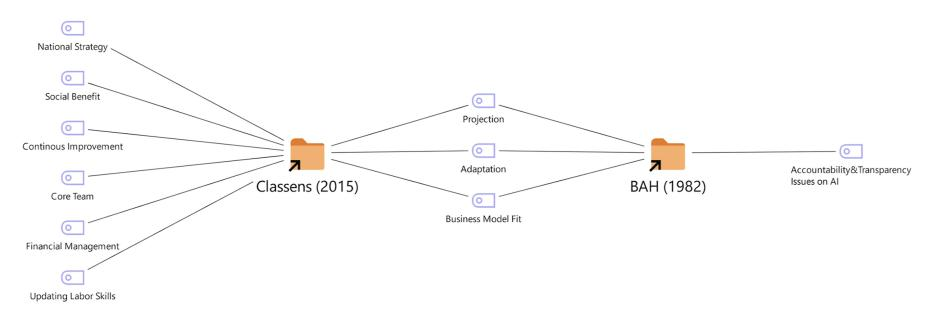
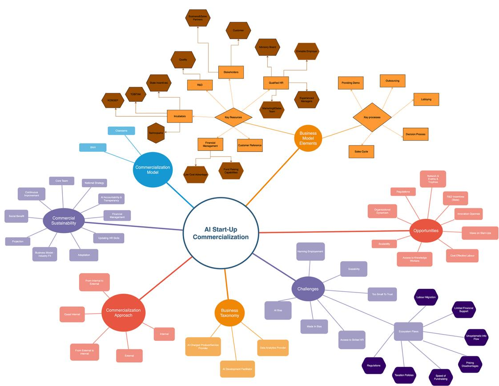

The current issue and full text archive of this journal is available on Emerald Insight at: https://www.emerald.com/insight/1463-7154.htm

# Commercialisation of artificial intelligence: a research on entrepreneurial companies with challenges and opportunities

Business Process Management Journal

605

Received 26 October 2023 Revised 1 June 2024 21 August 2024

Accepted 23 August 2024

Duygu Güner Gültekin and Fatih Pinarbasi

Faculty of Business and Management Sciences, Istanbul Medipol University, Istanbul, Turkey

Merve Yazici

School of Communication, Istanbul Medipol University, Istanbul, Turkey, and Zafer Adiguzel

Department of International Trade and Finance, Sakarya University of Applied Sciences, Sakarya, Turkey

#### Abstract

**Purpose** – The research paper's purpose is to contribute to the literature by analysing the essential resources and processes required for successful commercialisation, the contemporary challenges and opportunities of artificial intelligence initiatives in Türkiye, and the diverse models and methods employed by these initiatives. **Design/methodology/approach** – Within the scope of the research, interviews were conducted with 10 entrepreneurs who established artificial intelligence-oriented enterprises in technoparks in Istanbul and Antalya. All 10 interviews were analysed using the MAXQDA20 software tool. Structured qualitative content analysis was used for the data analysis procedure.

**Findings** – Based on the research, external factors have a significant impact on the future growth opportunities of the market. Expanding the client base, gaining international recognition, and securing financing are crucial for success. However, the findings reveal challenges in the relatively young local ecosystem. One major criticism is the lack of support in marketing and sales activities for refined products. To address this, providing financial incentives and knowledge transfer to those in need is vital.

**Research limitations/implications** – Since the research was conducted only with entrepreneurs who established and successfully commercialised artificial intelligence-oriented enterprises, it is recommended that future studies be performed with a widespread sample group, considering this limited situation. Furthermore, to overcome survivorship bias, it is recommended that posterior studies include failed commercialisation attempts in AI ventures.

**Practical implications** – It can be argued that there is no deliberate approach or model for commercialization. Entrepreneurs often draw from their own prior experiences or observe industry trends. Given the limited financial resources available in the domestic market and the challenge of attracting foreign investors to Turkish brands, entrepreneurs tend to rely on internal approaches for commercialisation.

**Originality/value** – This research delves into the commercialisation prospects and obstacles encountered by AI start-ups in Türkiye. It comprises qualitative insights into business models, commercialisation approaches, opportunities, and challenges. The data were obtained from interviews with entrepreneurs operating in the industry.

**Keywords** Commercialisation, Artificial intelligence, Entrepreneurship, Business model **Paper type** Research paper

# P

#### 1. Introduction

In the face of the rapid expansion of Industry 4.0 technologies, artificial intelligence (AI) emerges as a powerful catalyst for change in the worldwide business industry. Artificial intelligence (AI) has the ability to automate repetitive jobs and assist in making difficult decisions, which in turn transforms the way industries operate and strategize (Kaplan and

Business Process Management
Vol. 31 No. 2, 2025
pp. 605-630
© Emerald Publishing Limited
1463-7154
DOI 10.1108/BPMJ-10-2023-0836

Haenlein, 2019). For startups, the utilisation of AI technologies is not just a passing craze but a crucial necessity that may significantly expedite expansion, improve scalability, and promote innovation.

The rocketing domain of artificial intelligence (AI) offers remarkable opportunities for organisations to develop and attain a lucrative return on investment through the implementation of robust commercialisation strategies. Despite significant advancements in AI and its integration across several sectors, there remains a lack of comprehension of the optimal strategies for translating AI scientific developments into profitable business models. This paper seeks to fill the void by analysing how AI entrepreneurs, particularly in Türkiye, may efficiently navigate the complex process of AI commercialisation. Our research attempts to clarify the processes and strategies that result in successful outcomes in the commercialisation of AI products and services, with a particular emphasis on generating revenue. The research is distinct since its purpose is to investigate the commercialisation of AI as the core service or product. Therefore, the research focused on the start-ups that currently deliver AI as a service. The research paper's purpose is to provide pragmatic insights by analysing the experiences of entrepreneurs in this emerging industry. The objective is to aid AI firms in achieving financial stability and acquiring a competitive edge in the global economy. This investigation is of most significance, not only for the businesses themselves but also for policymakers and investors who play vital functions in the technology entrepreneurship ecosystem.

The significance of AI for startups is especially evident, considering their requirement to develop a competitive advantage in a technology-oriented economy. Artificial intelligence (AI) allows companies to utilise data-driven analysis, enhance operational effectiveness, and customise goods to meet client requirements more efficiently compared to conventional methods (Huang and Rust, 2018). The effectiveness of AI-driven initiatives in this scenario is frequently assessed based on enhanced metrics such as customer acquisition rates, reductions in operational costs, and improvements in personalised service or product offerings. These improvements directly contribute to increased customer satisfaction and loyalty (Choudhury *et al.*, 2020).

For firms looking to monetise AI technologies, it is crucial to carefully select the appropriate audience and efficiently target customers. Startups employ artificial intelligence (AI) to examine industry trends and customer behaviours, enabling them to pinpoint certain market segments that are most likely to gain advantages from novel solutions (Agrawal et al., 2018). By adopting this focused strategy, not only will marketing resources be allocated more efficiently, but also the potential for developing value propositions that strongly appeal to specific client segments will be enhanced.

Furthermore, in order to manage the competitive environment successfully, it is crucial for startups to take into account Porter's Five Forces paradigm. This model offers a thorough examination of the competitive landscape, aiding startups in comprehending prospective challenges from rivals, suppliers, customers, new market participants, and alternative products (Porter, 1980). By implementing this approach, AI startups can strategically position themselves in the marketplace to effectively withstand external constraints and take advantage of new opportunities.

This research is centred around a set of relevant research issues that are based on the examination of how artificial intelligence is commercialised in startup ecosystems in Türkiye. The main focus of this research is to investigate the specific methods and strategies utilised by AI entrepreneurs in Türkiye to effectively monetise their technology. The purpose of this inquiry is to reveal the precise techniques that these businesses employ to transform AI innovations into profitable business models. A secondary question investigates the impact of external factors, such as market conditions and investor behaviour, on the success of commercialising AI businesses in Türkiye. This question is crucial for comprehending the wider economic and social context in which these businesses function.

Finally, the research paper's purpose is to evaluate the sustainability of these commercialisation attempts by examining the long-term challenges and opportunities experienced by AI businesses in preserving their competitiveness and innovation in the market. The purpose of these questions is to analyse the commercialisation landscape for AI companies in Turkiye. € This analysis will examine the internal strategies and external variables that impact the success and sustainability of these startups.

This research involved conducting semi-structured interviews with ten entrepreneurs who have launched firms specialising in providing artificial intelligence-based services or products within technoparks located in Istanbul. The interviews were analysed using the MAXQDA20 programme, which utilised a structured qualitative content analysis methodology. These specific entrepreneurs were chosen for their participation in pioneering the commercialisation of artificial intelligence within a thriving metropolitan technological centre. This selection offers valuable insights into the operational strategies and issues faced by emerging AI businesses. However, the research was limited to AI-centric firms specifically in Istanbul, which suggests a constraint in the research's scope. Hence, it is advisable for future studies to include a wider range of entrepreneurs from different geographical and economic backgrounds in order to improve the accuracy and relevance of the results.

### **2. Literature review**

Artificial intelligence (AI) refers to the capacity of a system to accurately analyse external data, acquire knowledge from this data, and apply this knowledge to accomplish particular objectives and activities by means of adaptable adjustment (Kaplan [andHaenlein,](#page-23-0) 2019). AI's ability to imitate human behaviours like reasoning and prediction allows computers to improve their performance in complicated problem-solving situations [\(Obschonka](#page-24-0) and [Audretsch,](#page-24-0) 2020). AI's scalability, longevity, and continuous learning skills greatly enhance productivity, lower costs, and minimise human errors in many business processes ([Akerkar,](#page-22-0) [2019\)](#page-22-0). AI technology has made it easier to process big, unstructured datasets by applying complicated, adaptive algorithms that were previously only possible with human intelligence [\(Choudhury](#page-22-0) *et al.*, 2020). These developments provide companies with significant productivity advantages and the opportunity for commercial success by generating brand value through novel applications in domains including healthcare, legal affairs, and customer services [\(Amabile,](#page-22-0) 2020; [Nikolinakos,](#page-24-0) 2023).

The ability of AI to adapt to changing market conditions presents a valuable advantage for startups. This adaptability is crucial for the commercialisation of technology, where the transformation oftechnology-based inventions intomarket-viable products is necessary forthe survival and growth of enterprises in competitive markets (Balawi and [Ayoub,](#page-22-0) 2022; [Lemos](#page-23-0) *et al.*, [2022\)](#page-23-0). Effective commercialisation relies on aligning product features with customer needs in terms of cost, speed, quality, and innovation ([Houdek,](#page-23-0) 2024). While AI startups have received a lot of attention from VCs and investors, they inevitably need to find a stable business model at some pointto ensure long-term performance and survival ([Weber](#page-24-0) *et al*., 2022).There is a scarcity of research on the utilisation of artificial intelligence in startups for commercial purposes and its impact on the economy. Nevertheless, economists have conducted research from a macro-level standpoint to examine the theoretical comprehension of artificial intelligence and wider automation processes, as well as their impacts on employment, income, and policy ([Acemoglu](#page-22-0) and Restrepo, 2018; [Korinek](#page-23-0) and Stiglitz, 2018).

The objective of this research is to expedite advancements in both the theoretical and practical aspects of commercialising artificial intelligence, with a particular focus on its application in the sphere of entrepreneurship. The objective is to address the gap in current digital entrepreneurship theories by creating a conceptual framework that illustrates the impact of artificial intelligence on new entrepreneurial processes, practices, and results ([Nambisan,](#page-24-0) 2017; [Nambisan](#page-24-0) and Baron, 2021). By acknowledging this, we understand that the spread of AI and other digital technologies will not occur independently, but rather as a component of a broader interrelated path of economic and political transformation. The objective is to analyse high technology-based projects and start-ups to uncover the stages of commercialisation and how they contribute to building brand value, ultimately leading to commercial success. The framework incorporates the theories of entrepreneurship, economics, and digital technology to forecast the impact of these factors on many elements of entrepreneurship. This method takes into account the broader perspective and purpose to provide a comprehensive understanding of the subject [\(Obschonka](#page-24-0) and Audretsch, 2020).

Generative Artificial Intelligence (AI) has become a powerful and influential force, radically transforming several fields such as art, entertainment, healthcare, and finance. Generative AI differs from typical AI systems by going beyond pattern recognition and classification to explore the world of creativity. It produces novel content, such as images, text, and music, that imitates human-like creative abilities [\(Schwaller](#page-24-0) *et al.*, 2019).

It is stated that AI is the driving force of technology, provides market attractiveness, advances in innovation and contributes to new product development ([Brem](#page-22-0) *et al*., 2021). Giuggioli and [Pellegrini](#page-23-0) (2023) emphasise in theirresearch that AI has profound effects when it comes to entrepreneurship and especially positively affects entrepreneurs through opportunity, decision-making, performance, and education and research. It can be used to gain insight into the potential needs of users through artificial intelligence to provide entrepreneurs with a complete user profile (Li *et al*., [2022\)](#page-24-0). Therefore, through user demand information obtained from the artificial intelligence system, the identified product deficiencies will be more accurate.

Effectively commercialising artificial intelligence enables startups to cultivate enduring competitive advantages. This entails not only the introduction of groundbreaking items but also the assurance that these advancements align with market needs and client anticipations. Utilising AI strategically in organisational design, decision-making processes, and marketing efforts is essential for sustaining competitiveness and attaining long-term viability [\(Burton](#page-22-0) *et al.*, 2019; [Lockett](#page-24-0) *et al.*, 2009).

#### **3. Methodology**

This research paper's purpose is to pinpoint the essential components of commercialisation processes and business models adopted by AI-powered start-ups operating in different university technoparks in Turkiye. € Hence from this section onwards, the document details the process of conducting a qualitative research. It begins by explaining how interview participants were chosen, and data was collected. Next, it covers the creation of the interview guide and the analysis of the gathered data.

#### *3.1 Participant selection and data collection*

The start-ups for the case research were selected using a purposive sampling technique that matched the contextual framework and research questions being addressed. Efforts are made to reach out to founders, CEOs, and C-suite managers as they are considered to be valuable sources of information for the company. After reaching out to several start-up managers, a total of 10 individuals were interviewed for the research. The concept that qualitative research can reach saturation with relatively small sample sizes is substantiated by literature, such as the work of Guest *et al*. [\(2006\)](#page-23-0), who assert that saturation can frequently be attained after conducting just 12 interviews. Furthermore, the selection of C-level executives as interviews should be justified based on their capacity to offer strategic and comprehensive insights. This is particularly important when examining complex business processes like AI commercialisation (Yin, [2014](#page-25-0)).

We conducted semi-structured online interviews to answer the research questions. It was decided to interview ten representatives from different AI-generating start-ups. The major AI development fields included in the research: computer visioning, predictive data analysis, and language processing. The interviews were conducted and recorded in November 2022 using video conferencing software. The length of the interviews ranged from 35 to 87 min. A thorough review has been conducted on a total of 589 min of recorded material, ensuring accurate transcription and cross-checking. Our analysis consisted of examining 10 documents, each with an impressive average of over 4,000 words.

The preliminary analysis of the sample revealed the, on average, these firms have 15 employees and less than 50 customers. However, the only language processor of the sample has surmounted 100.000 customers by providing both transcribing and vocalising services to both businesses and individuals such as students, academicians etc. The market scope of the firms is stated as national, and the representative didn't mention any plans for international expansion. However, it is worth noting that most of the samples have already successfully operated in international markets. Even those currently focussing on the national market have expressed a desire to expand internationally as soon as possible. Most of the company focus on serving end-users, and only three of them use intermediaries to resell their services. Detailed profiling info regarding the sample is provided in [Table](#page-4-0) 1:

#### *3.2 Interview guidelines*

To create the interview guide, we begin by gathering all questions related to the research objective through a literature review. Next, we review the questions with all authors to ensure they align with our prior knowledge and overall purpose. This step is achieved by reaching a consensus. Finally, to ensure consistency, all participants are asked the same set of questions and follow the same interview guideline. At the beginning of the interviews, the research project was briefly introduced. The questions were then organised into categories such as leading questions, start-up profiling questions, and conceptualisation questions.

The semi-structured questionnaire comprises selected questions from the review of the literature as well as additional items introduced by the authors. A total of 26 questions are posed to the interviewees, covering 6 separate dimensions. The respondent demographics are assessed using two criteria that enquire about the participant's current position and total

| ID   | Interviewee position        | Year of kick-off | Industry                                           | No. of staff | Average no. of customers |
|------|--------------------------------|---------------------|----------------------------------------------------|-----------------|-----------------------------|
| CV1  | Founder                        | 2020                | All industries interested in computer visioning | 2               | No Info                     |
| CV2  | VP of Marketing and Sales   | 2015                | Airports                                           | 28              | Less than 50                |
| CV3  | Co-Founder                     | 2021                | Retail                                             | 16              | Less than 50                |
| CV4  | Founder                        | 2013                | Hybrid Seed Production                             | No Info         | No Info                     |
| CV5  | Co-Founder                     | 2000                | Manufacturing                                      | 10              | Less than 50                |
| LP1  | Co-Founder                     | 2020                | Media and Individuals                              | 12              | More than 100.000        |
| PDA1 | Co-Founder                     | 2019                | Energy, Construction                               | 4               | Less than 50                |
| PDA2 | Product Manager                | 2017                | Telecommunication                                  | 46              | Less than 50                |
| PDA3 | CEO                            | 2017                | Insure-Tech                                        | 20              | Less than 50                |
| PDA4 | Co-Founder                     | 2020                | Retail                                             | 15              | No Info                     |
|      | Source(s): Prepared by authors |                     |                                                    |                 |                             |

**Table 1.** Demographic data for AI start-ups **610**

tenure of employment in that position. These items are adapted from the [Pellikka](#page-24-0) and [Malinen](#page-24-0) (2014)'s research. The company demographics are examined using five parameters to determine the staff count, the life span of the business, the total quantity of services/ products launched, and the proportion of revenue generated from AI-powered services/ products. The items are derived from the works of [Karaboga](#page-23-0)� and Ozdemir € (2019) and [Pellikka](#page-24-0) and Malinen (2014), as well as the writers themselves. Four elements are generated from [Morris](#page-24-0) *et al*. (2005) to categorise the various value propositions of organisations. These categories cover concerns such as the approach to value creation, the targeted customer segments for this value, and the position of the customers in the value chain. For the purpose of identifying if the firms had established procedures for commercialising their AI inventions, six questions were created.Three of these questions originated from [Pellikka](#page-24-0) and [Malinen](#page-24-0) (2014), two were obtained from [Karaboga](#page-23-0)� and Ozdemir € (2019), and one was contributed by the authors. Finally, the current obstacles and opportunities encountered by the companies are investigated utilising elements derived from both [Pellikka](#page-24-0) and Malinen [\(2014\)](#page-24-0) and [Amadi-Echendu](#page-22-0) and Rasetlola (2011). The items include, but are not limited to, identifying the accelerator factors for commercialising AI, assessing the strengths of the firm, detecting variables that impede the process.

### *3.3 Data analysis*

All interview recordings were transcribed using the Whisper dataset/model [\(OpenAI,](#page-24-0) 2023; [Radford](#page-24-0) *et al.*, 2022) with Boog [\(2023\)](#page-22-0)'s approach, the audio logs are processed. Then, two of the authors cross-checked all transcriptions by video recordings to ensure clarity and accuracy of language.

All ten interviews were analysed by using the MAXQDA20 software tool. For the data analysis procedure, the structured qualitative content analysis was used.Therefore, a coding scheme was developed and applied as depicted in [Table](#page-5-0) 2:

#### **4. Findings**

In this section, we provide interpretations of research that offer insights into identified implementations of commercialisation practices used by AI start-ups. We also discuss the currently experienced challenges and presumed opportunities for success in this field.

#### *4.1 Taxonomy for AI start-up and commercialisation areas*

To better understand the start-ups, they were categorised using the contemporary taxonomy studies found in the literature. For this purpose, the unique selling proposition of each firm

**Table 2.** Coding scheme

was analysed. The three different clustering methods were investigated, and firms were categorised in accordance with all three options.

As a first step, the firms were clustered based on the core AI value they set to create. During the interview, the company representatives confirmed that 10 start-ups primarily focused on computer visioning, predictive data analysis, or language processing. To summarise, out of ten firms, five focus on computer visioning (CV 1–5), four specialise in predictive data analysis (PDA 1–4), and only one works on language processing (LP1).

It was found that the start-ups primarily focused on targeting B2B customers, except for the AI language processor company, which aimed at B2C customers along with B2Bs.The AI taxonomy clusters were adopted from [Weber](#page-24-0) *et al*. (2022).

- (1) AI-charged Product/Service Provider Start-ups: This cluster involves providing products or services that come equipped with pre-trained AI models that form the foundation of the business model.
- (2) AI Development Facilitator Start-ups: The companies here, focus on making AI development easier for their customers and have made it a central part of their business model.
- (3) Data Analytics Provider Start-ups: Companies concentrate on incorporating and analysing large volumes of data into their business model, utilising both internal and external data sources.
- (4) Deep Tech Researcher Start-ups: Companies focus on developing unique and creative solutions using AI technology in cutting-edge fields like robotics, autonomous driving, and medical drug discovery.

According to this taxonomy, only one (CV1) of the studied firms falls into the category of AI development facilitator. The unique selling proposition of CV1 is to reduce the cost, time, and error margin by presenting images similar to those needed by creating scenes through 3D modelling programs or game engines. The remaining participants were either a product/ service or a data analytics provider.

Additionally, for identifying the major commercialisation areas for AI start-ups [NSB](#page-24-0) [\(2020\)](#page-24-0) report was consulted.

- (1) Internet AI: The focus of this theme is predominantly on AI algorithms that function as recommendation engines.
- (2) Business AI: The main purpose is to scour through the vast databases of various businesses and institutions, crafting advanced algorithms that can surpass even the capabilities of human minds.
- (3) Perception AI: The physical environment is being digitised with the help of sensors and smart devices. This digitised information can be optimised and analysed using AI algorithms.
- (4) Autonomous AI: Mainly creates autonomous vehicles and drones, intelligent robots, and other devices and hardware to replace or supplement human labour.

The analysis revealed that there were no autonomous or internet AI in the sample.

# **5. Commercialisation model**

During the interview, it was discovered that the participants had neither a scholarly understanding of the commercialisation concept nor knowledge of the steps to follow. It appears that they rely on either their previous experience or act based on the current circumstances. Hence the explanations have been classified and organised by the authors according to the relevant literature.

Two models selected from the literature have contrasting approaches towards marketing activities to be executed. In the BAH (Booz, Allen & [Hamilton,](#page-22-0) 1982) model, the primary objective of the new product development process is to generate "superior customer value" that surpasses that of competitors and alternative products. The BAH model of commercialisation often refers to the commercialisation frameworks developed or utilised by Booz, Allen & Hamilton, a prominent consulting firm. The Booz, [Allen](#page-22-0) & [Hamilton](#page-22-0) (1982) (BAH) model for new product development, as described in their research, is a meticulously organised framework that delineates the sequential stages that a company commonly undergoes during the process of creating new products. This model has a methodical which enables organisations to effectively handle the intricate processes of product development. The BAH model categorises the process of developing a new product into various well-defined stages, including new product strategy, idea generation, screening and evaluation, development, commercialisation and post-launch review and management. According to BAH Model the new product strategy begins with the crucial step of determining the specific function that the new items will fulfil within the broader corporate plan. In the idea generation phase, novel concepts for new products are created. Potential sources of ideas can originate from either internal or external factors. Internal sources may include personnel or ongoing research and development projects, while external sources may consist of market research, customer feedback, and competitor analysis. Later on, in screening and evaluation steps will generate ideas are assess them based on a set of criteria to verify they correspond with the company's strategic objectives and to evaluate their feasibility, market potential, and financial viability. Followingly, the development stage encompasses the meticulous design and development of the product, along by testing procedures to enhance the product and guarantee its compliance with the set standards. The last stage, which is commercialisation, entails introducing the product into the market. The activities encompass the process of increasing production, developing marketing campaigns, managing distribution, and formulating sales strategies. Finally, during the post-launch review and management process, continuous analysis is carried out to evaluate the product's performance in relation to expectations and to make any necessary improvements.

The [Claessens](#page-23-0) (2015) model, is also a methodical process that firms follow to introduce a new product to the market. The process begins with the idea generation phase, during which innovative thinking is fostered to generate novel product concepts. Next, the idea screening stage ensues, during which the feasibility of these ideas is assessed in order to eliminate impractical ones. Following that, concept development and testing ensue, entailing examination of product concepts and conducting tests with the intended market segment. The process of marketing strategy and business analysis involves the formulation and analysis of a comprehensive company strategy and marketing plan to assess its financial feasibility. Product development is the stage in which prototypes are constructed and evaluated, ultimately leading to market testing. During market testing, the product and its marketing plan are examined in a simulated or real market environment to improve the approach. Ultimately, the process culminates in commercialisation, when the product is introduced to the market, followed by a post-launch review that aids in comprehending the product's influence and identifying any requisite modifications. [Claessens](#page-23-0) (2015) differs from BAH (Booz, Allen & [Hamilton,](#page-22-0) 1982) by incorporating two additional marketing processes in [Figure](#page-8-0) 1. The model distinguishes itself from the BAH model in two key areas: first, by developing a marketing strategy for the new product before beginning the development process, and second, by pre-planning a product commercialisation philosophy through marketing tests and measuring consumer preferences after the product is developed.

Choosing the commercialisation process seems not to be a conscious or intentional decision on businesses' part, it is rather the consequence of the previously implemented practical solutions. Many start-ups tend to follow the BAH model, which places less emphasis on marketing activities.The issue at hand could likely be attributed to a shortage of funding and marketing expertise. It's evident that marketing activities are not receiving sufficient funding in the ecosystem, and the majority of start-up founders are engineers, which could be contributing to the problem. Anotherimportant discovery is that no matter which model was used in practice, the respondents stressed that the process lacked clear-cut steps; it was depicted as a fuzzy process.

Then, ours is close to Claessens, but the stages you explained are very sharply separated, somewhat clear-cut. In our case, they can intertwine a little (PDA-4).

No because, the start-up cannot afford to slow down and review marketing materials. The priority is to move forward at full speed, as time is a valuable resource. It's important to enter the market as soon as possible, even if it means launching with a prototype. At least this is what we prioritise (PDA-3).

#### *5.1 Commercialisation approach*

Respondents were also asked to explain their stance regarding the commercialisation approach they embraced. It appears that start-ups are positioned on a spectrum between an internal and external approach in [Figure](#page-9-0) 2. Most of them are located in university technoparks yet they solely benefit from the tax incentives that these parks provide. In domestic markets, they did not mention any investments apart from state-initiated programs, although some of them were actively seeking international investors or funding programs.

#### *5.2 Business model elements for successful commercialisation*

In order to identify the essential components for a successful AI business in the Turkish ecosystem, participants are required to state the key resources and processes utilised for

BPMJ 31,2

**614**

commercialisation. Business model elements mapping based on commercialisation model is shown in [Figure](#page-9-1) 3.

It's important to note that the majority of respondents stated that customers are their main source of ideas. In general stakeholder participation is highly appreciated among the interviewees, but they especially emphasised the power of customers as their resources. Similarly, the quality of your product can be used as a tool to entice customers and encourage them to become enthusiastic advocates for the firm's services.

We always listen to the field from our customers (LP-1).

I don't know if it is mentioned as a source, but there is the customer himself. They are typically involved in the process from the beginning since they are the ones who initiated the idea for the product. At times, they may even put in as much effort as we do and become a stakeholder in the project (CV-5).

Who is your potential customer? You need to detect this very well. And you need to be in constant communication with those potential customers. You have to knock on their door all the time. You have to ask them constantly (CV-4).

Moreover, customers' referent power is cited as a means to attain recognition and reputation in the market. Well-served customers can act as peer reviews and help expand the firm's

**Figure 2.** Commercialization approach mapping based on commercialization model

**Figure 3.** Business model elements mapping based on commercialization model

**Business Process** 

customer base with less effort. This can also assist companies in dealing with the bias towards made in Türkiye software. One more valuable resource for firms is to attract qualified individuals to their organisation with less effort and expense. This can be an ongoing benefit.

The capacity and speed of fundraising are deemed critical determinants of long-term success. While some participants are struggling to acquire funds, others reported having no difficulty obtaining them.

We had no problem while receiving investments from both home and abroad (CV-3).

Investment, the basis of this business is funding (CV-4).

During the discussion, nearly all participants stressed the significance of having a demo version of the product or service. Most respondents recommend that ventures prepare a demo to show the stakeholders what the promised service will look like and how it will work. The demo will also serve as evidence to persuade stakeholders that the business has the capabilities to successfully complete the project.

Participants view outsourcing as a strategic decision to enhance the effectiveness and agility of the start-up. Engaging in lobbying activities is often viewed as a strategic approach, particularly in areas where regulations are not favourable to them.

We communicate the importance of this system to international aviation organisations and authorities to speed up the commercialisation process. Our involvement in related activities helps to increase awareness among individuals and organisations (CV-2).

A significant discovery is that many companies have an unclear, adaptable, and fluid approach to decision-making regarding commercialisation operations. The founders usually hold decision-making power, but they involve other staff in the process through a participative approach. Those participative processes are not formally designed but rather emerge in accordance with the actual needs.

Several participants expressed that their sales cycles are prolonged, making it crucial for them to efficiently and effectively organise their businesses to survive.

Our sales cycles are quite lengthy, with only one or two sales per year being considered good (CV-2).

#### 5.3 Commercialisation: challenges and opportunities in Türkiye

To gain a better understanding of the national ecosystem the individuals interviewed were asked to share the current challenges and opportunities they are facing in their AI-powered start-ups. Based on input from AI entrepreneurs, we've identified 10 major sub-categories of potential opportunities and 9 sub-categories for challenges, which are given and summarised in Figure 4:

The most commonly referenced category is network, events, and awards. According to several of the interviewees participating in national project contests organised by KOSGEP (Small and Medium Enterprises Development Organization of Türkiye), TUBITAK (The Scientific and Technological Research Council of Türkiye), or other technoparks is a great opportunity to gain recognition and expand the network. Another interviewee stated that they are actively involved in international networking activities, such as Microsoft's Start-up Hub and Nvidia's Inception program.

For example, the things we benefit most in this field are competitions, awards, and industry competitions, they are very effective in the emergence of our activities. Participating in fairs and promoting your products can be beneficial, especially if you've developed something using new and emerging technologies (PDA-2).

# 616

Figure 4. Challenges and opportunities mapping based on commercialization model

**Source(s):** Prepared by authors

Many participants believe that networking activities and competitions are as beneficial as national incubation programs. Although these types of activities may offer limited financing options, they have less bureaucracy. Many consider current regulations to be an obstacle, but they present significant opportunities for a newly established AI startup to grow. These opportunities arise from current debates about data privacy and its use in commercial products. And these private startups are able to solve their questions by providing fictionally created visuals for machine learning datasets.

In terms of finances, the government provides robust R&D support through various means, such as tax benefits offered in technoparks. Additionally, start-ups benefit greatly from specialised programs like KOSGEP and TUBİTAK, which positively affect their performance. However, the scope of the developments has received criticism for being too narrow, focussing solely on R&D and neglecting the importance of marketing activities for the commercial success of these ventures. However, many countries also face complex regulatory environments that hinder innovation. By simplifying regulations and aligning them with international standards, businesses can more easily navigate the commercialisation process. For example, emerging markets in Southeast Asia and Africa could benefit from regulatory reforms to attract more foreign investment and boost local entrepreneurship (Daraojimba *et al.*, 2023). Some participants have expressed concern that the support programs prioritise technical development while neglecting marketing efforts. They feel that the support mechanisms are geared towards product creation without providing adequate plans or resources for marketing the product.

Türkiye provides a significant amount of state support, and our bureaucracy seems to be functioning well. However, despite this support, the result is only a mediocre product, and there is little discussion or improvement beyond that point (CV-4).

For example, I am able to finance a portion of the expenses for R&D personnel involved in TÜBİTAK or KOSGEP projects, but unfortunately, there is currently no available program for financing sales and marketing expenses (CV-5).

Okay, TÜBİTAK has an R&D mission, but someone else needs to support – including personnel costs – the commercialisation of the process. This is the weak side, I think (PDA-2).

Programs that support product development are blocked in productization and product commercialisation processes. TÜBİTAK has a program that oversees the commercialisation process of products, but they do not provide financial support for it CV-5).

Another criticism of the support programs has come from the predetermined budgeting implications of the program executors. Because financial constraints are a common problem globally. Establishing various financing mechanisms helps reduce risks and supports startups. For example, Latin American countries can create financial models to encourage local innovation and support SMEs to access the necessary capital (Kolbe *et al.*, 2022). Some entrepreneurs are facing challenges due to the biased funding views of incubator organisations in Türkiye. They often assume that proposed projects can be achieved with less funding than requested, which can be detrimental to entrepreneurs.

Based on our experience, we have noticed that when we submit a project proposal with a specific budget to Tübitak, we are typically granted around one-third of the requested funds. Tübitak seems to believe that the project can still be successfully accomplished with this reduced budget (PDA-1).

Another obstacle mentioned by those interviewed is the slow speed of funding, particularly during the initial stages of establishing a company when urgent funds are needed. However, the process of injecting funds into the company takes a long time due to both the necessary processes and limited investor options. National markets offer valuable benefits such as industries being open to innovation and having a favourable attitude towards collaborating with start-ups.

Our sector benefits from customers who are highly receptive to new technology and innovation. They are quick to adopt these advancements and are enthusiastic about trying them out. This open-mindedness is a significant advantage for us, as we rarely face any resistance to implementing new techniques or technologies (CV-5).

Companies in Türkiye are not very conservative about working with start-ups (CV-3).

While certain ventures are embraced by industry leaders, others are met with scepticism. Especially in the field of predictive data analytics, it can be challenging for professionals to prove to their clients that they can offer substantial value to their business, regardless of their size or age. This scepticism seems to arise from the magnitude of business value proposed by a relatively young and small firm, they are deemed as too small to trust or depend on.

Indeed, very large companies may have little belief that a small start-up or small company can produce such high value (PDA-2).

The man who presented me with an award during the  $\dot{I}T\ddot{U}$  Seed program finals has not returned to collaborate with me. Why doesn't he work with me? I don't know either (PDA-3).

We struggle to convey the value proposition to large companies, as they often believe that their size means they can handle everything on their own (PDA-2).

Although employment costs are currently low in Turkey, finding people with the appropriate qualifications for the role is both an opportunity and a challenge. Due to pandemic conditions, new working regulations have been prepared that make it easier for some businesses to hire highly skilled white-collar workers. On the other hand, since these young enterprises carry more risks than companies, it is relatively difficult and costly for them to attract qualified employees.

One of the interviewees stated that the way they organise around tasks and jobs creates a huge advantage for them to survive in the industry. The company attaches great importance to its ability to adapt quickly and is confident that this will play an important role in its future success.

Scalability; Itrefers to the ability of a solution to expand and be applied to a larger market or industry. This idea can be seen as both a challenge and an opportunity, depending on the interviewees' perspective. One of the participants described this as an opportunity because it achieved its scalability potential. Their success can be attributed to highly adaptable products that appeal to different customers and have a rapid integration process. This gives them a competitive advantage in the market. But some see scalability as a possible danger. This is because the problem they are trying to solve is quite unique and is significantly hindering their progress.

The fact that the problem you're solving appeals to the general public is what accelerates you the most (PDA-1).

Aside from these concerns, AI start-ups in Turkiye € are experiencing challenges due to the underdeveloped nature of the ecosystem. Many highly skilled individuals seek employment abroad due to the recent economic conditions, which created a shortage in the market. While there have been more diverse options for incubators and resources lately, the bureaucratic process of getting involved in the system is still too cumbersome to manage. The pricing issue caused by the current economic situation in the country is presenting additional obstacles.

The price in Turkiye € is not comparable to abroad. And this is something that stems from the economic realities of the country (CV-3).

Furthermore, the participants expressed their concerns regarding the bias towards the origin of the service, product, or start-up in both national and international markets. Several reasons have been cited to support this notion in international markets. Turkish entrepreneurs and engineers are not commonly known for their software skills. As a result, services created by them may initially be met with scepticism about their capabilities. Furthermore, it is indicated that even the politicalrelations of the government have an impact on the views of international customers. Local customers are also doubtful about the abilities of national technology.

What we need now is to establish a narrative of a trust story. Overthe next 25 years, people will have more confidence in domestic technology as it will undergo frequent testing (PDA-1).

#### *5.4 Projections for commercial sustainability*

The respondents were also asked to specify the necessary conditions that the AI start-up industry needs to meet to achieve commercial sustainability. In general, the participants identified internal factors as the main contributors to commercial sustainability. And it is observed that participants, in general, considered sustainability issues as surviving in the business for an indefinite time. The most frequently mentioned factors were the business model-industry fit and future projection capabilities. In addition, sustainability issues mapping based on the commercialisation model is indicated in [Figure](#page-14-0) 5.

The business models need to be set up correctly. The "sell and forget" approach is not a sustainable strategy, in my opinion (CV-2).

To achieve sustainability, we need adaptable products that can address various problems in different sectors. We must adopt a modular planning approach to keep up with evolving customer needs, societal expectations, and market trends. This need for agility will only increase in the future (PDA-4).

When we think, our children cannot continue this business. This is not a job like this. Therefore, it is necessary to think carefully about its administrative structure. In other words, we have to make corporate affairs independent from people both in terms of legal and infrastructural issues (PDA-3). Keeping the organisation and the labour force up to date is also essential for continuous success. Generally, experienced managerial staff was identified as a key source for commercialisation, but it is equally crucial to keep their experience up to date to sustain the business in the future successfully.

Third, for this company to be sustainable, experienced leaders and new talents must be constantly renewed, and the experience must be kept up to date (CV-3).

As for the external factors, participants were generally concerned about the implications of having AI-based applications in society. The focus is on improving transparency and accountability in AI algorithms to prevent harm to society. This will help build trust and open up more possibilities for using AI. Additionally, it is stressed that integrating social benefits into AI applications should be an essential phase of the development process. The national strategy concerning the issue is also referred to, especially the allocation of resources for today and the future is of utmost essence. Fortunately, the respondents hold a positive outlook on the prioritisation of issues by the state and hope that this strategy will continue to expand in the future.

I think the state policy is on the right track, with important matters being prioritised (LP-1).

In other words, how much of the resources will be reserved here, and how much investment will these companies receive, even if we do not think that they will ever come to American standards, will they come to European standards? (PDA-1).

Also, it is underlined that the adaptation abilities of the organisations will be a fundamental determining factor of survival. Most participants believe it's impractical to stick to pre-set plans or strategies due to the ever-changing nature of the industry.

I think neitherthe fastest northe strongest survives, but the most adaptable survive. That's why it is important to make change sustainable (CV-3).

There can be rapid developments in the market and industry we are in. Therefore, if we cannot keep up with these rapid developments as a start-up, it may be very difficult for us to continue the business. There may be external factors like this (PDA-2).

Finally, a conceptual map has been devised to showcase all the crucial discoveries surrounding the commercialisation process of AI Start-Ups in Turkiye. € According to the holistic view, regardless of the model or approach chosen for monetisation of the AI services, the key to success lies with the business model and industry fit. Most of the participants emphasised that incorporating the customer as a crucial element in launching a product can be the determining factor in its success. By placing the customer at the forefront of the

**Figure 5.** Sustainability issues mapping based on commercialization model commercialisation process, this approach ensures that their needs and preferences are thoroughly considered, leading to a more favourable outcome. The current domestic ecosystem is full of vibrant prospects, indicating great potential for growth and development. However, it is crucial to acknowledge the substantial obstacles arising from the country's prevailing limitations and economic conditions. The implications of these factors can vary depending on the approach taken by businesses orthe government, and they have the potential to either enhance or hinder future growth opportunities. For instance, the ability to scale the problem addressed and government regulations can either support or impede the progress depending on the strategies employed. While the business will solely determine scalability, state policies will directly dictate regulations. Similarly, achieving long-term success in business does not depend on the specific approach or model of commercialisation. Survey participants highlighted the importance of AI development having a positive impact on society in order for it to be better regulated and accepted by the community.

The holistic view of all the essential findings is presented in the following thematic map in [Figure](#page-16-0) 6.

# **6. Discussion**

The process of commercialising AI technologies in startups is complex and dynamic, showcasing both the possibilities and difficulties of incorporating advanced technologies into successful business models. The outcomes of this research emphasise the crucial influence that external factors, such as market demands and financing, have on the development of commercialisation strategies. These observations are in agreement with and build upon the current body of knowledge, highlighting the importance for startups to quickly adjust to external market conditions and successfully utilise financial opportunities.

Technology-oriented commercialisation is the process of transforming technology-based inventions into commercially viable new products or services ([Fontes,](#page-23-0) 2005). The important thing here is to determine the right methods to be followed in order for artificial intelligenceoriented enterprises to achieve commercialisation success. Successful commercialisation is essential for survival in today's competitive markets. Successful commercialisation ensures that the firm's technologies meet the needs of its customers in terms of cost, speed, quality, and innovation (Zahra and [Nielsen,](#page-25-0) 2002). Technology commercialisation capability refers to the ability to grasp and reformat a new technology for use in production and marketing; in other words, it is the ability to integrate technology into concrete production and marketing activities ([Jolly,](#page-23-0) 1997). The results of our research support the existing research that emphasises the importance of market adaptation in the process of commercialisation [\(Zahra](#page-25-0) and [Nielsen,](#page-25-0) 2002; [Cooper,](#page-23-0) 2000). Startups that effectively increase their customer base and achieve global recognition exhibit a strong aptitude for aligning their product offers with market demands, a crucial element in their business successes. This finding is especially pertinent in the context of AI companies, where the rapid pace of technology advancements requires adaptable and proactive market strategies (Kaplan and [Haenlein,](#page-23-0) 2019; [Huang](#page-23-0) and [Rust,](#page-23-0) 2018).

It is clearthat technology commercialisation is an important process that directly benefits through technology development (Kim *et al.*, [2019](#page-23-0)). Technology commercialisation is defined as a process that leads production by developing new products and new processes through the actual use of R&D performances, improving existing products and processes [\(Kang,](#page-23-0) [2013\)](#page-23-0). In this context, when the results of the analysis are examined, it is stated that entrepreneurs generally have difficulties in terms of financial resources. In order to be successful in commercialisation, R&D investments must be a priority. In this case, it is necessary to have the necessary financial resources. Obtaining and maintaining sufficient

**621**

Business Process Management Journal

**Figure 6.** Thematic map of findings

funding has become a crucial element in the effective implementation of AI technologies for commercial purposes. This is consistent with economic theories that emphasise the importance of financial capital in expanding innovations and maintaining long-term growth ([Agrawal](#page-22-0) *et al.*, 2018; [Acemoglu](#page-22-0) and Restrepo, 2018). The capability to attract investment plays a crucialrole in driving the advancement and improvement of AI technology, as well as helping firms efficiently navigate competitive environments.

[Nevens](#page-24-0) (1990) defines technology commercialisation capability as the ability to reduce costs, improve quality, rise above competitors and gain competitive advantage through the adoption of new technologies. Technology can be defined as a process leading to production through commercialisation, the actual use of ar-re performances, or the development of new products and new processes through improvement of existing products and processes. Technology commercialisation is a very important competency ([Chen,](#page-22-0) 2009). Commercialisation competence refers to the competence of companies to use more technology in products and to bring products to market faster [\(Nevens,](#page-24-0) 1990). Firms that commercialise technologies contribute significantly to their country's domestic production, trade opportunities, and living standards ([Chen](#page-22-0) *et al.*, 2011). Commercialisation of technology is also seen as the ability to move a product from concept to market quickly and efficiently in light of changes in the business environment [\(Nevens,](#page-24-0) 1990). Technology commercialisation has been defined in various ways, but it is clear that technology commercialisation is an important process that directly benefits through technology development (Kim *et al.*, [2019](#page-23-0)). It is also a driving force to be a pioneer in an uncertain and busy market environment ([Qian](#page-24-0) *et al.*, [2018](#page-24-0)). As [Simon](#page-24-0) (1977) points out, "the purpose of making predictions about the future should be to provide a basis for decisions to be made today; tomorrow's decisions can and must be made on the basis of the information available tomorrow. Some decisions are necessary today to provide preliminary time for tomorrow's actions" ([Simon,](#page-24-0) 1977). In the decisions to be taken forthe future in artificial intelligence-oriented initiatives, there is a need to determine the commercialisation stages within the planning. This planning should be done in order to create brand value and gain competitive power of the enterprise. Since the determination of these planning stages has not yet been determined in the research carried out in artificial intelligence-oriented initiatives, it is aimed to close this gap in the focus of the research. It is accepted that socio-economic factors also play an important role in the success of entrepreneurship in high-tech enterprises [\(Wiklund](#page-25-0) *et al.*, 2019). Scaling a startup using AI-powered technologies can result in high-tech literate entrepreneurs achieving much higher financial returns with far less effort than more traditional forms of entrepreneurship. For this reason, it is necessary to consider the funding level of artificial intelligence-oriented initiatives in the research from a conceptual point of view.

The findings underpinned the current reliance of AI startups on customer feedback, which underscores a broader trend in AI commercialisation: the iterative and user-centric nature of AI product development. This suggests that successful AI commercialisation hinges on a deep understanding of customer pain points and the ability to adapt and refine products based on real-world usage and experience. Furthermore, the challenges faced by AI startups in marketing strategies indicate a more extensive need for specialised support and expertise in this area.

The findings reveal that AI startups, typically founded by technical experts, may lack the marketing insight to strategically position and promote their products in the market. This highlights the significance of bridging the gap between technological innovation and market penetration through targeted marketing support and training programs. On the other hand, the substantial influence of government support programs on AI startups in Turkiye € illustrates the crucial role of public policy in fostering the growth of the AI as an industry. These results demonstrate that government actions, such as funding programs and tax incentives, can play a pivotal role in enabling AI startups to overcome financial obstacles. Additionally, the research also highlights the need for more comprehensive and inclusive support that extends beyond R&D to include marketing and sales assistance, addressing a critical gap in the current national ecosystem.

Overall, the research reveals that AI startups in Turkiye € face a complex landscape with interconnected challenges and opportunities. The lack of marketing proficiency, coupled with the technical orientation of government support programs, creates a unique hurdle for these startups. Although the government offers substantial support for R&D, there's a clear deficiency in promoting the marketing and sales capabilities necessary for successful commercialisation. This disconnection underscores the need for a more holistic approach to supporting AI businesses, one that addresses both technological innovation and market penetration. Moreover, the reliance on customer feedback in the absence of strong marketing strategies suggests that AI startups are adopting a grassroots approach to product development and market validation. This dependence on direct client engagement can be seen as both a strength and a limitation. While it allows for agile product development and close alignment with user needs, it may also hinder scalability and wider market reach.

The research's findings also highlight the interplay between internal capabilities and external factors in shaping the commercialisation journey of AI startups. While internal factors such as adaptability and a strong business model are crucial, external factors like government policies, access to funding, and market receptiveness play a significant role in determining success. The challenges faced by Turkish AI startups in securing international funding and overcoming the "made in Turkey" bias underscore the importance of building brand equity and fostering a supportive ecosystem for AI innovation.

In essence, the research's results depict a picture of a nascent but promising AI startup ecosysteminTu€rkiye, one thatis navigating a complex interplay of challenges and opportunities. The interrelatedness of these aspects highlights the necessity for a multi-pronged approach to facilitate the commercialisation of AI. This approach should encompass technical proficiency, marketing capabilities, financial accessibility, and a conductive regulatory environment.

#### **7. Conclusion**

During the research, we analysed the essentialresources and processes needed for successful commercialisation and the current challenges and opportunities for AI start-ups in Turkiye. € We also looked into the various models and approaches utilised by these businesses. Based on the 10 interviews conducted, there is a level of insight saturation that was reached. However, the inclusion of more participants with diverse AI capabilities would have greatly added valuable insights to the topic at hand. According to the research, it is essential to note that most firms do not have a deliberate approach or model for commercialisation. Instead, they rely on their prior experiences or follow the trends set in the market. Most businesses in Turkiye € tend to rely on internal approaches to commercialisation, which may be due to the limited financial resources available in domestic markets and the challenges of attracting foreign investors to Turkish brands. Marketing activities are being overlooked by start-ups that prioritise technical aspects, typically following the BAH model. This is often due to limited funding and a lack of marketing expertise, resulting in an inadequate allocation of funds to marketing activities. It's worth noting that the majority of start-up founders are engineers, which may contribute to this trend. Our research also revealed that regardless of the model used, respondents felt that the process lacked clear steps and was frequently ambiguous. Based on the results, it seems that the market's future growth opportunities are mainly influenced by external factors. One factor to consider is the availability of a young and affordable labour force, which will continue to be relatively inexpensive in the near future. International contests are considered to be one of the most important ways to gain recognition and funding and expand the customer base.

Findings in the field of challenges indicate the shortcomings of the relatively young domestic ecosystem.The first and foremost mentioned criticism was the need for more support in marketing and sales activities for the developed products. In order to provide the necessary assistance, it will be crucial to offer both financial incentives and information/know-how transfer to those involved. Although the current incubators generate vast amounts of information, it lacks efficiency because the knowledge is not directed towards a specific goal. None of the participants mentioned receiving any investments from the private sector, suggesting that the ecosystem's financial support is primarily reliant on state policies. This subsequently results in a restricted pool for conducting fundraising endeavours. Additionally, the funding process can be quite challenging, as it involves navigating through several bureaucratic procedures and documentation. Also, a few of the participants expressed their dissatisfaction with the funding not being available when they needed it the most. They felt there was a discrepancy between the funding and the timing of their needs. They even suggested updating the tax policies for start-ups by delaying tax collection until the business has a sufficient flow of funds. Besides facing limitations within their own country, start-ups also encounter difficulties when trying to secure funding from international investors or funding programs. Unfortunately, Tu€rkiye's current political and economic situation discourages global programs from investing in the country, which restricts the number of available funding sources. Some of the participants tried to overcome these obstacles by establishing their companies in countries like Germany. This strategy allows them to reach a wider range of potential investors and overcome the made-in Tu€rkiye bias for their products and services. Both the investors and customers, either domestic orinternational, seem to have a bias against Tu€rkiye-based software developments. It is discovered that the current AI startups in the country suffer from a lack of brand equity, which hinders their competitive powers and access to speedy funding.The preliminary results indicate that the primary obstacles stem from the underdeveloped domestic ecosystem, which requires enhancements to become more advanced and efficient for all stakeholders.

For sustainability issues, general emphasis is put on organisational adaptability because all the participants identified their industry and market as constantly evolving. Almost all participants advised flexibility both in the organisation and in the mindset of the employees to be able to cope with the changing trends, preferences and even technology. Domestic practitioners are also concerned about the advancement and application of AI in societal issues, reflecting the global concerns surrounding this technology.

The practical ramifications of these findings suggest that AI firms should focus on creating compelling strategies for penetrating the market and engaging with investors. To address the identified shortcomings, it is advisable to increase marketing efforts, namely by emphasising the distinctive value propositions of AI-powered goods and services. Moreover, entrepreneurs should contemplate utilising global networks and alliances to augment their prominence and access wider sources of finance.

#### *7.1 Theoretical implications*

One ofthemain theoretical conclusions ofthe research highlights the criticalrole of entrepreneurs' prior experience and their ability to observe and adaptto industry trends in the commercialisation process. This is in line with the resource-based view (RBV) that emphasises the importance of unique resources and capabilities in achieving competitive advantage. However, the research finds that in the absence of structured commercialisation models, entrepreneurs often rely on ad hoc strategies, highlighting the need for more formal approaches in emerging markets.

The research also argues against traditional linear innovation models that suggest a straightforward path from idea generation to commercialisation. Instead, these linear innovation models support the concept that innovation is a dynamic and iterative process, especially in the AI sector, where rapid technological advances and market uncertainties require continuous adaptation and learning. This finding contributes to the literature on open innovation and the importance of flexibility and responsiveness in innovation management.

The research's findings on the impact of external factors on the commercialisation efforts of AI startups contribute to the broader discourse on the role of the external environment in entrepreneurship. The significant impact of market conditions, financial resources, and internationalrecognition on the success of AI startups is consistent with institutional theory, which posits that the external environment shapes corporate behaviour and outcomes. The research highlights the importance of supportive institutional frameworks and policies by showing how limited availability of financial resources and difficulties in attracting foreign investment in the local market can hinder the commercialisation of AI innovations.

Furthermore, the research's emphasis on the importance of expanding customer bases and gaining international recognition for successful commercialisation provides empirical support for market orientation and international entrepreneurship theories.These theories suggest that a strongmarket orientation and focus on internationalmarkets aremore likely for companies to achieve sustainable growth and success. The findings suggest that a proactive approach to market expansion and internationalisation is crucial for AI startups in Turkey to overcome the constraints of a relatively young and underdeveloped local ecosystem.

### *7.2 Practical implications*

According to the findings of the research, one of the main problems entrepreneurs face for successful commercialisation is limited domestic financial resources and the difficulty of attracting foreign investors to Turkish brands. This situation directs entrepreneurs to internal approaches and effective use of existing resources in the commercialisation process.

The inadequacy of traditional financing sources requires entrepreneurs to turn to creative and alternative financing models in the commercialisation process. For example, alternative financing methods such as crowdfunding, venture capital, and angel investing can support the commercialisation processes of these startups. In order for entrepreneurs to use these financing models effectively, their financial literacy should be increased and they should be encouraged to learn more about such models.

Due to the limited investor network in Turkey, entrepreneurs are often forced to rely on their own experiences and existing connections. In this context, strengthening local and international networks is of critical importance to accelerate the commercialisation processes of startups. AI startups in Turkey should be encouraged to integrate into the global AI ecosystem and establish stronger ties with international investors and partners. For this purpose, international conferences, collaboration programs and networking events organised for entrepreneurs are of great importance.

As stated in the research, inadequate marketing and sales support for products/services is one of the major challenges faced by entrepreneurs. Therefore, developing marketing strategies specific to startups is of vital importance in this process. Entrepreneurs should receive strategic support on issues such as determining the target customer audience, product positioning and brand awareness. In order to create and implement these strategies, it is recommended to cooperate with sectoral consulting services and marketing agencies for AI startups.

#### *7.3 Implications of the research*

The results of this research, which are based on the specific circumstances of AI startups in Turkey, have wider significance for the worldwide commercialisation of AI technologies. The issues and initiatives described can offer insights for stakeholders globally, guiding their efforts in various economic and regulatory contexts. AI startups worldwide suffer from similar obstacles to those highlighted in Turkiye, € such as the requirement for sufficient funding, efficient market strategies, and the ability to adapt to quickly evolving technology environments. Obtaining funding and navigating complicated market dynamics are challenges faced not only by Turkish companies but also by AI businesses globally ([Obschonka](#page-24-0) and Audretsch, 2020; [Chen,](#page-22-0) 2009).

Policymakers and economic developers should contemplate the implementation of more comprehensive support mechanisms that extend beyond financial support to encompass marketing and sales assistance, in response to the demands emphasised by Turkish entrepreneurs. Comparable approaches could prove advantageous in several areas, especially in developing economies where AI initiatives are still gathering momentum. The Turkish AI startups' encounters with state support programmes emphasise the pivotal role of the government in fostering the expansion of high-tech sectors. Policymakers can utilise these observations to customise assistance initiatives that not only promote research and development but also tackle the unique obstacles related to the commercialisation of artificial intelligence, such as methods for entering the market and competing internationally.

The significance of international recognition and expansion witnessed in Turkiye € demonstrates how crucial it is for AI startups worldwide to establish international networks. Global platforms and alliances have the potential to facilitate the sharing of knowledge, expand the scope of markets, and increase the visibility of entrepreneurs on a global level ([Agrawal](#page-22-0) *et al.*, 2018).

Due to the swift evolution of AI technology, legal frameworks need to be flexible in order to stay up to date with advancements in technology. Policymakers should collaborate with technologists and business leaders to establish policies that promote innovation while safeguarding public interests, a premise that is relevant in all countries [\(Vinuesa](#page-24-0) *et al.*, 2020).

#### *7.4 Limitations and future research*

There are limitations to the qualitative research process that present opportunities for future research. The research's empirical portion is limited to only ten interviews focused on AIoriented venture commercialisation. Although the sample size was chosen to allow for a detailed analysis of critical commercialisation processes, it may limit the generalisability of the findings. Therefore future research can further enhance this research by conducting larger-scale investigations to differentiate between various configurations of conceptual approaches in different scenarios. It would be beneficial to break down cases of commercialising AI ventures into subcategories based on customer types (B2B, B2C, etc.), locations, AI taxonomies, and more and research those categories in greater detail. Furthermore, the research's participants were limited to AI initiatives that had already achieved success. As a result, the findings may be subject to survivorship bias, which could overlook critical challenges that pose a substantial risk to the successful launch of an AI start-up. These challenges may remain hidden and unaddressed. The research sample could benefit from the inclusion of failed attempts at commercialisation. This could aid in overcoming the survivorship bias by exploring the fundamental challenges that have impeded the success of specific AI initiatives in domestic markets.

Additionally, the empirical component of this research, which is based on ten interviews focused on the commercialisation of AI-oriented ventures, has certain limitations. While the sample size was deliberately chosen to enable an in-depth analysis of crucial commercialisation processes, it might restrict the generalisability of the findings to a larger population of AI startups. Hence the observations and findings derived from this research may be limited to the unique setting and may have less relevance to the wider AI startup industry. Likewise, the variability in responses and perspectives from the interviewees, while insightful, may not fully encompass the diversity within this sector, potentially limiting a comprehensive understanding of the phenomenon.

In conclusion, there are several areas that could be further investigated in greater detail for future research:

Business Process Management Journal

- (1) Examining the differences between SMEs and AI start-ups
- (2) Optimising marketing and sales techniques within the ecosystem
- (3) Exploring different taxation policies to support these ventures better
- (4) Developing a systematic knowledge pool with a specific target focus
- (5) Expanding current incubator programs to include marketing phases (as suggested by [Markman](#page-24-0) *et al*., 2008)
- (6) Engaging the private sector in fundraising activities for the AI start-up community
- (7) Conducting interviews with those who have experienced failed attempts at AI ventures to identify vital challenges.

#### **References**

- Acemoglu, D. and Restrepo, P. (2018), "Artificial intelligence, automation, and work", in *The Economics of Artificial Intelligence: An Agenda*, University of Chicago Press, pp. 197-236.
- Agrawal, A., Gans, J. and Goldfarb, A. (2018), *Prediction Machines: The Simple Economics of Artificial Intelligence*, Harvard Business Review Press, Boston.
- Akerkar, R. (2019), *Artificial Intelligence for Business*, Springer, Singapore.
- Amabile, T.M. (2020), "Creativity, artificial intelligence, and a world of surprises", *Academy of Management Discoveries*, Vol. 6 No. 3, pp. 351-354.
- Amadi-Echendu, J.E. and Rasetlola, R.T. (2011), "Technology commercialization factors, frameworks and models", *First International Technology Management Conference*, IEEE, pp. 144-148.
- Balawi, A. and Ayoub, A. (2022), "How can companies pursue better strategies through innovation? A review of various perspectives on innovation, competitiveness, and technology", *International Journal of Operations and Quantitative Management*, Vol. 28 No. 1, pp. 280-294.
- Boog, J. (2023), "Transcribe and translate with OpenAI whisper", available at: [https://colab.research.](https://colab.research.google.com/drive/1WLYoBvA3YNKQ0X2lC9udUOmjK7rZgAwr?usp=sharing) [google.com/drive/1WLYoBvA3YNKQ0X2lC9udUOmjK7rZgAwr?usp](https://colab.research.google.com/drive/1WLYoBvA3YNKQ0X2lC9udUOmjK7rZgAwr?usp=sharing)5sharing
- Booz, Allen & Hamilton (1982), *New Products Management for the 1980s*, Booz, Allen & Hamilton, New York.
- Brem, A., Giones, F. and Werle, M. (2021), "The AI digital revolution in innovation: a conceptual framework of artificial intelligence technologies for the management of innovation", *IEEE Transactions on Engineering Management*, Vol. 70 No. 2, pp. 770-776, doi: [10.1109/tem.2021.3109983](https://doi.org/10.1109/tem.2021.3109983).
- Burton, M.D., Colombo, M.G., Rossi-Lamastra, C. and Wasserman, N. (2019), "The organizational design of entrepreneurial ventures", *Strategic Entrepreneurship Journal*, Vol. 13 No. 3, pp. 243-255, doi: [10.1002/sej.1332](https://doi.org/10.1002/sej.1332).
- Chen, C.J. (2009), "Technology commercialization, incubator and venture capital, and new venture performance", *Journal of Business research*, Vol. 62 No. 1, pp. 93-103, doi: [10.1016/j.jbusres.2008.01.003](https://doi.org/10.1016/j.jbusres.2008.01.003).
- Chen, C.J., Chang, C.C. and Hung, S.W. (2011), "Influences of technological attributes and environmental factors on technology commercialization", *Journal of Business Ethics*, Vol. 104 No. 4, pp. 525-535, doi: [10.1007/s10551-011-0926-6.](https://doi.org/10.1007/s10551-011-0926-6)
- Choudhury, P., Starr, E. and Agarwal, R. (2020), "Machine learning and human capital complementarities: experimental evidence on bias mitigation", *Strategic Management Journal*, Vol. 41 No. 8, pp. 1381-1411, doi: [10.1002/smj.3152.](https://doi.org/10.1002/smj.3152)

**627**

- Claessens, M. (2015), "'New product development process (NPD) - obtain new products' MarketingInsider", available at: <https://marketing-insider.eu/new-product-development-process/>
- Cooper, L.G. (2000), "Strategic marketing planning for radically new products", *Journal of Marketing*, Vol. 64 No. 1, pp. 1-16, doi: [10.1509/jmkg.64.1.1.17987.](https://doi.org/10.1509/jmkg.64.1.1.17987)
- Daraojimba, C., Kolade, A.O., Nwankwo, T.C., Odochi, M. and Okafor, C.M. (2023), "A review of business development strategies in emerging markets: economic impacts and growth evaluation", *International Journal of Research and Scientific Innovation*, Vol. 10 No. 9, pp. 195-206, doi: [10.51244/ijrsi.2023.10919.](https://doi.org/10.51244/ijrsi.2023.10919)
- Fontes, M. (2005), "The process of transformation of scientific and technological knowledge into economic value conducted by biotechnology spin-offs", *Technovation*, Vol. 25 No. 4, pp. 339-347, doi: [10.1016/j.technovation.2003.08.004](https://doi.org/10.1016/j.technovation.2003.08.004).
- Giuggioli, G. and Pellegrini, M.M. (2023), "Artificial intelligence as an enabler for entrepreneurs: a systematic literature review and an agenda for future research", *International Journal of Entrepreneurial Behavior and Research*, Vol. 29 No. 4, pp. 816-837, doi: [10.1108/ijebr-05-](https://doi.org/10.1108/ijebr-05-2021-0426) [2021-0426](https://doi.org/10.1108/ijebr-05-2021-0426).
- Guest, G., Bunce, A. and Johnson, L. (2006), "How many interviews are enough?: an experiment with data saturation and variability", *Field Methods*, Vol. 18 No. 1, pp. 59-82, doi: [10.1177/](https://doi.org/10.1177/1525822x05279903) [1525822x05279903](https://doi.org/10.1177/1525822x05279903).
- Houdek, M. (2024), "Commercialization plan", Bachelor's thesis, faculty of economics and administration", Department Programme Business Management and Finance, Masaryk University.
- Huang, M.H. and Rust, R.T. (2018), "Artificial intelligence in service", *Journal of Service Research*, Vol. 21No No. 2, pp. 155-172, doi: [10.1177/1094670517752459](https://doi.org/10.1177/1094670517752459).
- Jolly, V.K. (1997), *Commercializing New Technologies: Getting from Mind to Market*, Harvard Business Press, Boston.
- Kang, J.M. (2013), "The effect of open innovation on technology commercialization performance: a case of bio-pharmaceutical industry", PhD thesis, Sungkyunkwan University Graduate School, Seoul.
- Kaplan, A. and Haenlein, M. (2019), "Siri, Siri, in my hand: who's the fairest in the land? On the interpretations, illustrations, and implications of artificial intelligence", *Business Horizons*, Vol. 62 No. 1, pp. 15-25, doi: [10.1016/j.bushor.2018.08.004](https://doi.org/10.1016/j.bushor.2018.08.004).
- Karaboga, � K. and Ozdemir, € Y. (2019), "Teknopark is¸letmelerinde ur € un€ ticariles¸tirme ve pazarlama yetkinligi � boyutlarının ve yeterliliklerinin belirlenmesine y€onelik bir aras¸tırma", *AJIT-e: Online Academic Journal of Information Technology*, Vol. 10 No. 38, pp. 53-74.
- Kim, H., Park, S.Y. and Joh, W.I. (2019), "A study on technology development performance and technology commercialization performance according to the technology development capability of SMEs focusing on a comparative analysis of technology business groups", *Journal of Open Innovation: Technology, Market, and Complexity*, Vol. 5 No. 3, pp. 1-19, doi: [10.](https://doi.org/10.3390/joitmc5030065) [3390/joitmc5030065](https://doi.org/10.3390/joitmc5030065).
- Kolbe, D., Frasquet, M. and Calderon, H. (2022), "The role of market orientation and innovation capability in export performance of small-and medium-sized enterprises: a Latin American perspective", *Multinational Business Review*, Vol. 30 No. 2, pp. 289-312, doi: [10.1108/mbr-10-](https://doi.org/10.1108/mbr-10-2020-0202) [2020-0202](https://doi.org/10.1108/mbr-10-2020-0202).
- Korinek, A. and Stiglitz, J.E. (2018), "Artificial intelligence and its implications for income distribution and unemployment", in *The Economics of Artificial Intelligence: an Agenda*, University of Chicago Press, pp. 349-390.
- Lemos, S.I., Ferreira, F.A., Zopounidis, C., Galariotis, E. and Ferreira, N.C. (2022), "Artificial intelligence and change management in small and medium-sized enterprises: an analysis of dynamics within adaptation initiatives", *Annals of Operations Research*, pp. 1-27, doi: [10.1007/](https://doi.org/10.1007/s10479-022-05159-4) [s10479-022-05159-4.](https://doi.org/10.1007/s10479-022-05159-4)

- Li, X., Zhang, X., Liu, Y., Mi, Y. and Chen, Y. (2022), "The impact of artificial intelligence on users' entrepreneurial activities", *Systems Research and Behavioral Science*, Vol. 39 No. 3, pp. 597-608, doi: [10.1002/sres.2854.](https://doi.org/10.1002/sres.2854)
- Lockett, A., Thompson, S. and Morgenstern, U. (2009), "The development of the resource-based view of the firm: a critical appraisal", *International Journal of Management Reviews*, Vol. 11 No. 1, pp. 9-28, doi: [10.1111/j.1468-2370.2008.00252.x.](https://doi.org/10.1111/j.1468-2370.2008.00252.x)
- Markman, G.D., Siegel, D.S. and Wright, M. (2008), "Research and technology commercialization", *Journal of Management Studies*, Vol. 45 No. 8, pp. 1401-1423, doi: [10.1111/j.1467-6486.2008.00803.x.](https://doi.org/10.1111/j.1467-6486.2008.00803.x)
- Morris, M., Schindehutte, M. and Allen, J. (2005), "The entrepreneur's business model: toward a unified perspective", *Journal of Business Research*, Vol. 58 No. 6, pp. 726-735, doi: [10.1016/j.](https://doi.org/10.1016/j.jbusres.2003.11.001) [jbusres.2003.11.001.](https://doi.org/10.1016/j.jbusres.2003.11.001)
- Nambisan, S. (2017), "Digital entrepreneurship: toward a digital technology perspective of entrepreneurship", *Entrepreneurship Theory and Practice*, Vol. 41 No. 6, pp. 1029-1055, doi: [10.1111/etap.12254](https://doi.org/10.1111/etap.12254).
- Nambisan, S. and Baron, R.A. (2021), "On the costs of digital entrepreneurship: role conflict, stress, and venture performance in digital platform-based ecosystems", *Journal of Business Research*, Vol. 125, pp. 520-532, doi: [10.1016/j.jbusres.2019.06.037.](https://doi.org/10.1016/j.jbusres.2019.06.037)
- Nevens, T.M. (1990), "Commercializing technology: what the best companies do", *Planning Review*, Vol. 18 No. 6, pp. 20-24, doi: [10.1108/eb054310](https://doi.org/10.1108/eb054310).
- Nikolinakos, N.T. (2023), *'EU Policy and Legal Framework for Artificial Intelligence', Robotics and Related Technologies-The AI Act*, Springer, Cham.
- NSB (2020), "Commercialisation of artificial intelligence", *Science and Engineering Indicators, USA-National Science Board*, Vol. 5 No. 1, pp. 1-2.
- Obschonka, M. and Audretsch, D.B. (2020), "Artificial intelligence and big data in entrepreneurship: a new era has begun", *Small Business Economics*, Vol. 55 No. 3, pp. 529-539, doi: [10.1007/s11187-](https://doi.org/10.1007/s11187-019-00202-4) [019-00202-4](https://doi.org/10.1007/s11187-019-00202-4).
- OpenAI (2023), "Whisper", available at: <https://github.com/openai/whisper>
- Pellikka, J.T. and Malinen, P. (2014), "Business models in the commercialization processes of innovation among small high-technology firms", *International Journal of Innovation and Technology Management*, Vol. 11 No. 2, pp. 1-20, doi: [10.1142/s0219877014500072](https://doi.org/10.1142/s0219877014500072).
- Porter, M.E. (1980), *Competitive Strategy: Techniques for Analyzing Industries and Competitors*, Free Press, New York.
- Qian, X.D., Xia, J., Liu, W. and Tsai, S.B. (2018), "An empirical study on sustainable innovation academic entrepreneurship process model", *Sustainability*, Vol. 10 No. 6, pp. 1-15, doi: [10.3390/](https://doi.org/10.3390/su10061974) [su10061974.](https://doi.org/10.3390/su10061974)
- Radford, A., Kim, J.W., Xu, T., Brockman, G., McLeavey, C. and Sutskever, I. (2022), "Robust speech recognition via large-scale weak supervision", *ArXiv [Eess.AS]*, available at: [http://arxiv.org/](http://arxiv.org/abs/2212.04356) [abs/2212.04356](http://arxiv.org/abs/2212.04356)
- Schwaller, P., Laino, T., Gaudin, T., Bolgar, P., Hunter, A., Bekas, C. and Lee, A.A. (2019), "'Found in translation': predicting outcomes of complex organic chemistry reactions using neural sequence-to-sequence models", *Chemical Science*, Vol. 10 No. 6, pp. 1655-1663.
- Simon, H. (1977), *The New Science of Management Decision*, Prentice-Hall, Englewood Cliffs, NJ.
- Vinuesa, R., Azizpour, H., Leite, I., Balaam, M., Dignum, V., Domisch, S., Fell€ander, A., Langhans, S.D., Tegmark, M. and Fuso Nerini, F. (2020), "The role of artificial intelligence in achieving the Sustainable Development Goals", *Nature Communications*, Vol. 11 No. 1, pp. 1-10, doi: [10.1038/](https://doi.org/10.1038/s41467-019-14108-y) [s41467-019-14108-y](https://doi.org/10.1038/s41467-019-14108-y).
- Weber, M., Beutter, M., Weking, J., B€ohm, M. and Krcmar, H. (2022), "AI startup business models: key characteristics and directions for entrepreneurship research", *Business and Information Systems Engineering*, Vol. 64 No. 1, pp. 91-109, doi: [10.1007/s12599-021-00732-w](https://doi.org/10.1007/s12599-021-00732-w).

# BPMJ 31,2

**630**

Wiklund, J., Wright, M. and Zahra, S.A. (2019), "Conquering relevance: entrepreneurship research's grand challenge", *Entrepreneurship Theory and Practice*, Vol. 43 No. 3, pp. 419-436, doi: [10.](https://doi.org/10.1177/1042258718807478) [1177/1042258718807478.](https://doi.org/10.1177/1042258718807478)

Yin, R.K. (2014), *Case Study Research: Design and Methods*, 5th ed., Sage Publications, California.

Zahra, S.A. and Nielsen, A.P. (2002), "Sources of capabilities, integration and technology commercialization", *Strategic Management Journal*, Vol. 23 No. 5, pp. 377-398, doi: [10.1002/smj.229](https://doi.org/10.1002/smj.229).

#### **Further reading**

- Audretsch, D.B. (2021), "Have we oversold the silicon valley model of entrepreneurship?", *Small Business Economics*, Vol. 56 No. 2, pp. 849-856, doi: [10.1007/s11187-019-00272-4](https://doi.org/10.1007/s11187-019-00272-4).
- Austin, E.C. (2020), "Business survival growth model (BSGM) canvas vs business model canvas (BMC)", *European Journal of Business and Innovation Research*, Vol. 8 No. 1, pp. 52-68.
- Clark, W.C., Crutzen, P.J. and Schnellnhuber, H.J. (2005), "Science for global sustainability: toward a new paradigm", RWPO5-032, Harvard University, John K, Kennedy School of Government, Faculty Research Working Papers Series.
- Fogel, S., Hoffmeister, D., Rocco, R. and Strunk, D. (2012), "Solving the sales talent shortage", *Harvard Business Review*, Vol. 8 No. 1, pp. 1-8.
- Gimmon, E. and Levie, J. (2021), "Early indicators of very long-term venture performance: a 20-year panel study", *Academy of Management Discoveries*, Vol. 7 No. 2, pp. 203-224, doi: [10.5465/amd.2019.0056](https://doi.org/10.5465/amd.2019.0056).
- Hamel, G. (2020), "Competition for competence and inter-partner learning within international strategic alliances", in *Organizational Collaboration*, Routledge, pp. 183-197.
- Henderson, R. and Serafeim, G. (2020), "Tackling climate change requires organizational purpose", *AEA Papers and Proceedings*, Vol. 110, pp. 177-180, doi: [10.1257/pandp.20201067.](https://doi.org/10.1257/pandp.20201067)
- Hoffman, A. (2004), "Reconsidering the role of the practical theorist: on (re) connecting theory to practice in organization theory", *Strategic Organization*, Vol. 2 No. 2, pp. 213-222, doi: [10.1177/](https://doi.org/10.1177/1476127004042845) [1476127004042845.](https://doi.org/10.1177/1476127004042845)
- Matthews, R.S., Chalmers, D.M. and Fraser, S.S. (2018), "The intersection of entrepreneurship and selling: an interdisciplinary review, framework, and future research agenda", *Journal of Business Venturing*, Vol. 33 No. 6, pp. 691-719, doi: [10.1016/j.jbusvent.2018.04.008](https://doi.org/10.1016/j.jbusvent.2018.04.008).
- Osterwalder, A. and Pigneur, Y. (2010), *Business Model Generation: A Handbook for Visionaries, Game Changers, and Challengers*, John Wiley & Sons, New Jersey, Vol. 1.
- Pahnke, A. and Welter, F. (2019), "The German mittelstand: antithesis to Silicon valley entrepreneurship?", *Small Business Economics*, Vol. 52 No. 2, pp. 345-358, doi: [10.1007/s11187-018-0095-4.](https://doi.org/10.1007/s11187-018-0095-4)
- Puranam, P., Alexy, O. and Reitzig, M. (2014), "What's 'new' about new forms of organizing?", *Academy of Management Review*, Vol. 39 No. 2, pp. 162-180, doi: [10.5465/amr.2011.0436.](https://doi.org/10.5465/amr.2011.0436)
- Renko, M. (2013), "Early challenges of nascent social entrepreneurs", *Entrepreneurship Theory and Practice*, Vol. 37 No. 5, pp. 1045-1069, doi: [10.1111/j.1540-6520.2012.00522.x.](https://doi.org/10.1111/j.1540-6520.2012.00522.x)
- Sl�avik, � S. (2019), "The business model of start-up – structure and consequences", *Administrative Sciences*, Vol. 9 No. 3, pp. 1-23, doi: [10.3390/admsci9030069.](https://doi.org/10.3390/admsci9030069)
- Terra, N., Rodrigues, J.C. and Maia, C. (2019), "Business model evolution in university startups of the healthcare sector", *2019 IEEE International Conference on Engineering, Technology and Innovation (ICE/ITMC)*, IEEE, pp. 1-9.

#### **Corresponding author**

Zafer Adiguzel can be contacted at: [zaferadiguzel@subu.edu.tr](mailto:zaferadiguzel@subu.edu.tr)

For instructions on how to order reprints of this article, please visit our website: **www.emeraldgrouppublishing.com/licensing/reprints.htm** Or contact us for further details: **permissions@emeraldinsight.com**